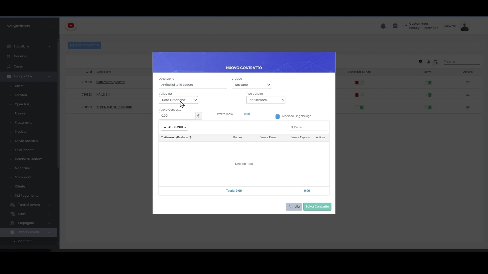
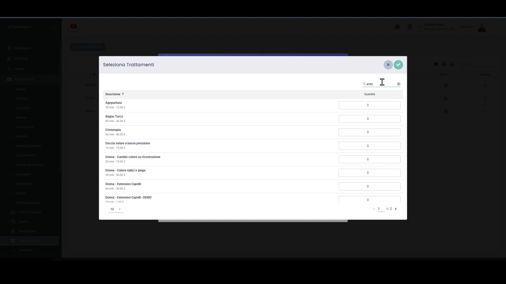
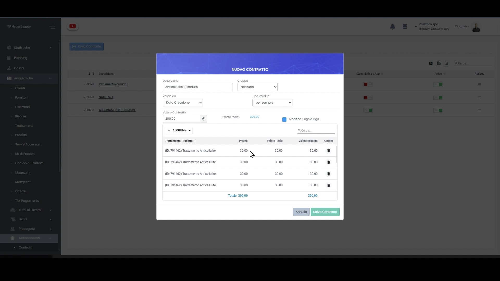
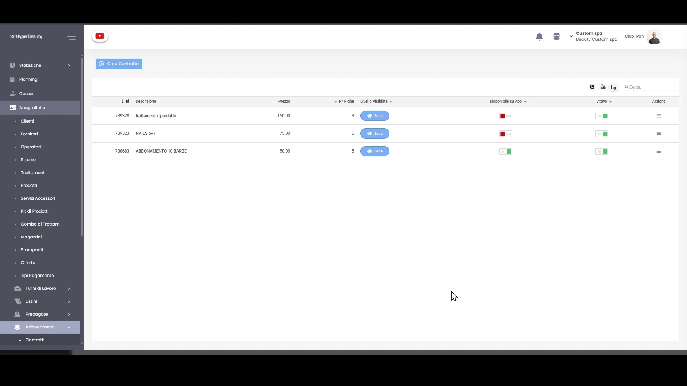
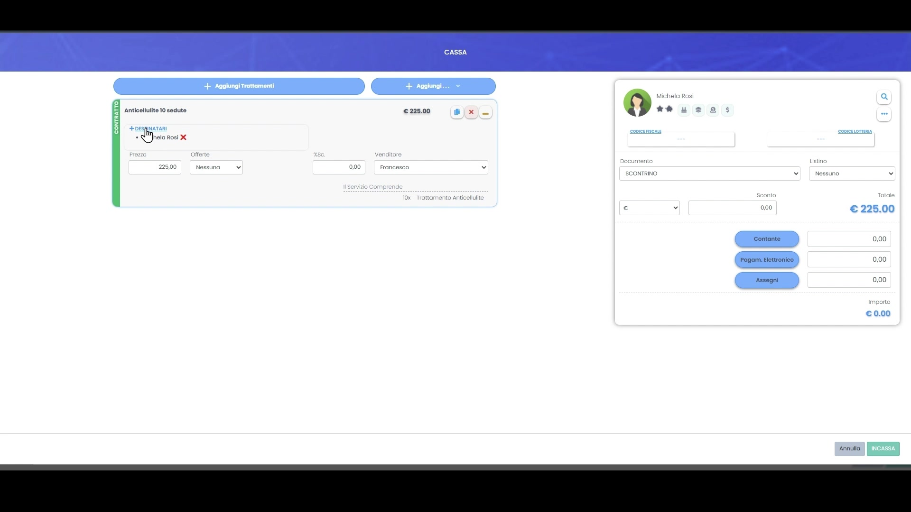
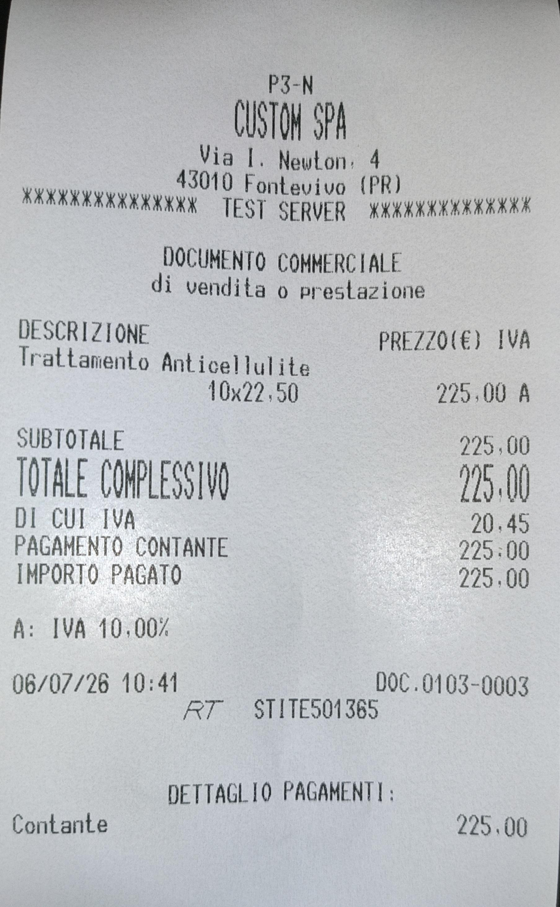
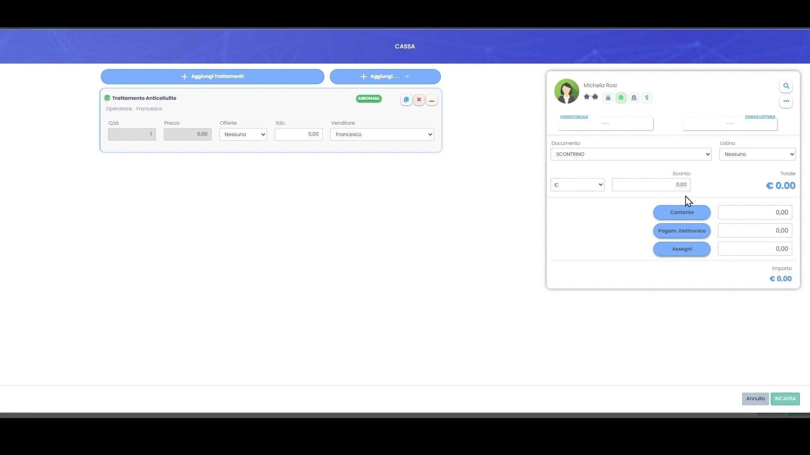
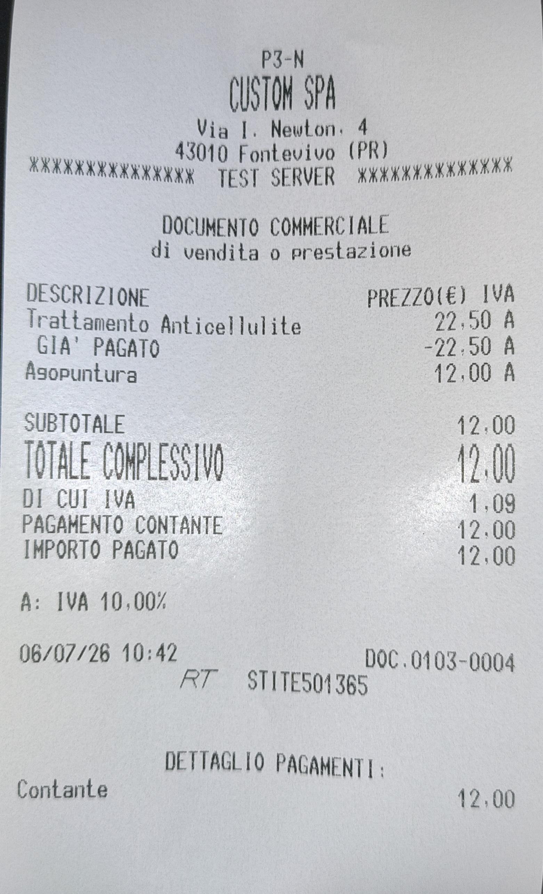
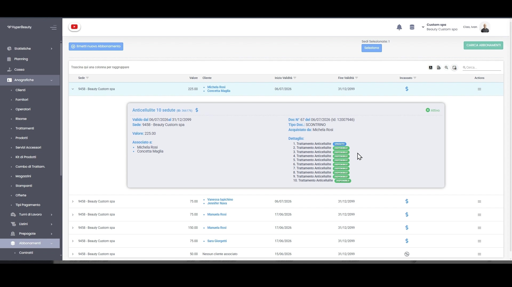
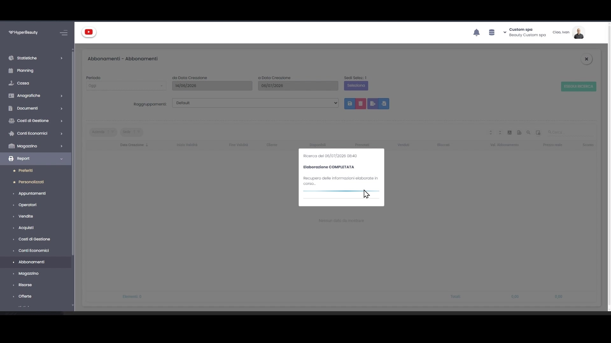

# Abbonamenti

L'abbonamento è un **pacchetto di sedute pagato in anticipo** (es. 10 trattamenti anticellulite). Il cliente paga subito, l'incasso entra tutto oggi e il cliente torna finché ha sedute da usare. In HyperBeauty l'abbonamento si costruisce come **contratto**, si vende in **cassa** e le sedute si **scalano da sole** al momento dell'appuntamento. Ecco come, passo per passo.

---

<video controls width="100%" style="border-radius:8px; margin-bottom:1.5rem;">
  <source src="../assets/resources/FIDELIZZARE/abbonamenti/abbonamenti.mp4" type="video/mp4">
  Il tuo browser non supporta il tag video.
</video>

---

## Passo 1 — Crea il contratto abbonamento

Vai su **Anagrafiche → Abbonamenti → Contratti** e clicca **Crea Contratto**. Nella finestra **Nuovo Contratto** imposta la **Descrizione** (es. "Anticellulite 10 sedute"), l'eventuale **Gruppo**, il campo **Valido da** (di norma *Data Creazione*) e il **Tipo Validità** (es. *per sempre*).

## Passo 2 — Aggiungi i trattamenti al contratto

Clicca **+ Aggiungi** e apri **Seleziona Trattamenti**. Cerca il trattamento e indica la **Quantità** di sedute (es. 10 di *Trattamento Anticellulite*). Confermando, le righe vengono aggiunte al contratto.

Ogni riga riporta **Prezzo**, **Valore Reale** e **Valore Esposto**; in basso trovi il **Totale** del contratto. Il **Valore Contratto** è il prezzo che il cliente pagherà per il pacchetto.

!!! tip "Prezzo pacchetto scontato"
    Il **Valore Contratto** può essere inferiore alla somma delle singole sedute: è proprio lo sconto che rende conveniente il pacchetto al cliente. Attiva **Modifica Singola Riga** se vuoi ritoccare il valore di ogni trattamento.

Salva con **Salva Contratto**.

## Passo 3 — Il contratto nell'anagrafica

Il nuovo contratto compare nell'elenco **Contratti**, con **Descrizione**, **Prezzo**, **N° Righe** (le sedute incluse), **Livello Visibilità**, disponibilità su App e stato **Attivo**. Da qui puoi modificarlo o disattivarlo in qualsiasi momento.

## Passo 4 — Vendi l'abbonamento in cassa

Vai in **Cassa**, seleziona il **cliente** (es. Michela Rosi) e con **Aggiungi…** inserisci l'abbonamento appena creato. Il riepilogo mostra il **prezzo del pacchetto** (es. € 225,00) e la voce *Il Servizio Comprende: 10x Trattamento Anticellulite*. Scegli il **Documento** (Scontrino), imposta il pagamento e clicca **Incassa**.

!!! info "Incassi tutto subito"
    Alla vendita incassi l'**intero valore del pacchetto**, non la singola seduta. È questo il vantaggio di cassa dell'abbonamento.

## Passo 5 — Lo scontrino di vendita

Alla conferma viene emesso il **documento commerciale di vendita o prestazione**. Le sedute del pacchetto compaiono come un'unica voce (es. *Trattamento Anticellulite 10x22,50 = 225,00*) con **Totale complessivo** e **Importo pagato** pari al prezzo del pacchetto.

## Passo 6 — Usa una seduta (scalatura automatica)

Quando il cliente torna, in **Cassa** aggiungi il trattamento incluso nell'abbonamento: il sistema lo riconosce, lo contrassegna con il badge **ABBONAM.** e ne porta il **Prezzo a 0,00**, perché è già pagato. Puoi comunque aggiungere allo stesso scontrino altri servizi **a pagamento** (es. Agopuntura).

## Passo 7 — Lo scontrino di utilizzo ("già pagato")

Lo scontrino di utilizzo riporta il trattamento al suo valore (es. *22,50*) seguito dalla riga **GIA' PAGATO** in negativo (*-22,50*): la seduta è scalata dall'abbonamento e non viene riaddebitata. Il cliente paga solo gli eventuali servizi extra (es. *Agopuntura 12,00*), come mostra il **Totale complessivo**.

## Passo 8 — Controlla i contatori dell'abbonamento

In **Anagrafiche → Abbonamenti → Abbonamenti** trovi tutti gli abbonamenti **emessi**, con cliente, valore, validità e stato incasso. Aprendo il dettaglio vedi la situazione seduta per seduta: quelle usate risultano **VENDUTO**, quelle ancora da erogare **DISPONIBILE**.

!!! tip "Icona verde in agenda"
    Se il cliente ha sedute residue compare un'icona **verde**, visibile a tutti gli operatori: chiunque può proporre di usare le sedute rimaste al prossimo appuntamento.

## Passo 9 — Il report degli abbonamenti

Da **Report → Abbonamenti** ottieni la fotografia complessiva per periodo: sedute **Disponibili**, **Prenotate**, **Vendute** e **Bloccate**, con **Valore Abbonamento** e prezzo reale. È lo strumento per monitorare quanto credito hai già incassato e quanto devi ancora erogare.

---

## Perché conviene

!!! quote "Argomento di vendita"
    *"Il cliente paga 10 sedute e ne usa 8: hai già incassato tutto. E torna perché ha ancora credito da spendere da te."*

## Abbonamento o prepagata?

| | **Abbonamento** | **Prepagata** |
|--|-----------------|---------------|
| Cosa lega | Un trattamento specifico | Credito libero |
| Esempio | 10 sedute di anticellulite | €250 su tutto |
| In cassa | Scala una seduta ("già pagato") | Scala un importo dal credito |

Vedi anche [Carte Prepagate & Gift Card](carte_prepagate.md).

---

*Documento a cura di Custom S.p.a. — HyperBeauty Training Program — Versione 2.0 — Luglio 2026*
