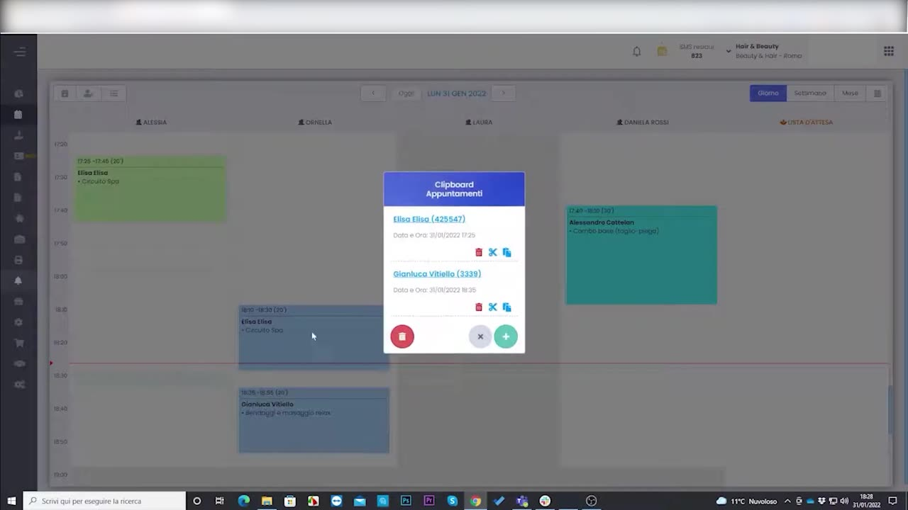
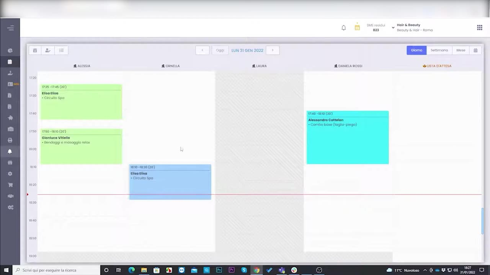

# Copia, incolla e sposta appuntamenti

L'agenda permette di riorganizzare rapidamente gli appuntamenti tramite **drag & drop** e le funzioni di **clipboard** (copia / incolla / sposta), utili per riprogrammazioni e disdette dell'ultimo minuto.

---

<video controls width="100%" style="border-radius:8px; margin-bottom:1.5rem;">
  <source src="../assets/resources/GESTIRE/appuntamento/35_copia_incolla_sposta_appuntamenti_in_agenda.mp4" type="video/mp4">
  Il tuo browser non supporta il tag video.
</video>

---

## Copiare o spostare con la clipboard

Selezionando un appuntamento si apre la **clipboard appuntamento**, da cui si sceglie se copiarlo o spostarlo in un altro slot/operatore.

## Il risultato in agenda

Una volta incollato o spostato, l'appuntamento appare nella nuova posizione e il sistema conferma l'operazione.

!!! tip "Drag & drop"
    Per spostamenti semplici basta **trascinare** l'appuntamento nel nuovo slot; la clipboard è invece comoda quando si copia lo stesso appuntamento su più giorni o operatori.

---

*Documento a cura di Custom S.p.a. — HyperBeauty Training Program — Versione 1.0 — Luglio 2026*
