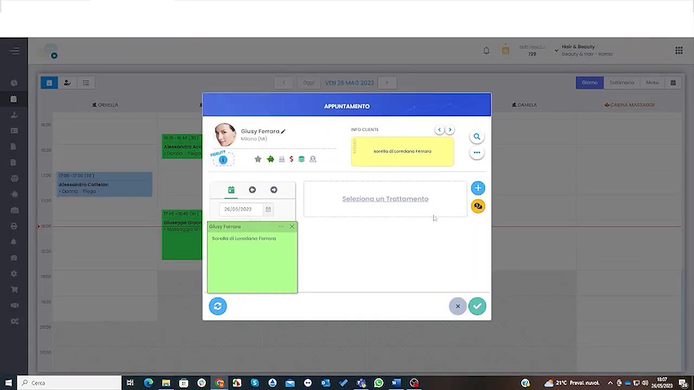
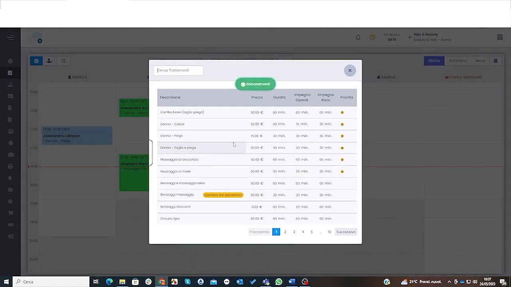
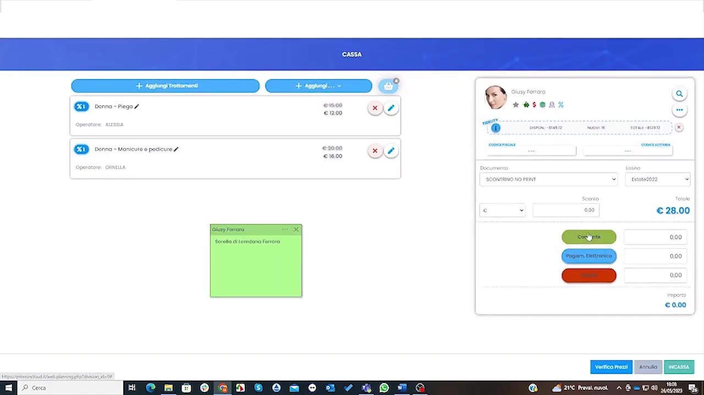

# Inserimento rapido e chiusura

La modalità più veloce per gestire il flusso completo: creare l'appuntamento, aggiungere i trattamenti e chiuderlo con l'incasso in cassa, in pochi clic.

---

<video controls width="100%" style="border-radius:8px; margin-bottom:1.5rem;">
  <source src="../assets/resources/GESTIRE/appuntamento/53-Hyperbeauty_inserire_rapidmente_appuntamenti_e_relativa_chiusura.mp4" type="video/mp4">
  Il tuo browser non supporta il tag video.
</video>

---

## 1. Creare l'appuntamento

Dalla vista agenda si apre il pannello **Gestione Appuntamento**: si seleziona il cliente e si aggiungono i trattamenti.

## 2. Aggiungere i trattamenti

Si scelgono i trattamenti dal listino; il sistema calcola durata e importo.

## 3. Chiudere con l'incasso

Al termine del servizio, l'appuntamento si chiude passando direttamente in **cassa**, dove si registra l'incasso.

!!! tip "Flusso senza interruzioni"
    Appuntamento → trattamenti → cassa: un unico percorso continuo riduce i tempi al banco e gli errori di registrazione.

---

*Documento a cura di Custom S.p.a. — HyperBeauty Training Program — Versione 1.0 — Luglio 2026*
