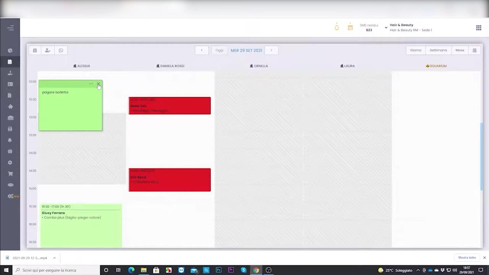
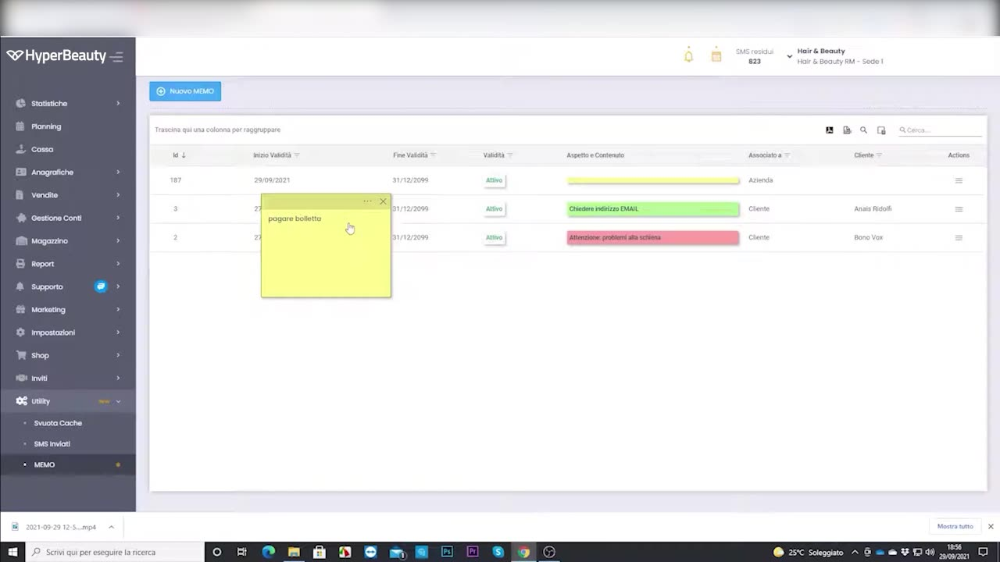
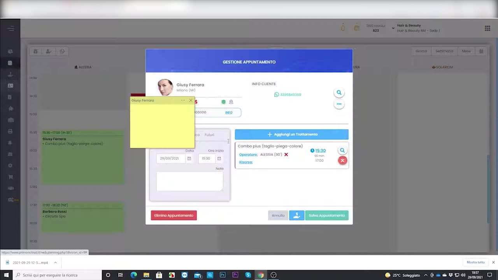

# Memo e Post-it in agenda

I **post-it** e i **memo** sono promemoria visivi che si attaccano direttamente all'agenda o al singolo appuntamento: sono visibili a tutto lo staff e aiutano a non dimenticare informazioni importanti.

---

<video controls width="100%" style="border-radius:8px; margin-bottom:1.5rem;">
  <source src="../assets/resources/GESTIRE/appuntamento/31-Hyperbeauty_gestione_memo_post-it.mp4" type="video/mp4">
  Il tuo browser non supporta il tag video.
</video>

---

## Post-it in agenda

Un post-it può essere appuntato su una data/fascia dell'agenda (es. "consegna merce", "riunione"), come nota colorata sempre in vista.

## L'elenco dei memo

I memo creati sono raccolti in un **elenco** gestibile, dove modificarli o eliminarli.

## Post-it sull'appuntamento

Il post-it può essere legato a uno specifico appuntamento: compare nel pannello di gestione, così l'operatore vede subito la nota del cliente.

!!! tip "Comunicazione interna immediata"
    A differenza delle note nella scheda cliente (storiche), i post-it in agenda sono promemoria "del momento": perfetti per comunicazioni rapide tra colleghi durante la giornata.

---

*Documento a cura di Custom S.p.a. — HyperBeauty Training Program — Versione 1.0 — Luglio 2026*
