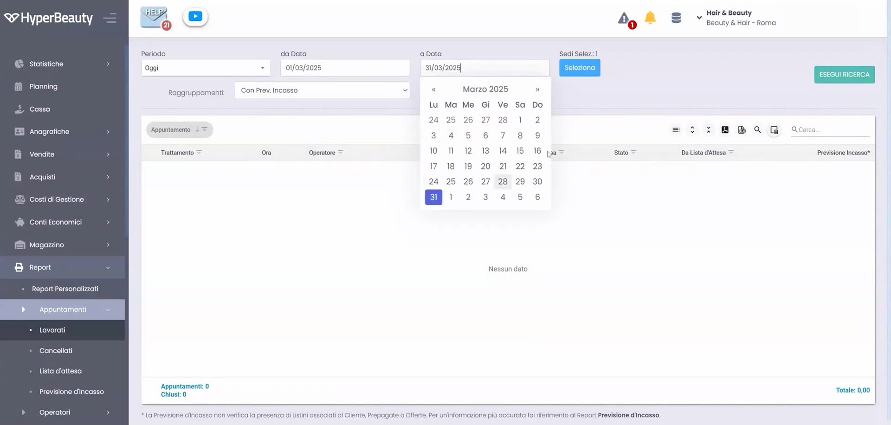
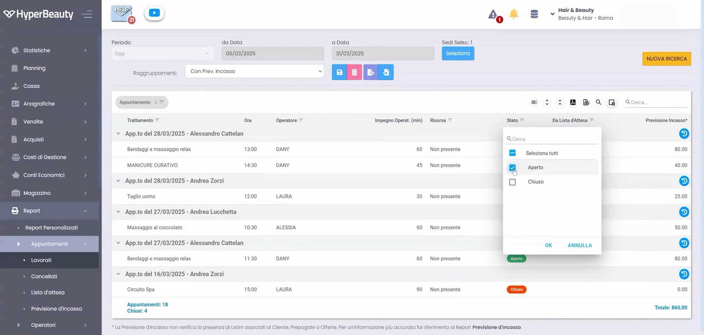
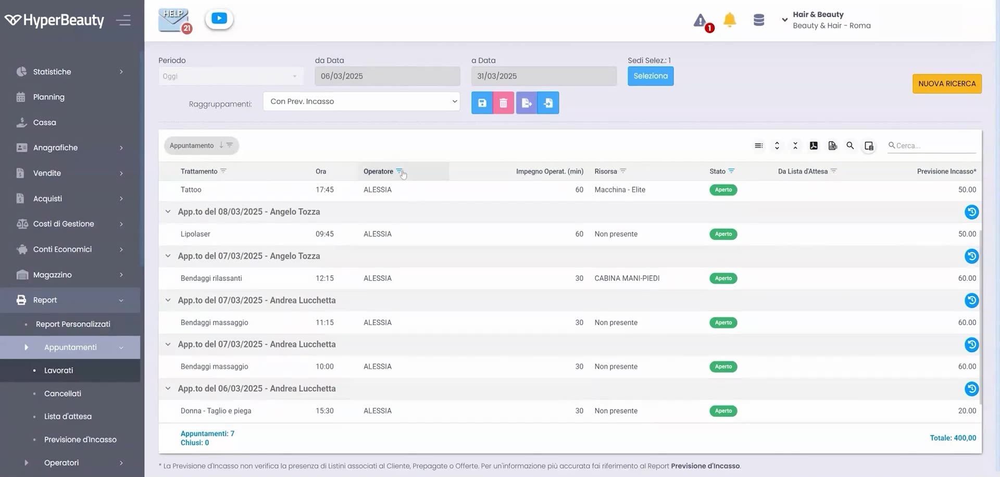

# Report appuntamenti lavorati e futuri

Il report degli appuntamenti dà il controllo completo sull'agenda: quali appuntamenti sono stati **lavorati**, quali sono **futuri**, con operatore, importo e stato. Utile per produttività e verifica dei no-show.

---

<video controls width="100%" style="border-radius:8px; margin-bottom:1.5rem;">
  <source src="../assets/resources/GESTIRE/appuntamento/65-Hyperbeauty_report_appuntamenti_lavorati_e_futuri.mp4" type="video/mp4">
  Il tuo browser non supporta il tag video.
</video>

---

## 1. Filtrare per periodo

Si imposta l'intervallo di date (da / a) per estrarre gli appuntamenti del periodo desiderato.

## 2. Scegliere i campi da visualizzare

Come per gli altri report, la **selezione campi** permette di scegliere quali colonne mostrare (operatore, trattamento, importo, ecc.).

## 3. Leggere gli stati

Ogni riga riporta lo **stato** dell'appuntamento (es. lavorato / non lavorato) con badge colorati, per distinguere subito eseguiti e in programma.

!!! tip "Controllo no-show"
    Incrociando appuntamenti "non lavorati" e mancati incassi si individuano i no-show: il dato che giustifica l'attivazione dei promemoria automatici (SMS/WhatsApp).

---

*Documento a cura di Custom S.p.a. — HyperBeauty Training Program — Versione 1.0 — Luglio 2026*
