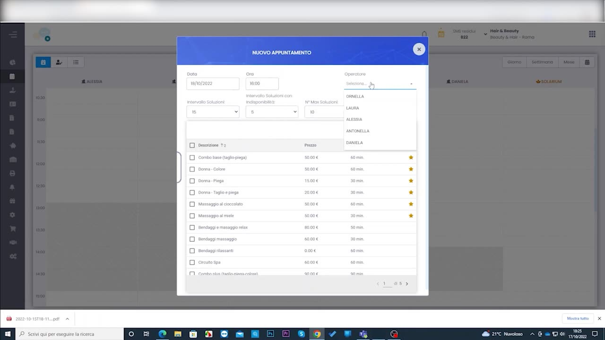
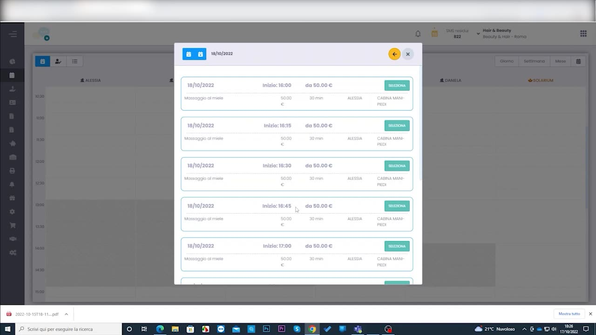
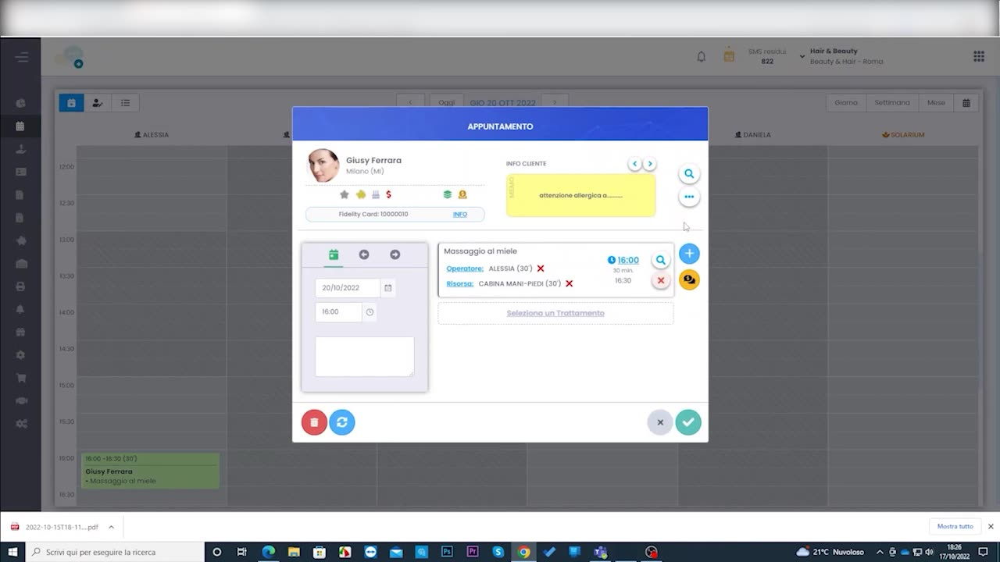

# Creazione appuntamento con ricerca disponibilità

Quando il cliente chiede "quando avete posto?", la **ricerca disponibilità** propone automaticamente i primi slot liberi in base al trattamento e all'operatore, evitando di scorrere l'agenda a mano.

---

<video controls width="100%" style="border-radius:8px; margin-bottom:1.5rem;">
  <source src="../assets/resources/GESTIRE/appuntamento/45_creazione_appuntamento_con_ricerca_disponibilit%C3%A0.mp4" type="video/mp4">
  Il tuo browser non supporta il tag video.
</video>

---

## 1. Nuovo appuntamento e trattamenti

Si apre **Nuovo Appuntamento**, si sceglie il cliente e si aggiungono i trattamenti desiderati (che determinano durata e operatori idonei).

## 2. Ricerca degli slot disponibili

Il sistema calcola e propone le **prime disponibilità** compatibili, ordinate per data e ora.

## 3. Conferma dell'appuntamento

Selezionato lo slot, l'appuntamento viene creato e compare in agenda.

!!! tip "Meno tempo al telefono"
    La ricerca disponibilità è particolarmente utile per la prenotazione telefonica: si trova lo slot giusto in pochi secondi, senza far attendere il cliente.

---

*Documento a cura di Custom S.p.a. — HyperBeauty Training Program — Versione 1.0 — Luglio 2026*
