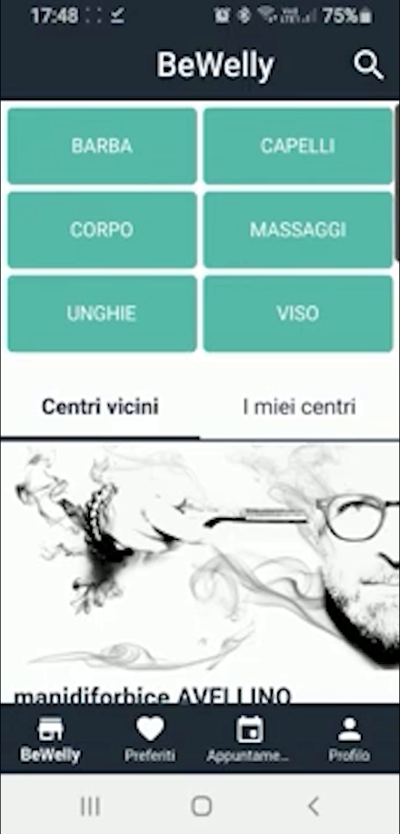
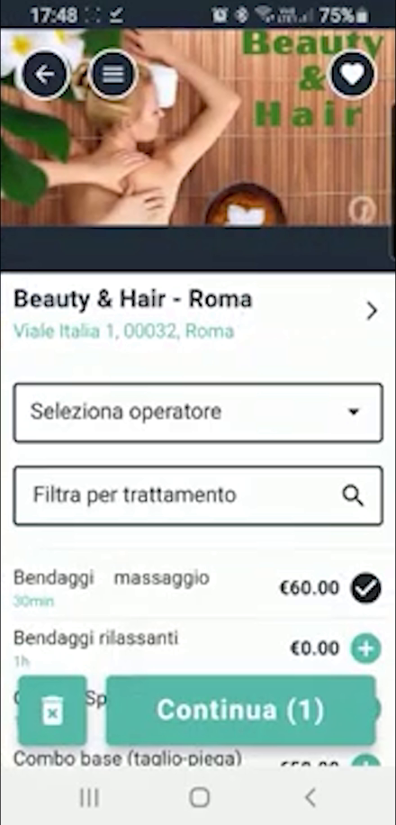
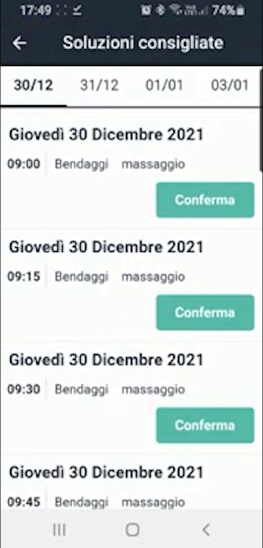
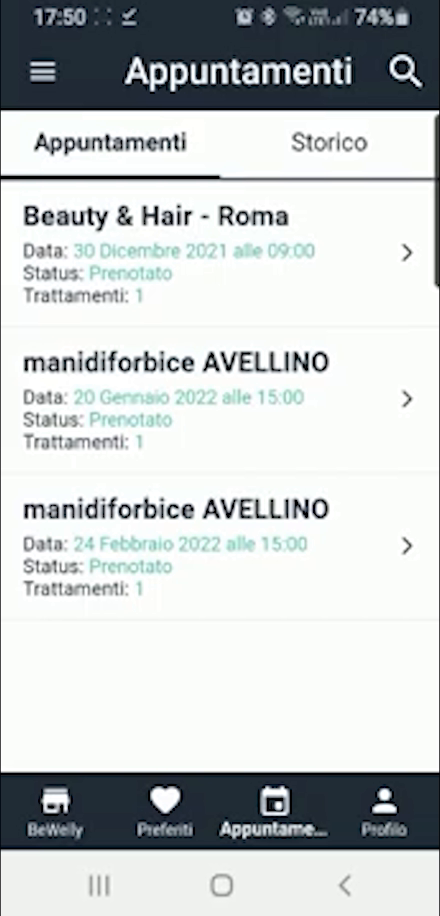
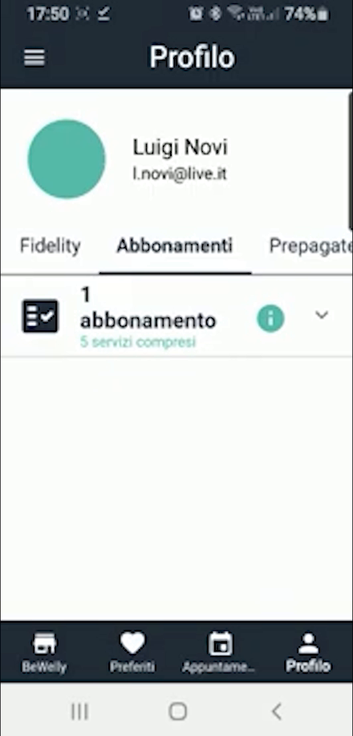

# BeWelly — App di prenotazione online

BeWelly è la **prenotazione online integrata** di HyperBeauty: il cliente prenota autonomamente dal proprio smartphone (app o link web) e la prenotazione confluisce direttamente in agenda, senza intervento dello staff.

---

<video controls width="100%" style="border-radius:8px; margin-bottom:1.5rem;">
  <source src="../assets/resources/bewelly.mp4" type="video/mp4">
  Il tuo browser non supporta il tag video.
</video>

---

## L'esperienza del cliente

Aprendo l'app, il cliente sceglie la categoria di servizio e trova i centri vicini.

Nella pagina del salone vede le foto, seleziona l'**operatore** e filtra per **trattamento**, con prezzi e durate.

Il calendario mostra la **disponibilità in tempo reale**: il cliente sceglie giorno e ora tra le soluzioni proposte e conferma.

---

## Appuntamenti e profilo

Il cliente ritrova le sue prenotazioni nella sezione **Appuntamenti**, con stato e storico.

Nel **Profilo** il cliente vede anche Fidelity, **Abbonamenti** e **Prepagate**: gli strumenti di fidelizzazione del salone sono a portata di mano anche online.

!!! tip "Il cerchio si chiude"
    Il cliente vede in app i propri abbonamenti e il credito prepagato: questo lo invoglia a prenotare di nuovo per usare ciò che ha già acquistato. Prenotazione online e fidelizzazione si rafforzano a vicenda.

---

## Come si configura

**Percorso:** Impostazioni → Sede → Prenotazione Online → attivare il toggle

Poi si definisce:

- quali **trattamenti** sono prenotabili online
- quali **operatori** appaiono (es. nascondere il titolare che non prende prenotazioni dirette)
- l'**anticipo minimo** (es. non prenotabile nelle prossime 2 ore)
- la **cancellazione online** (sì/no + anticipo minimo per cancellare)

!!! note "Le 5 foto del salone"
    Si possono caricare fino a **5 foto** del salone (Impostazioni → Sede): sono la prima impressione per il cliente online. Consigliare al dealer foto professionali dell'ambiente.

!!! info "Il link prenotazione"
    Viene generato un **URL univoco** del salone, condivisibile via WhatsApp, bio di Instagram e Google Business Profile. Va messo subito online: è il ROI più immediato di BeWelly.

---

*Documento a cura di Custom S.p.a. — HyperBeauty Training Program — Versione 1.0 — Luglio 2026*
