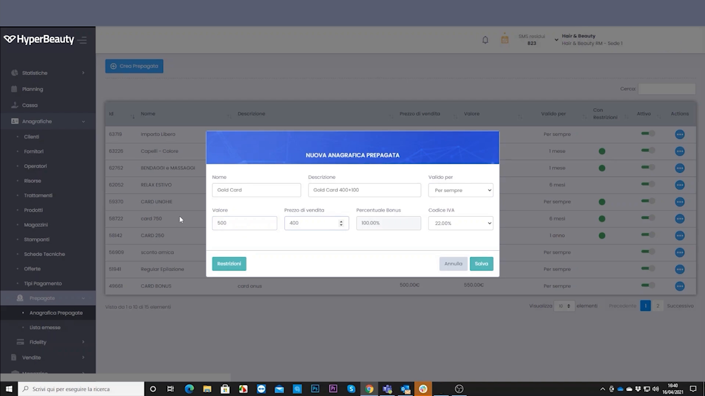
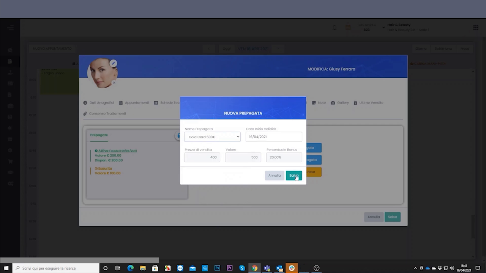
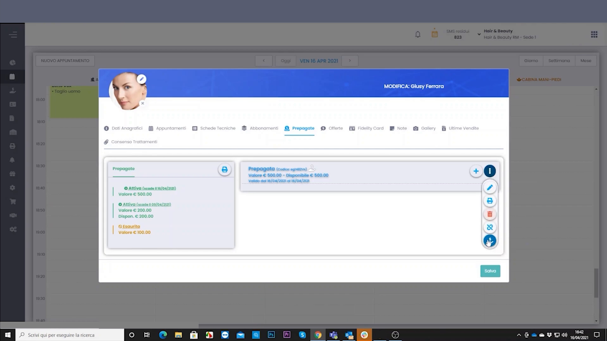
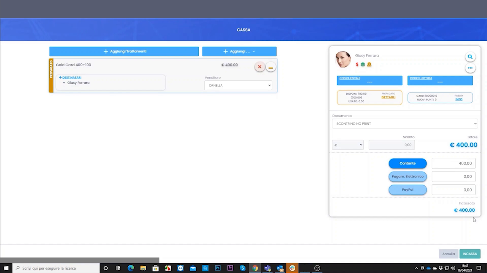
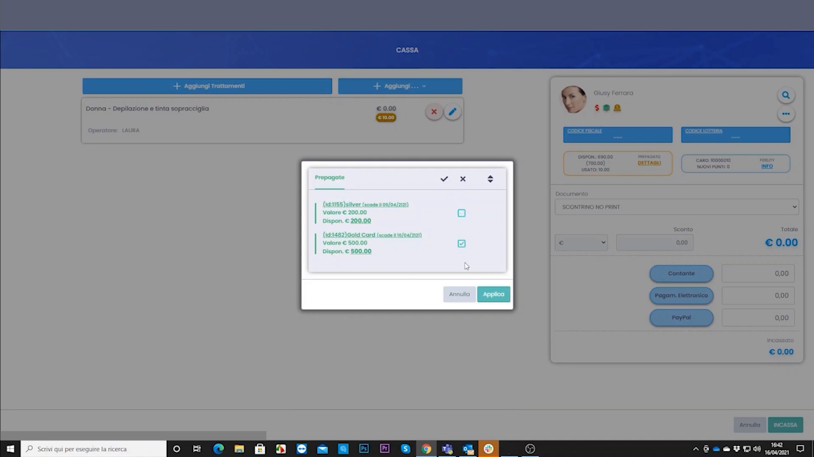
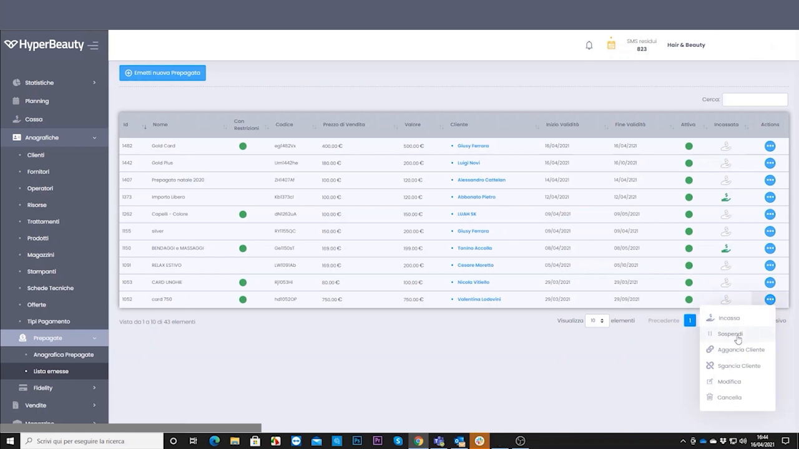

# Carte Prepagate & Gift Card

Le carte prepagate sono strumenti di fidelizzazione basati su **credito monetario**: il cliente carica un importo e riceve un valore maggiorato. Sono ideali per qualsiasi tipo di salone e generano incasso anticipato.

---

<video controls width="100%" style="border-radius:8px; margin-bottom:1.5rem;">
  <source src="../assets/resources/carte_prepagate.mp4" type="video/mp4">
  Il tuo browser non supporta il tag video.
</video>

---

## Il meccanismo della prepagata

Il cliente carica un importo sul conto prepagato (es. **€200**) e riceve un **valore spendibile maggiorato** (es. **€250**). La differenza (€50) è un **bonus fedeltà** che incentiva il riacquisto. Le percentuali di bonus sono configurabili.

Si parte creando il tipo di prepagata (nome, prezzo di vendita, percentuale bonus, valore).

---

## Assegnare la prepagata al cliente

Dalla scheda cliente, tab **Prepagate**, si assegna una nuova prepagata al cliente.

Il tab mostra tutte le prepagate del cliente con **valore caricato, bonus e credito residuo**.

---

## Ricarica e uso in cassa

La ricarica e l'utilizzo del credito avvengono in **cassa**. Al momento dell'incasso, se il cliente ha credito prepagato, il sistema propone automaticamente di scalare dall'importo prepagato.

Il credito si scala proporzionalmente al costo del trattamento o prodotto acquistato.

!!! info "Icona arancione in agenda"
    Quando il cliente ha credito prepagato residuo, in agenda compare un'**icona arancione**: un promemoria per proporre l'utilizzo del credito o un'ulteriore ricarica.

---

## Gift Card

La **gift card** è funzionalmente identica alla prepagata, ma pensata per essere **regalata a terzi**: il cliente A la acquista e la consegna al cliente B, che ne usa il credito.

**Percorso:** Cassa → Vendita Gift Card → importo → genera codice univoco → stampabile o inviabile.

!!! tip "Spunto commerciale"
    Ottima per le campagne di **Natale, Festa della Mamma, San Valentino**. È uno strumento di marketing che i dealer con mentalità commerciale capiscono subito.

---

## Il registro delle prepagate

L'elenco **Anagrafica Prepagate** raccoglie tutte le carte emesse con valore, cliente associato, date e stato.

!!! quote "Argomento di vendita"
    *"Il salone vende €200 e incassa €250 di fedeltà. Il cliente si sente premiato e ritorna."*

---

## Prepagata o abbonamento?

| | **Prepagata** | **Abbonamento** |
|--|---------------|-----------------|
| **Cosa lega** | Credito libero | Un trattamento specifico |
| **Esempio** | €250 spendibili su tutto | 10 sedute di pulizia viso |
| **Uso** | Scala un importo | Scala una seduta |

Vedi anche la pagina [Abbonamenti](abbonamenti.md).

---

*Documento a cura di Custom S.p.a. — HyperBeauty Training Program — Versione 1.0 — Luglio 2026*
