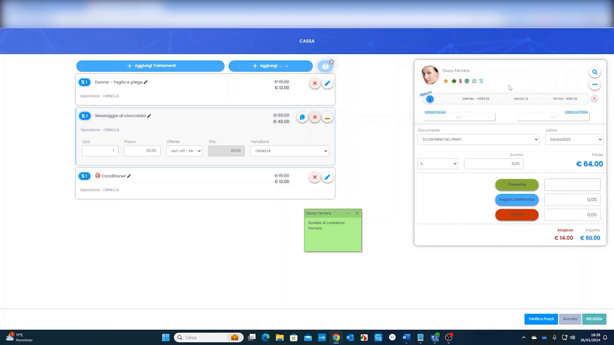
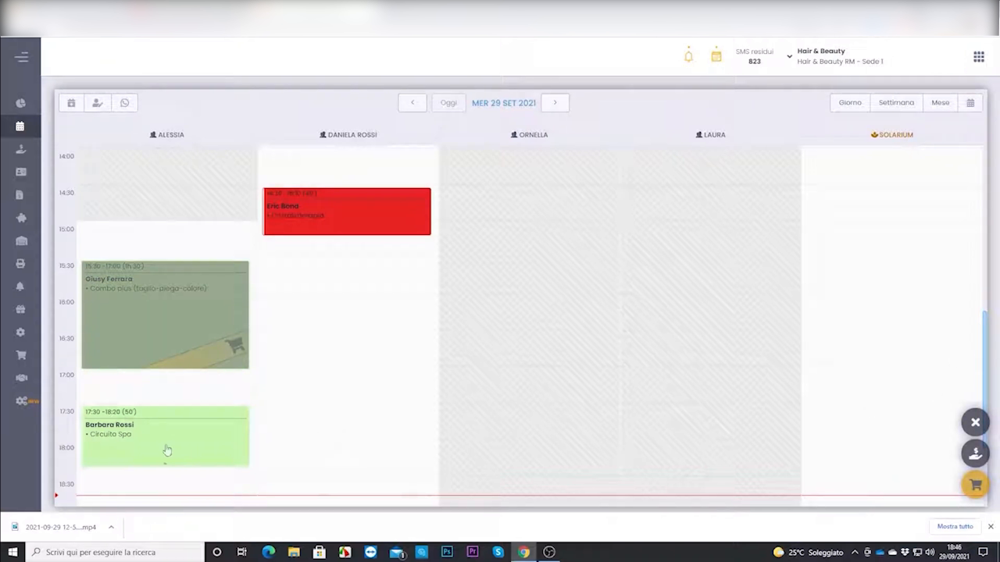

# Cassa & Incassi

La cassa è il punto in cui l'appuntamento diventa vendita: si compone il carrello, si registra l'incasso e, se necessario, si gestiscono i sospesi (pagamenti differiti).

---

## Gestione cassa, sospesi e incassi

Registrazione dell'incasso, gestione dei pagamenti parziali/sospesi e chiusura del documento di vendita.

<video controls width="100%" style="border-radius:8px; margin:1rem 0;">
  <source src="../assets/resources/GESTIRE/incassi/09-Hyperbeauty_gestione_cassa_sospesi_ed_incassi.mp4" type="video/mp4">
  Il tuo browser non supporta il tag video.
</video>

!!! info "Sospesi"
    Un **sospeso** è un importo non ancora saldato dal cliente. Resta tracciato sulla scheda cliente (icona $ rossa in agenda) finché non viene incassato.

---

## Gestione carrello

Composizione del carrello con trattamenti e prodotti prima dell'incasso.

<video controls width="100%" style="border-radius:8px; margin:1rem 0;">
  <source src="../assets/resources/GESTIRE/incassi/30-Hyperbeauty_gestione_carrello.mp4" type="video/mp4">
  Il tuo browser non supporta il tag video.
</video>

---

*Documento a cura di Custom S.p.a. — HyperBeauty Training Program — Versione 1.0 — Luglio 2026*
