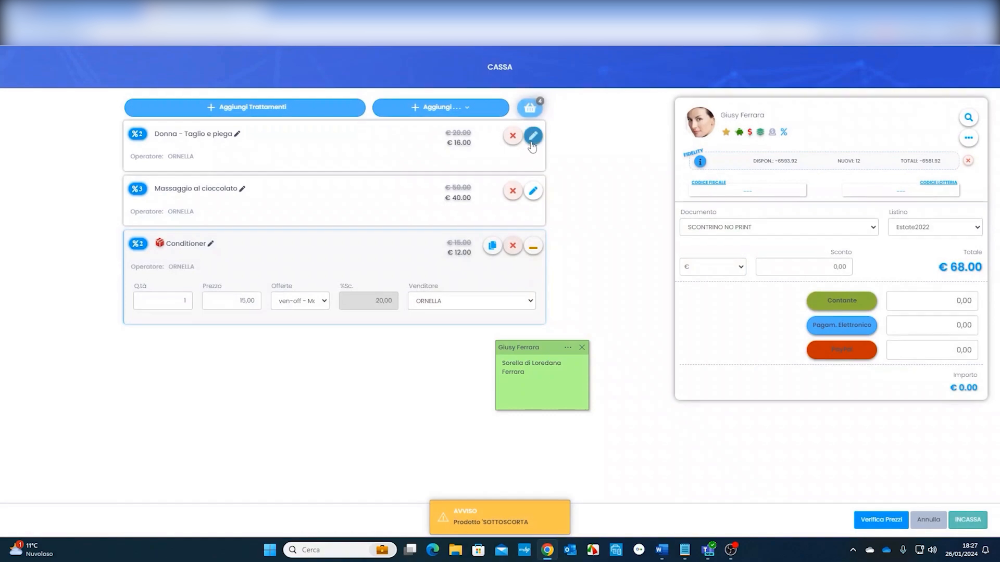
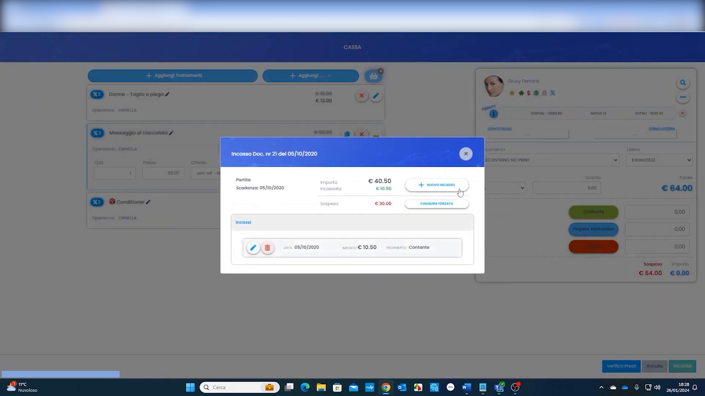
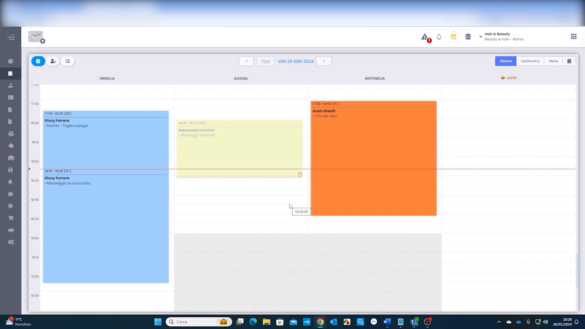

# Gestione cassa, sospesi e incassi

La cassa è il punto in cui il servizio diventa vendita: si registra l'incasso, si sceglie il metodo di pagamento e, quando il cliente non salda subito, si gestisce il **sospeso**.

---

<video controls width="100%" style="border-radius:8px; margin-bottom:1.5rem;">
  <source src="../assets/resources/GESTIRE/incassi/09-Hyperbeauty_gestione_cassa_sospesi_ed_incassi.mp4" type="video/mp4">
  Il tuo browser non supporta il tag video.
</video>

---

## Dall'agenda alla cassa

Chiudendo l'appuntamento si passa in cassa con i trattamenti già caricati, pronti per l'incasso.

## Incasso e metodo di pagamento

Si registra l'incasso indicando l'importo e il metodo di pagamento; il sistema genera il documento.

## I sospesi

Se il cliente non salda l'intero importo, la differenza resta come **sospeso** sulla sua scheda (icona $ rossa in agenda) finché non viene incassata.

!!! warning "Tenere sotto controllo i sospesi"
    Il report dei sospesi elenca tutti i clienti con debiti aperti: va controllato periodicamente per non perdere incassi.

---

*Documento a cura di Custom S.p.a. — HyperBeauty Training Program — Versione 1.0 — Luglio 2026*
