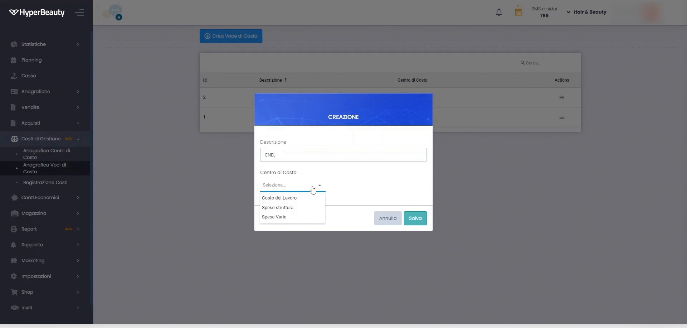
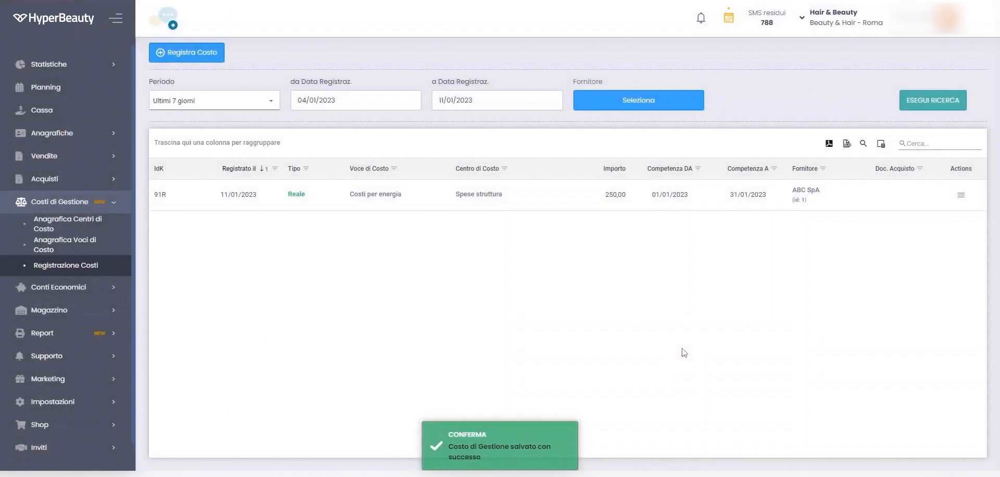

# Costi di Gestione

La sezione Costi di Gestione permette di registrare le **spese fisse e variabili** del salone (affitto, utenze, forniture, personale), integrandole con i report di redditività per avere il quadro reale del margine.

---

<video controls width="100%" style="border-radius:8px; margin-bottom:1.5rem;">
  <source src="../assets/resources/GESTIRE/costi%20di%20gestione/49-Hyperbeauty_costi_di_gestione.mp4" type="video/mp4">
  Il tuo browser non supporta il tag video.
</video>

---

## Registrare un costo

Ogni costo si registra indicando descrizione, importo, periodicità e categoria.

!!! tip "Dal fatturato al margine"
    Registrare i costi consente ai report di mostrare non solo il fatturato ma la **redditività reale**: è ciò che trasforma il gestionale in uno strumento di controllo del business.

---

*Documento a cura di Custom S.p.a. — HyperBeauty Training Program — Versione 1.0 — Luglio 2026*
