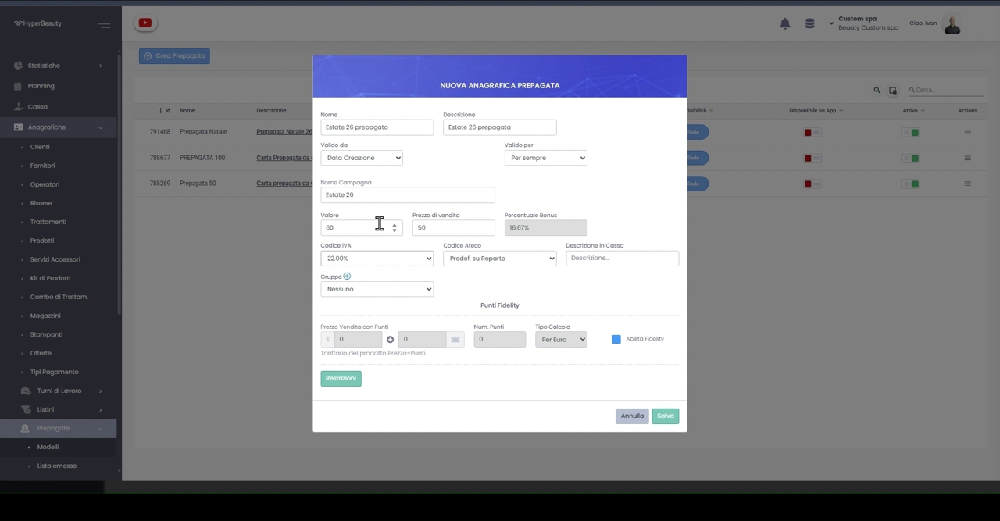
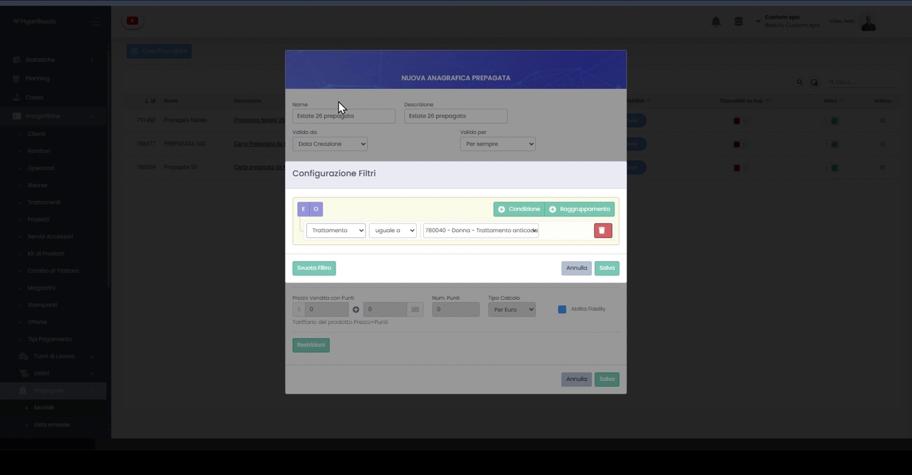
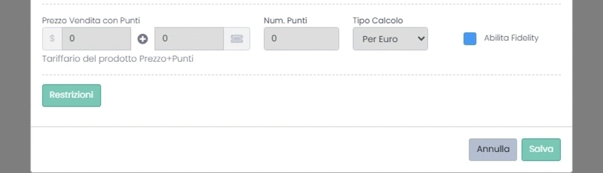
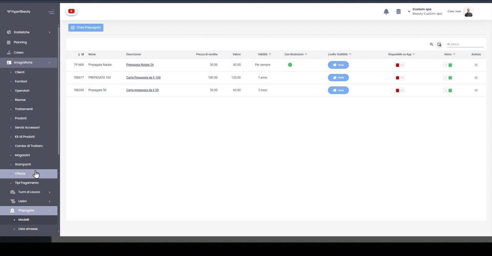

# Emissione Prepagate — Creazione dell'Anagrafica

Prima di poter vendere una prepagata devi **crearne il modello** (l'anagrafica): definisci quanto paga il cliente, quanto credito riceve, quanto dura e dove può spenderlo. Una volta salvato, il modello è pronto per essere emesso in cassa o assegnato ai clienti. Ecco come si fa, passo per passo.

---

<video controls width="100%" style="border-radius:8px; margin-bottom:1.5rem;">
  <source src="../assets/resources/FIDELIZZARE/prepagate/emissione_prep.mp4" type="video/mp4">
  Il tuo browser non supporta il tag video.
</video>

---

## Passo 1 — Apri l'elenco dei modelli

Vai su **Anagrafiche → Prepagate → Modelli**. Qui trovi tutte le prepagate già create, con **prezzo di vendita, valore, validità, livello di visibilità** e stato (Attivo / Disponibile su App). Per crearne una nuova clicca **Crea Prepagata**.

## Passo 2 — Compila l'anagrafica

Si apre la finestra **Nuova Anagrafica Prepagata**. Imposta i dati principali:

- **Nome** e **Descrizione** — come appare la carta in cassa e in elenco.
- **Valido da** — di norma *Data Creazione*.
- **Valido per** — la durata del credito (*Per sempre*, *1 anno*, *3 mesi*…).
- **Valore** — il credito spendibile dal cliente.
- **Prezzo di vendita** — quanto paga effettivamente.
- **Percentuale Bonus** — calcolata **in automatico** dalla differenza tra valore e prezzo (es. valore 60 € pagato 50 € → bonus 16,67%).
- **Codice IVA**, **Codice Ateco** e **Descrizione in Cassa** per la corretta contabilizzazione.

!!! info "Il bonus è la leva di ritorno"
    Il cliente paga meno del credito che riceve: è il motivo per cui torna a spendere. Più il bonus è visibile, più la prepagata funziona.

## Passo 3 — (Opzionale) Restrizioni con filtri

Cliccando **Restrizioni** apri la **Configurazione Filtri**: puoi limitare dove il credito è spendibile (per trattamento, categoria, reparto…). Combina più regole con la logica **E / O**, aggiungi una **Condizione** o un **Raggruppamento**, e salva. Se non imposti nulla, il credito è spendibile su tutto.

## Passo 4 — (Opzionale) Punti Fidelity

Nella sezione **Punti Fidelity** puoi collegare la prepagata alla raccolta punti: definisci il **Prezzo Vendita con Punti**, il **Num. Punti**, il **Tipo Calcolo** (es. *Per Euro*) e spunta **Abilita Fidelity**. Così la carta può essere venduta anche in modalità *Prezzo + Punti*.

## Passo 5 — Salva ed emetti

Premi **Salva**: la nuova prepagata compare tra i **Modelli**, con validità, **Livello Visibilità** (es. *Sede*), *Disponibile su App* e stato *Attivo*. Da questo momento è pronta per essere **venduta in cassa** o **assegnata al cliente**.

!!! tip "Modelli e Lista emesse"
    In **Prepagate → Modelli** trovi i *modelli* (i tipi di carta che crei). In **Prepagate → Lista emesse** trovi invece le prepagate **effettivamente emesse e assegnate ai clienti**, con il credito residuo.

---

## Modelli o carte emesse?

| | **Modelli** | **Lista emesse** |
|--|-------------|------------------|
| Cosa contiene | I tipi di prepagata che crei | Le carte vendute/assegnate ai clienti |
| Quando lo usi | Per definire valore, bonus e regole | Per controllare credito residuo e utilizzo |

Vedi anche [Carte Prepagate & Gift Card](carte_prepagate.md) per l'uso del credito in cassa e le gift card.

---

*Documento a cura di Custom S.p.a. — HyperBeauty Training Program — Versione 1.0 — Luglio 2026*
