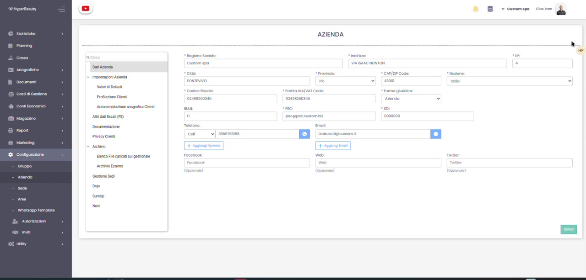
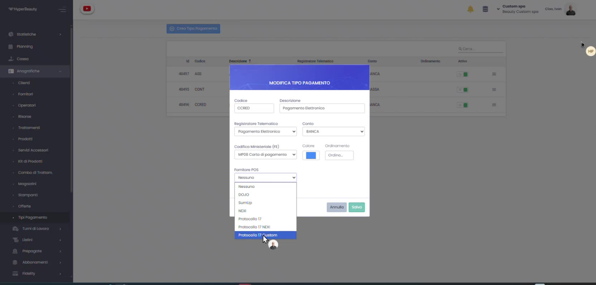
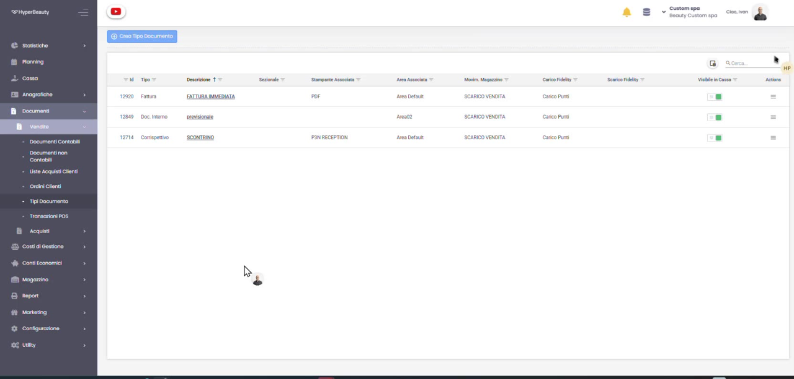
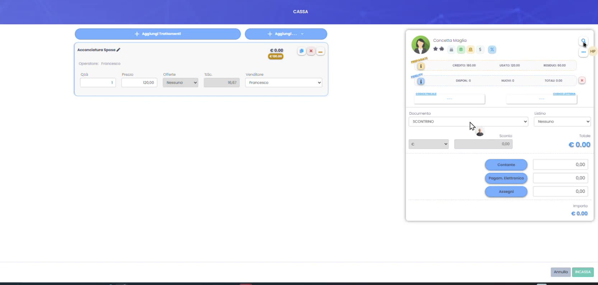
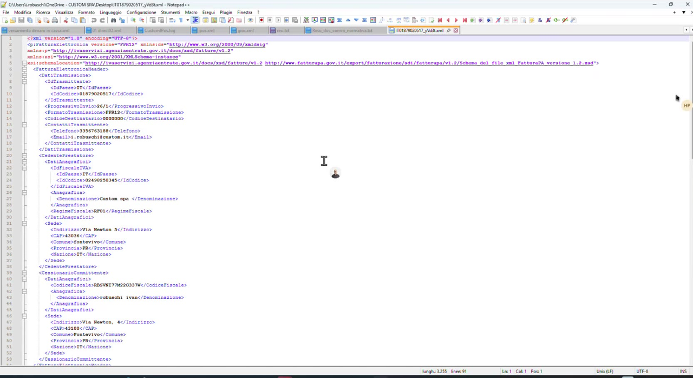
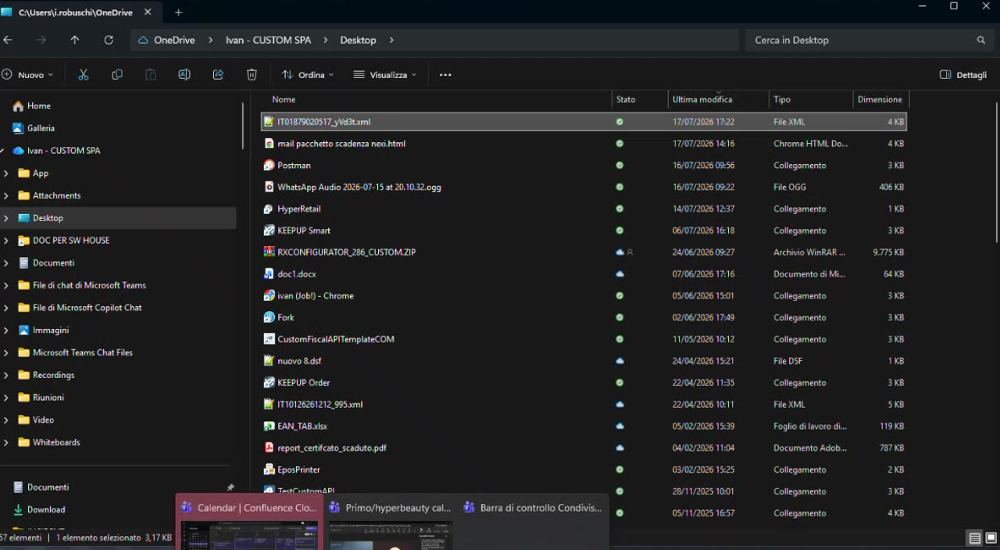

# Fattura Elettronica — Creazione del File XML

Questa guida mostra come configurare i dati fiscali ed **emettere una fattura generando il relativo file XML** (formato FatturaPA) in HyperBeauty.

!!! warning "Come funziona oggi la fattura elettronica in HyperBeauty"
    Ad oggi la fatturazione elettronica in HyperBeauty è un **pacchetto fisso annuale**, acquistabile con un **modulo a parte**. Il sistema esegue la **sola creazione del file XML**: **non** effettua l'**invio** né la **conservazione a norma sullo SdI**. Il file XML generato può essere **inviato al proprio consulente fiscale (commercialista)** oppure **caricato direttamente sul proprio cassetto fiscale**.

---

## Passo 1 — Configura i dati fiscali dell'azienda

Vai su **Configurazione → Azienda → Dati Azienda** e compila i campi obbligatori per la fattura: **Ragione Sociale, Indirizzo, Città, Provincia, CAP, Nazione, Codice Fiscale, Partita IVA, Forma giuridica, PEC** e **SDI** (il Codice Destinatario). Completa anche la sezione **Altri dati fiscali (FE)** con il regime fiscale. Al termine premi **Salva**.

!!! info "PEC e Codice Destinatario"
    Sono i recapiti fiscali che finiscono nell'XML. Se il cliente non ha un Codice Destinatario, nel file viene riportato **0000000**.

## Passo 2 — Imposta la Codifica Ministeriale (FE) dei pagamenti

In **Anagrafiche → Tipi Pagamento** apri ogni tipo di pagamento e imposta la **Codifica Ministeriale (FE)** corretta (es. *MP08 Carta di pagamento*, *MP01 Contanti*, *MP05 Bonifico*). È il codice della modalità di pagamento che viene scritto nell'XML.

## Passo 3 — Verifica il tipo documento Fattura

In **Documenti → Vendite → Tipi Documento** assicurati che sia presente e attivo il tipo **Fattura** (es. *FATTURA IMMEDIATA*), con la stampante e i parametri corretti. È il documento che genererà l'XML.

!!! info "Dati del cliente"
    Perché la fattura sia valida, l'anagrafica del cliente deve contenere i suoi dati fiscali: **Codice Fiscale / Partita IVA** e, dove disponibile, **PEC** o **Codice Destinatario**.

## Passo 4 — Emetti la fattura in cassa

In **Cassa**, dopo aver inserito i trattamenti/prodotti e selezionato il cliente, nel campo **Documento** scegli **Fattura** al posto di *Scontrino*. Completa il pagamento e premi **INCASSA**.

## Passo 5 — Genera il file XML

Dal documento fattura emesso, avvia la **generazione del file XML**. HyperBeauty produce un file conforme **FatturaPA** (`<FatturaElettronica versione="FPR12">`) con intestazione (dati trasmittente, cedente/prestatore, cessionario/committente) e corpo del documento. Il file viene **scaricato** con la nomenclatura standard `IT<PartitaIVA>_<progressivo>.xml`.

## Passo 6 — Utilizza il file XML

Il file `.xml` scaricato è pronto per l'inoltro. Puoi:

Inviarlo al tuo **commercialista**, che provvederà all'invio allo SdI; oppure caricarlo tu stesso sul tuo **cassetto fiscale** dell'Agenzia delle Entrate. HyperBeauty, come indicato, si ferma alla **creazione** del file.

---

## In sintesi

| Passo | Dove | Risultato |
|-------|------|-----------|
| **Dati azienda** | Configurazione → Azienda | Dati fiscali, PEC, SDI, regime |
| **Codifica FE** | Anagrafiche → Tipi Pagamento | Modalità di pagamento per l'XML |
| **Tipo documento** | Documenti → Vendite → Tipi Documento | Documento Fattura disponibile |
| **Emissione** | Cassa → Documento: Fattura | Fattura emessa |
| **XML** | Documento fattura → Genera XML | File FatturaPA scaricato |
| **Inoltro** | Commercialista o cassetto fiscale | XML consegnato |

---

*Documento a cura di Custom S.p.a. — HyperBeauty Training Program — Versione 1.0 — Luglio 2026*
