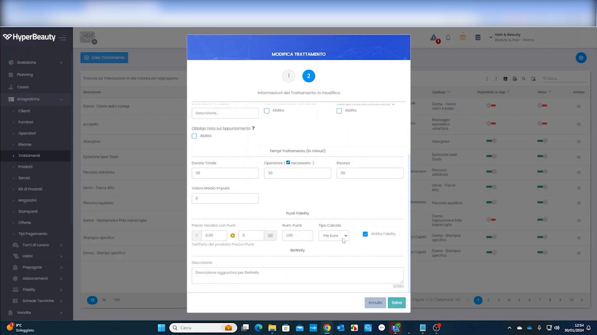
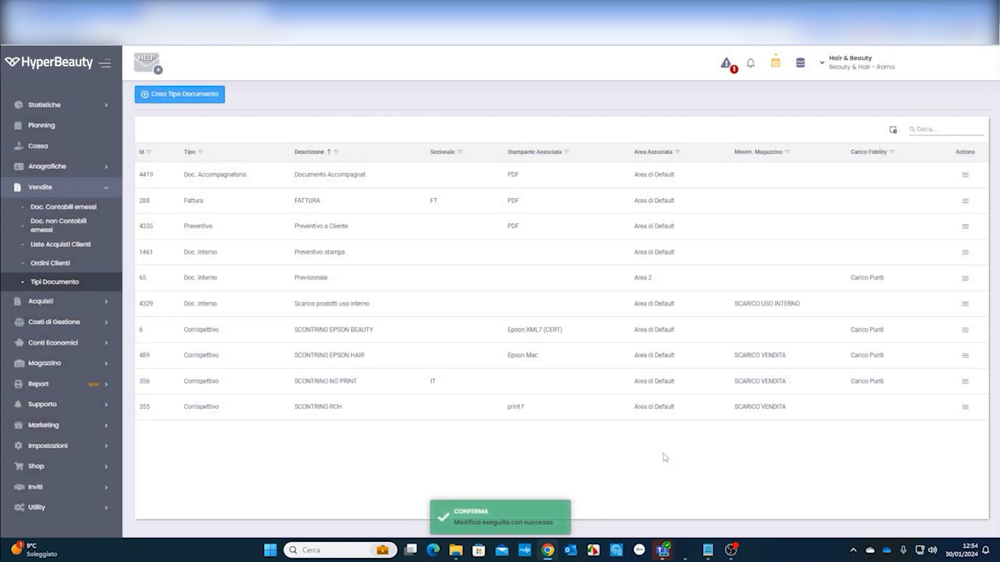
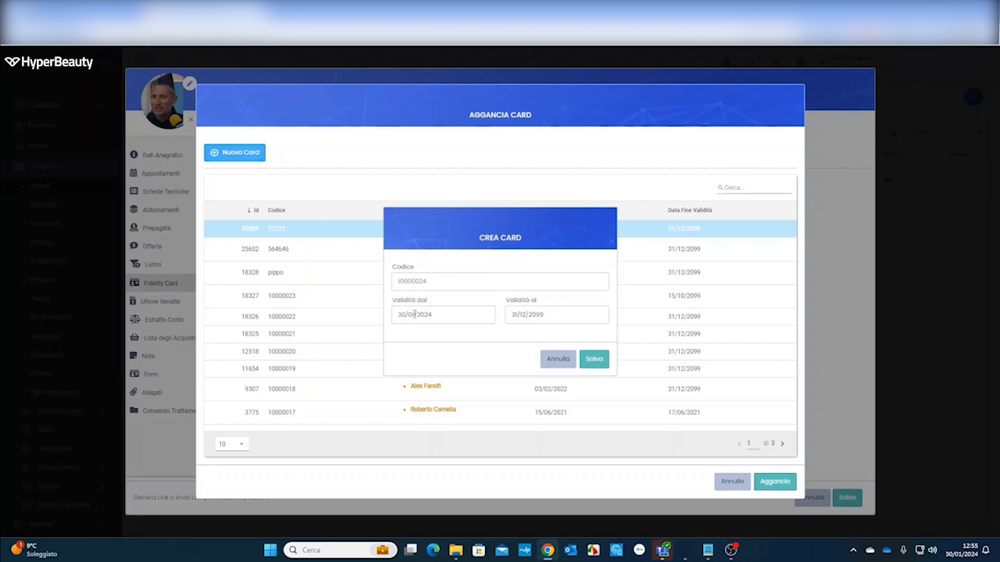
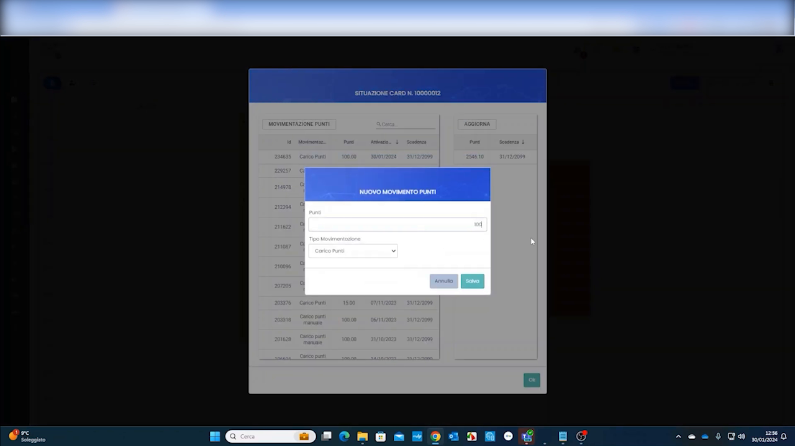
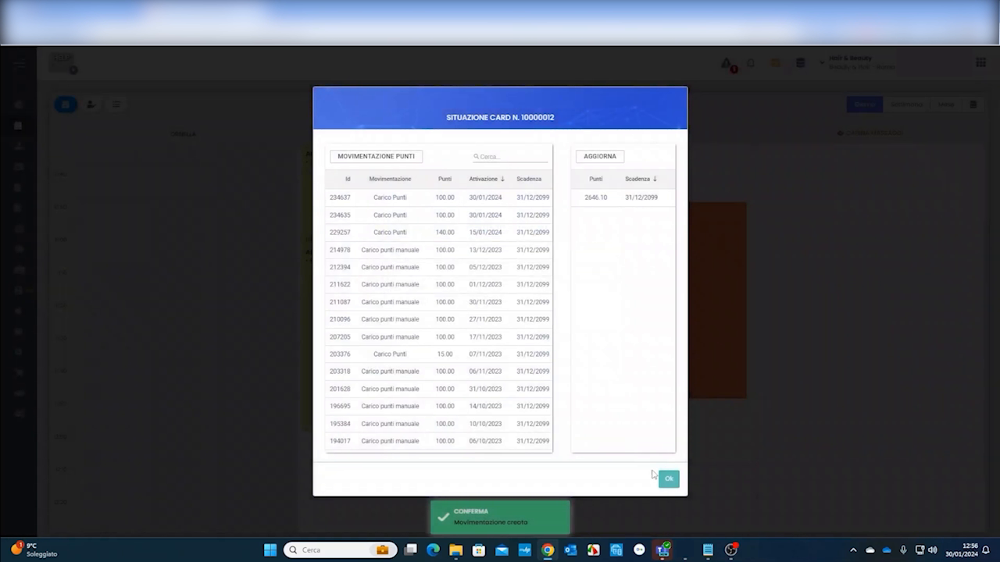

# Fidelity Card

La fidelity card è la **tessera a punti** del salone: il cliente accumula punti a ogni acquisto e li trasforma in premi. Ecco come impostarla e usarla, passo per passo.

---

<video controls width="100%" style="border-radius:8px; margin-bottom:1.5rem;">
  <source src="../assets/resources/FIDELIZZARE/prepagate/fidelity_card.mp4" type="video/mp4">
  Il tuo browser non supporta il tag video.
</video>

---

## Passo 1 — Assegna i punti a trattamenti e prodotti

Apri un trattamento (o prodotto) e, nella scheda **Modifica Trattamento**, vai alla sezione **Punti Fidelity**: imposta il **Num. Punti**, il **Tipo Calcolo** (es. *Per Euro*) e spunta **Abilita Fidelity**. È la tua "economia dei punti".

## Passo 2 — Fai caricare i punti in automatico

In **Vendite → Tipi Documento**, sul documento usato in cassa (es. lo scontrino), imposta il **Carico Fidelity** su *Carico Punti*. Così a ogni vendita i punti si accumulano da soli, senza interventi dello staff.

## Passo 3 — Crea e aggancia la card al cliente

Dalla scheda cliente apri **Fidelity Card → Aggancia Card**, clicca **Crea Card**, inserisci il **Codice** e la **Validità (dal / al)**, salva e poi **Aggancia** la tessera al cliente.

## Passo 4 — Movimenti punti manuali

Quando serve puoi intervenire a mano: con **Nuovo Movimento Punti** aggiungi o scali punti indicando **Punti** e **Tipo Movimentazione** (es. *Carico Punti*).

## Passo 5 — Controlla la situazione della card

La **Situazione Card** mostra lo **storico movimenti** (carichi automatici e manuali, con data e scadenza) e il **saldo punti** aggiornato del cliente.

---

## ⭐ Premi automatici con le automazioni

Il vero potere della fidelity nasce quando la colleghi alle **automazioni marketing**: i punti diventano premi automatici, senza lavoro dello staff.

!!! tip "Che premi puoi dare"
    - **Prodotti** — es. al raggiungimento di X punti, un prodotto omaggio
    - **Trattamenti** — es. la decima seduta gratis, o un trattamento per il compleanno
    - **Sconti** — es. sconto automatico sul prossimo acquisto oltre una soglia punti
    - **…e altro** — buoni, upgrade, inviti a eventi

    Imposti la regola una volta e il sistema riconosce il cliente, controlla i punti e applica il premio da solo. Vedi [Marketing Automation](marketing_automation.md).

---

*Documento a cura di Custom S.p.a. — HyperBeauty Training Program — Versione 1.0 — Luglio 2026*
