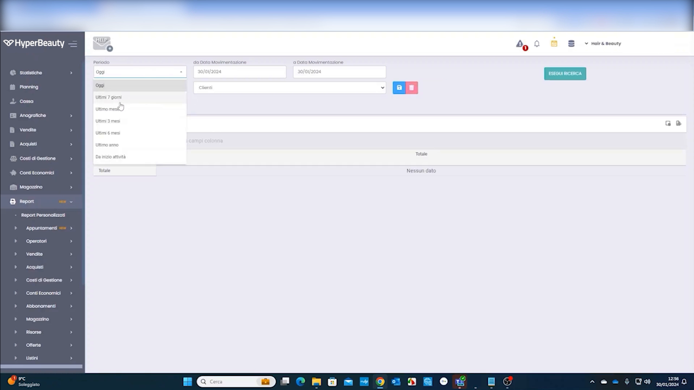

# Fidelity Card

La fidelity card è la **tessera a punti** del salone: il cliente accumula punti a ogni acquisto e li converte in premi. Combinata con le **automazioni marketing**, diventa uno degli strumenti di fidelizzazione più potenti di HyperBeauty.

---

<video controls width="100%" style="border-radius:8px; margin-bottom:1.5rem;">
  <source src="../assets/resources/fidelity_card.mp4" type="video/mp4">
  Il tuo browser non supporta il tag video.
</video>

---

## Come funziona: l'accumulo punti

Ogni trattamento e prodotto può generare un numero di punti configurabile. Dalla lista trattamenti si imposta **quanti punti** vengono accumulati per ciascun servizio.

In questo modo il salone decide la propria "economia dei punti": quanto vale ogni servizio in termini di fedeltà.

---

## Le card fedeltà

L'**Anagrafica Card** raccoglie tutte le tessere emesse, con codice, cliente associato e periodo di validità.

Con **Crea Card** si emette una nuova tessera e la si associa al cliente, indicando codice e validità.

---

## Accumulo e spesa dei punti

Ogni card ha uno **storico movimenti punti**: accumuli, spese e rettifiche. Da qui si gestiscono manualmente i movimenti quando serve.

---

## La fidelity alla cassa

Al momento del pagamento, i punti si accumulano automaticamente e possono essere spesi direttamente in cassa.

---

## ⭐ Premi automatici con le automazioni

Il vero valore della fidelity card emerge quando la si collega alle **automazioni marketing** di HyperBeauty. Le regole automatiche permettono di trasformare i punti in premi di ogni tipo, senza lavoro manuale dello staff.

!!! tip "Cosa puoi dare come premio"
    Grazie alle automazioni è possibile creare premi in:

    - **Prodotti** — es. al raggiungimento di X punti, un prodotto in omaggio
    - **Trattamenti** — es. la decima seduta gratuita, o un trattamento omaggio al compleanno
    - **Sconti** — es. sconto automatico sul prossimo acquisto quando si supera una soglia punti
    - **…e molto altro** — buoni, upgrade di servizio, inviti a eventi, promozioni dedicate ai clienti più fedeli

    Le regole si impostano una volta e lavorano da sole: il sistema riconosce il cliente, verifica i punti e applica il premio automaticamente. È il modo più efficace per far tornare i clienti senza sforzo operativo.

!!! note "Collegamento con il Marketing Automation"
    La configurazione dei premi e delle regole avanzate fa parte del modulo **Marketing Automation** (Sezione 3 · Automatizzare). La fidelity card è la base dati su cui quelle automazioni lavorano: più è curata, più i premi automatici sono efficaci.

---

## Riepilogo

| Passo | Azione |
|-------|--------|
| 1 | Impostare i punti accumulati per trattamento/prodotto |
| 2 | Creare e assegnare le fidelity card ai clienti |
| 3 | Lasciare che i punti si accumulino automaticamente in cassa |
| 4 | Gestire i movimenti punti quando necessario |
| 5 | Collegare le automazioni per erogare premi (prodotti, trattamenti, sconti) |

---

*Documento a cura di Custom S.p.a. — HyperBeauty Training Program — Versione 1.0 — Luglio 2026*
