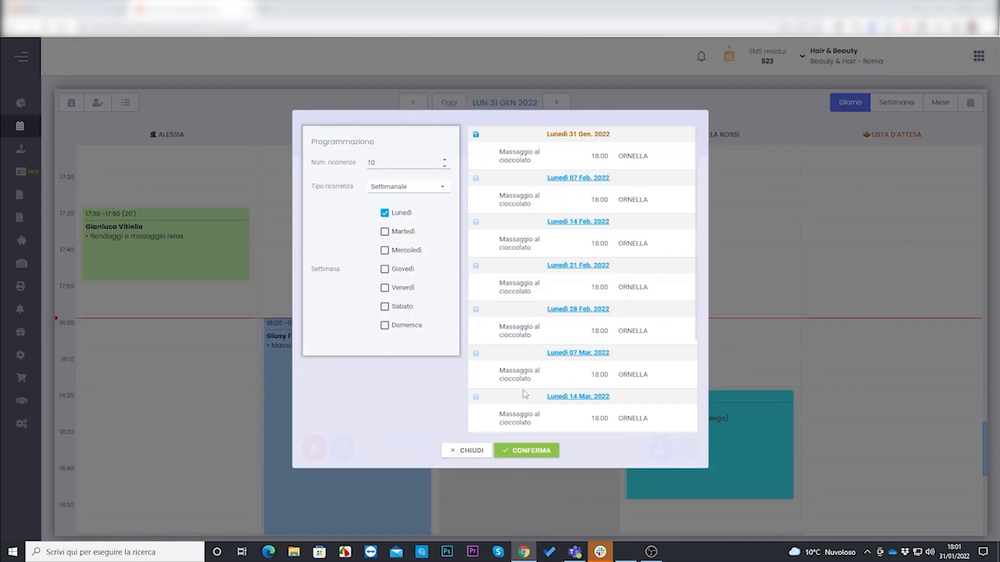
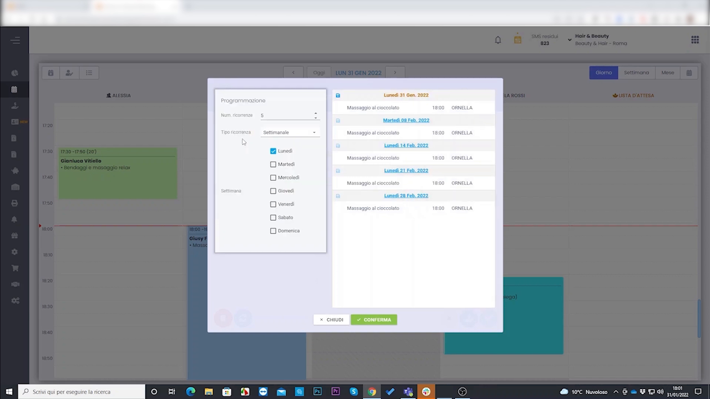
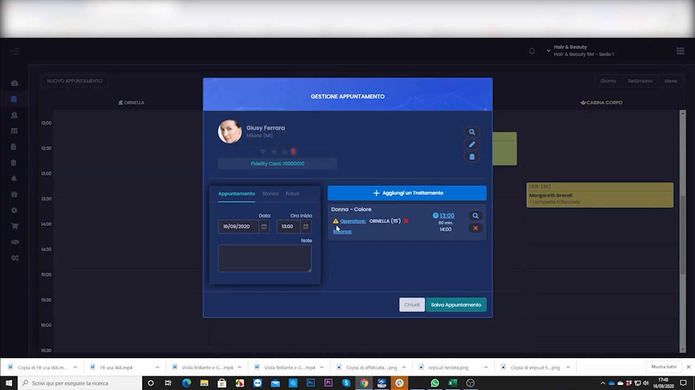
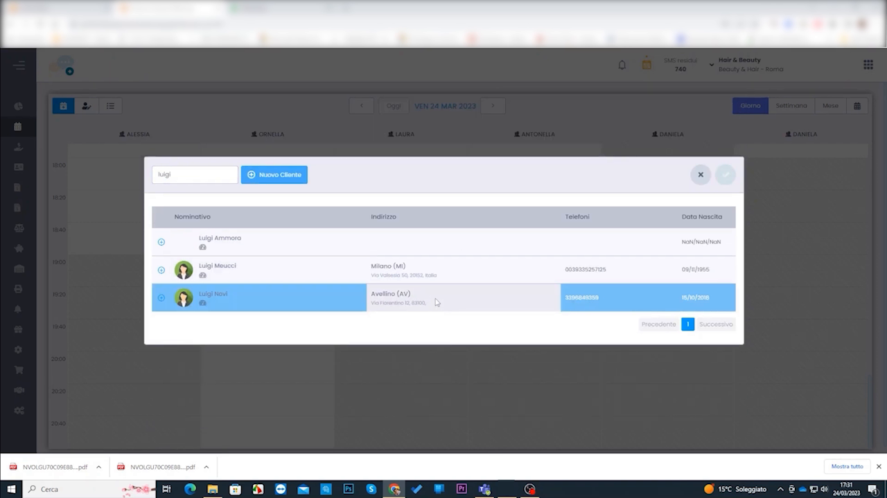

# Gestione appuntamento

È la fase centrale del lavoro quotidiano in salone: dalla presa dell'appuntamento fino alla vendita con relativo incasso. Questa sezione raccoglie tutte le tecniche operative dell'agenda.

---

## Creazione rapida e chiusura

Inserimento veloce di un appuntamento, selezione cliente e trattamento, salvataggio e chiusura con incasso in cassa.

<video controls width="100%" style="border-radius:8px; margin:1rem 0;">
  <source src="../assets/resources/GESTIRE/appuntamento/53-Hyperbeauty_inserire_rapidmente_appuntamenti_e_relativa_chiusura.mp4" type="video/mp4">
  Il tuo browser non supporta il tag video.
</video>

---

## Creazione con ricerca disponibilità

Quando il cliente chiede "quando c'è posto?", la **ricerca disponibilità** propone i primi slot liberi in base al trattamento e all'operatore scelti.

<video controls width="100%" style="border-radius:8px; margin:1rem 0;">
  <source src="../assets/resources/GESTIRE/appuntamento/45_creazione_appuntamento_con_ricerca_disponibilit%C3%A0.mp4" type="video/mp4">
  Il tuo browser non supporta il tag video.
</video>

---

## Appuntamenti ricorrenti

Per i clienti con cadenza fissa (es. piega ogni 15 giorni) si programma un appuntamento che si ripete automaticamente ogni X settimane.

<video controls width="100%" style="border-radius:8px; margin:1rem 0;">
  <source src="../assets/resources/GESTIRE/appuntamento/36_programmazione_appuntamenti_ricorrenti.mp4" type="video/mp4">
  Il tuo browser non supporta il tag video.
</video>

---

## Copia, incolla e sposta appuntamenti

L'agenda supporta il **drag & drop** e le funzioni di clipboard per spostare o duplicare rapidamente gli appuntamenti.

<video controls width="100%" style="border-radius:8px; margin:1rem 0;">
  <source src="../assets/resources/GESTIRE/appuntamento/35_copia_incolla_sposta_appuntamenti_in_agenda.mp4" type="video/mp4">
  Il tuo browser non supporta il tag video.
</video>

---

## Operatore specializzato e risorsa preferenziale

Si può indicare l'operatore che esegue abitualmente un certo trattamento e la risorsa/postazione preferenziale, così l'agenda propone le assegnazioni corrette.

<video controls width="100%" style="border-radius:8px; margin:1rem 0;">
  <source src="../assets/resources/GESTIRE/appuntamento/13-Hyperbeauty_l%27operatore_specializzato_e_la_risorsa_preferenziale.mp4" type="video/mp4">
  Il tuo browser non supporta il tag video.
</video>

---

## Memo e post-it in agenda

I **post-it** e i **memo** permettono di annotare promemoria direttamente in agenda o sull'appuntamento, visibili a tutto lo staff.

<video controls width="100%" style="border-radius:8px; margin:1rem 0;">
  <source src="../assets/resources/GESTIRE/appuntamento/31-Hyperbeauty_gestione_memo_post-it.mp4" type="video/mp4">
  Il tuo browser non supporta il tag video.
</video>

---

## Riepilogo appuntamenti via WhatsApp

Al salvataggio, il gestionale può pre-comporre un messaggio WhatsApp con il **riepilogo degli appuntamenti** del cliente, pronto da inviare.

<video controls width="100%" style="border-radius:8px; margin:1rem 0;">
  <source src="../assets/resources/GESTIRE/appuntamento/51-Hyperbeauty_inviare_riepilogo_appuntamenti_con_whatsapp_al_salvataggio.mp4" type="video/mp4">
  Il tuo browser non supporta il tag video.
</video>

---

## Report appuntamenti lavorati e futuri

Il report degli appuntamenti mostra quelli **lavorati** e quelli **futuri**, con stato, operatore e importo — utile per il controllo dell'agenda e la produttività.

<video controls width="100%" style="border-radius:8px; margin:1rem 0;">
  <source src="../assets/resources/GESTIRE/appuntamento/65-Hyperbeauty_report_appuntamenti_lavorati_e_futuri.mp4" type="video/mp4">
  Il tuo browser non supporta il tag video.
</video>

---

*Documento a cura di Custom S.p.a. — HyperBeauty Training Program — Versione 1.0 — Luglio 2026*
