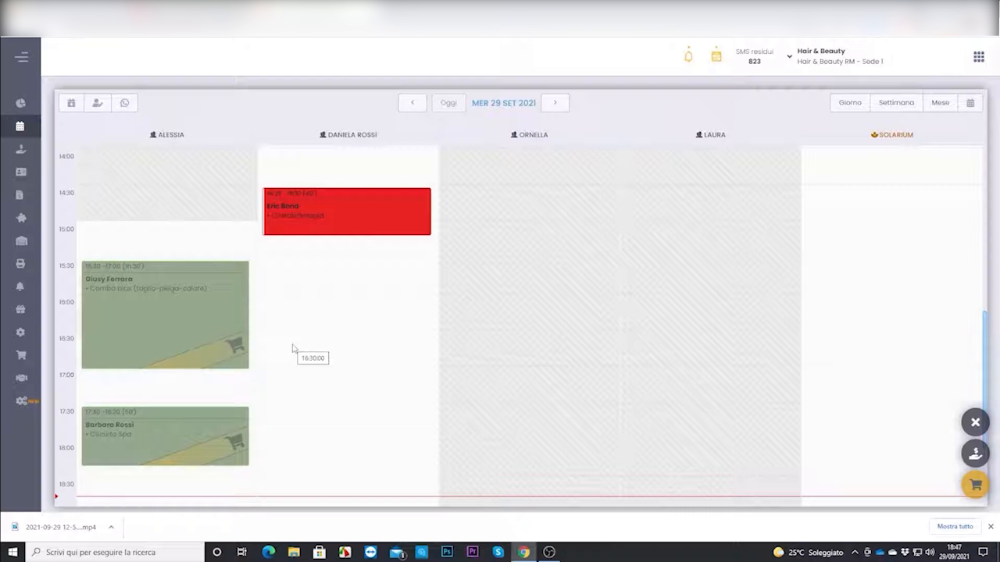
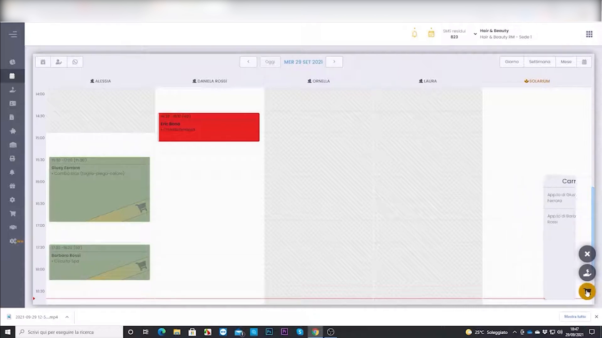

# Gestione carrello

Il carrello raccoglie tutto ciò che il cliente sta acquistando — trattamenti e prodotti — prima di procedere all'incasso in cassa. È lo strumento per gestire la vendita in un'unica operazione.

---

<video controls width="100%" style="border-radius:8px; margin-bottom:1.5rem;">
  <source src="../assets/resources/GESTIRE/incassi/30-Hyperbeauty_gestione_carrello.mp4" type="video/mp4">
  Il tuo browser non supporta il tag video.
</video>

---

## Aggiungere al carrello

Dall'agenda o dalla vendita si aggiungono trattamenti e prodotti al **carrello**, richiamabile in qualsiasi momento dall'apposita icona.

## Rivedere il carrello

Il pannello del carrello mostra gli articoli inseriti con quantità e importi, prima di passare alla cassa.

!!! tip "Vendita completa"
    Il carrello permette di unire servizio e retail (prodotti) nello stesso scontrino: è il momento ideale per proporre un prodotto abbinato al trattamento appena eseguito.

---

*Documento a cura di Custom S.p.a. — HyperBeauty Training Program — Versione 1.0 — Luglio 2026*
