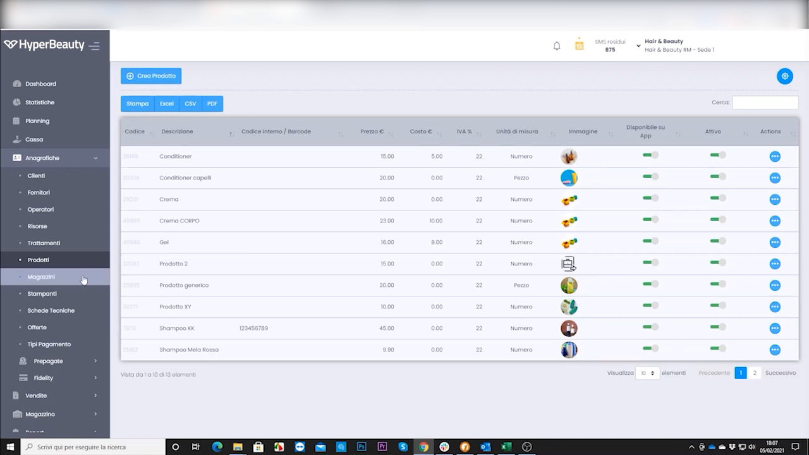
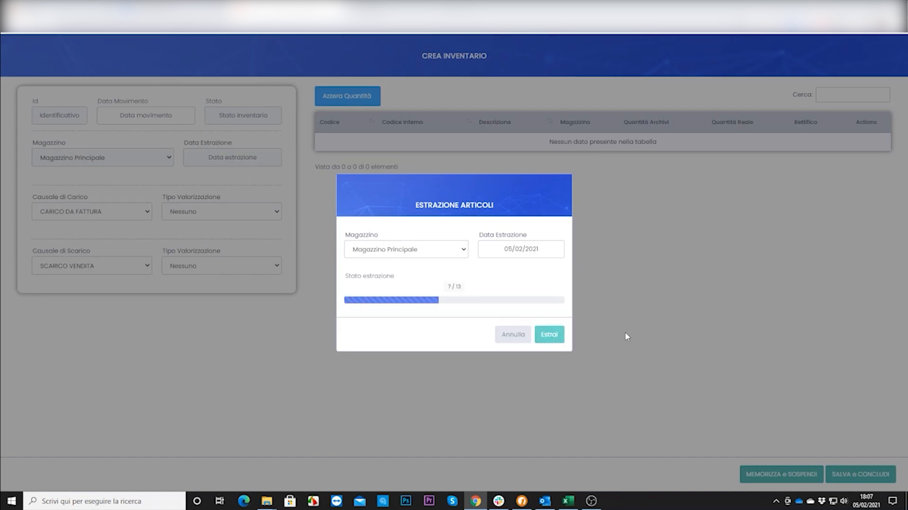
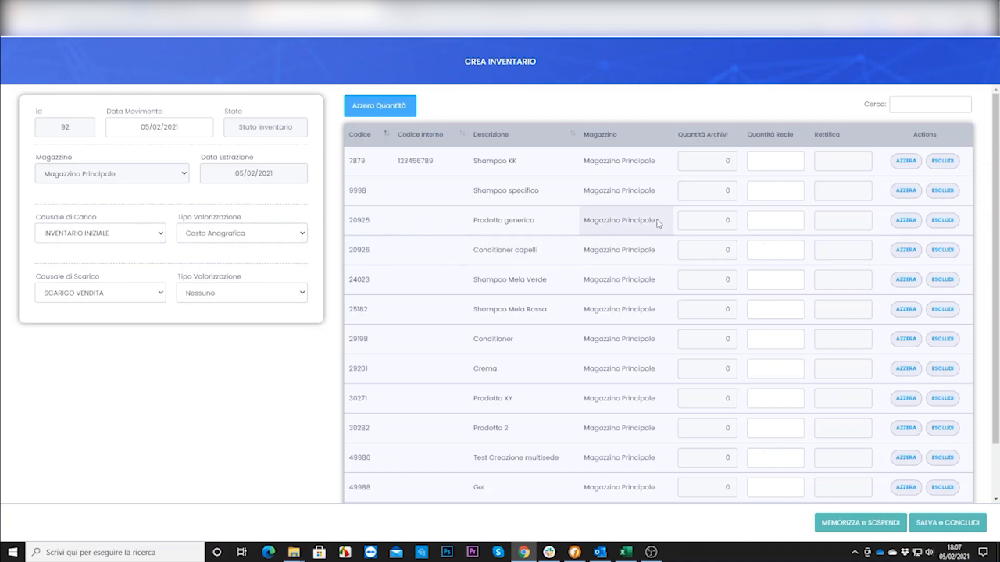
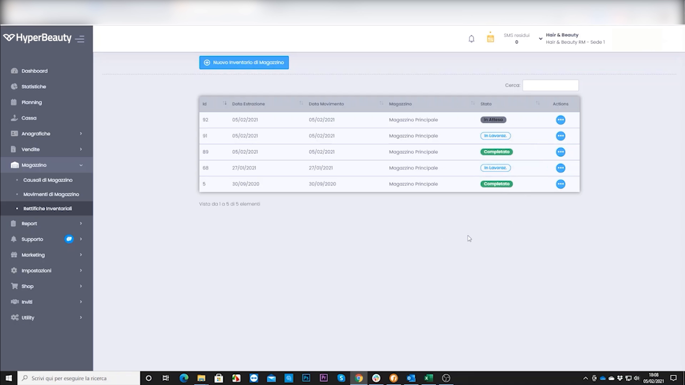
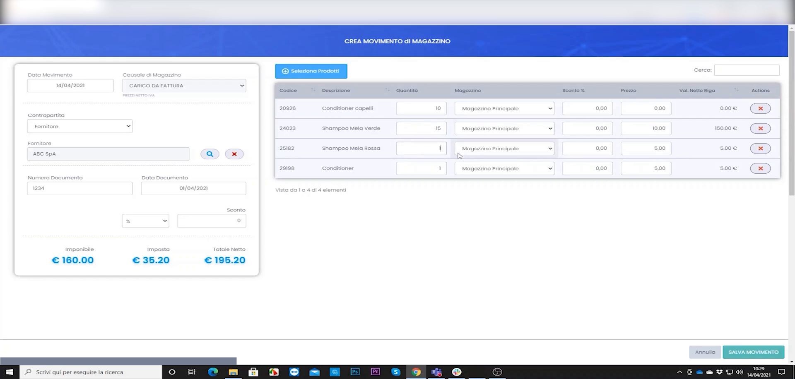
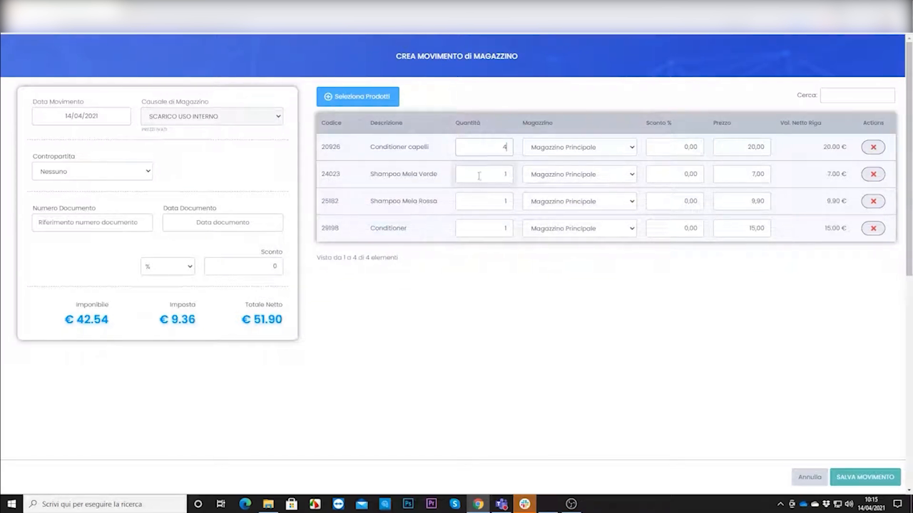

# Gestione Magazzino

Il magazzino di HyperBeauty permette di **monitorare le giacenze**, gestire carichi e scarichi e tenere sotto controllo i costi dei prodotti. Il punto di partenza è l'**inventario iniziale**, che allinea le quantità reali a quelle registrate a sistema.

---

<video controls width="100%" style="border-radius:8px; margin-bottom:1.5rem;">
  <source src="../assets/resources/GESTIRE/magazzino/gestione_magazzino.mp4" type="video/mp4">
  Il tuo browser non supporta il tag video.
</video>

---

## Prerequisito: prodotti con prezzo d'acquisto

Perché il magazzino funzioni correttamente, i prodotti devono essere già anagrafati e avere il **prezzo di acquisto** compilato (visto nel Webinar 1).

**Percorso:** Anagrafiche → Prodotti

!!! warning "Senza prezzo d'acquisto niente valorizzazione"
    Il prezzo di acquisto è la base per calcolare il valore di magazzino e la marginalità. Verificare che sia compilato prima di avviare l'inventario.

---

## L'inventario iniziale

**Percorso:** Magazzino → Movimenti → **Nuovo inventario**

Si crea un documento di inventario indicando il magazzino e la data; il sistema **estrae automaticamente l'elenco degli articoli** da conteggiare.

---

## Il conteggio: attesa, rilevata, rettifica

Nella tabella dell'inventario, per ogni articolo si confrontano tre valori:

| Colonna | Significato |
|---------|-------------|
| **Quantità Attesa** | Giacenza teorica registrata a sistema |
| **Quantità Rilevata** | Quantità realmente contata a scaffale |
| **Rettifica** | Differenza applicata per allineare il sistema alla realtà |

Si inseriscono le quantità rilevate; il sistema calcola la rettifica necessaria. A fine conteggio si può **Memorizzare a inventario** (salvare la bozza) oppure **Inviare a concludere** per rendere definitivo il documento.

---

## Movimenti di magazzino e stati

Ogni carico, scarico o inventario genera un **movimento** tracciato, consultabile nell'elenco dei movimenti.

Ogni riga riporta data, magazzino e **stato** del documento (es. *in sospeso* / *completato*), garantendo la tracciabilità di ogni operazione con data e operatore.

---

## Le funzionalità del magazzino

| Funzione | Descrizione |
|----------|-------------|
| **Giacenze in tempo reale** | Quantità attuale per ogni prodotto |
| **Carico manuale** | Registrare l'arrivo di nuova merce con quantità e prezzo di acquisto |
| **Scarico automatico** | A ogni vendita in cassa la giacenza si aggiorna da sola |
| **Soglia di riordino** | Livello minimo sotto il quale il sistema avvisa |
| **Storico movimenti** | Tracciabilità di ogni carico e scarico |

---

## Costi di gestione e ordini fornitori

Oltre al magazzino, il gestionale include una sezione **Costi di Gestione** per registrare le spese fisse e variabili del salone (affitto, utenze, forniture), integrate con i report di redditività. È inoltre possibile creare **ordini d'acquisto** da inviare direttamente al fornitore dal gestionale.

!!! tip "Spunto commerciale"
    *"Con il magazzino integrato non servi mai un cliente scoprendo troppo tardi che il prodotto è esaurito — il gestionale ti avvisa prima."* È anche un'ottima leva di upsell dal piano Advanced al piano Business.

---

## Riepilogo

| Passo | Azione |
|-------|--------|
| 1 | Verificare i prodotti anagrafati con prezzo d'acquisto |
| 2 | Creare il documento di inventario iniziale |
| 3 | Inserire le quantità rilevate e applicare le rettifiche |
| 4 | Memorizzare o concludere l'inventario |
| 5 | Consultare i movimenti e monitorare le giacenze |
| 6 | Impostare le soglie di riordino e usare costi/ordini fornitori |

---

## Carico da fattura d'acquisto

La merce in arrivo si registra creando un **movimento di carico** collegato alla fattura del fornitore: si inseriscono gli articoli con quantità e prezzo d'acquisto, aggiornando le giacenze.

<video controls width="100%" style="border-radius:8px; margin:1rem 0;">
  <source src="../assets/resources/GESTIRE/magazzino/23-Hyperbeauty_registrazione_fattura_acquisto_in_magazzino.mp4" type="video/mp4">
  Il tuo browser non supporta il tag video.
</video>

## Scarico per uso interno

I prodotti consumati internamente (non venduti) si registrano con un **movimento di scarico per uso interno**, così la giacenza resta sempre allineata alla realtà.

<video controls width="100%" style="border-radius:8px; margin:1rem 0;">
  <source src="../assets/resources/GESTIRE/magazzino/24-Hyperbeauty_scarico_prodotti_ad_uso_interno.mp4" type="video/mp4">
  Il tuo browser non supporta il tag video.
</video>

---

*Documento a cura di Custom S.p.a. — HyperBeauty Training Program — Versione 1.0 — Luglio 2026*
