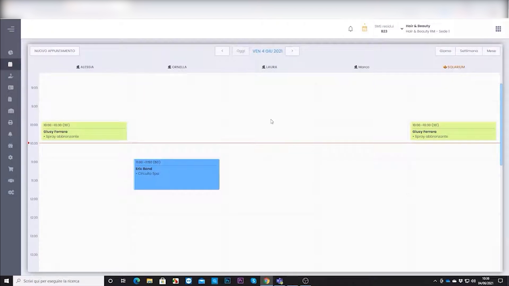
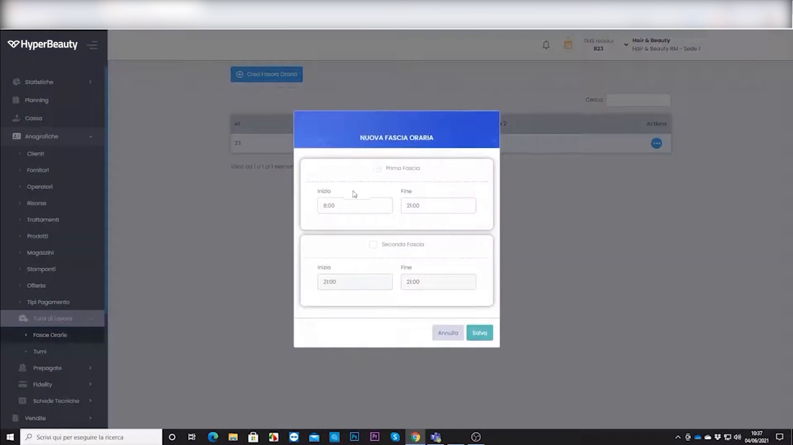
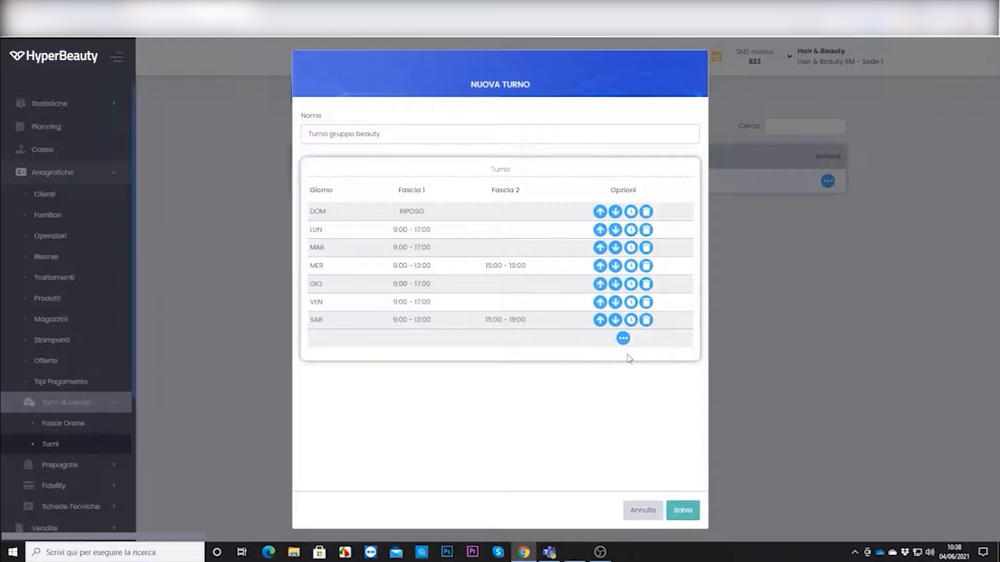
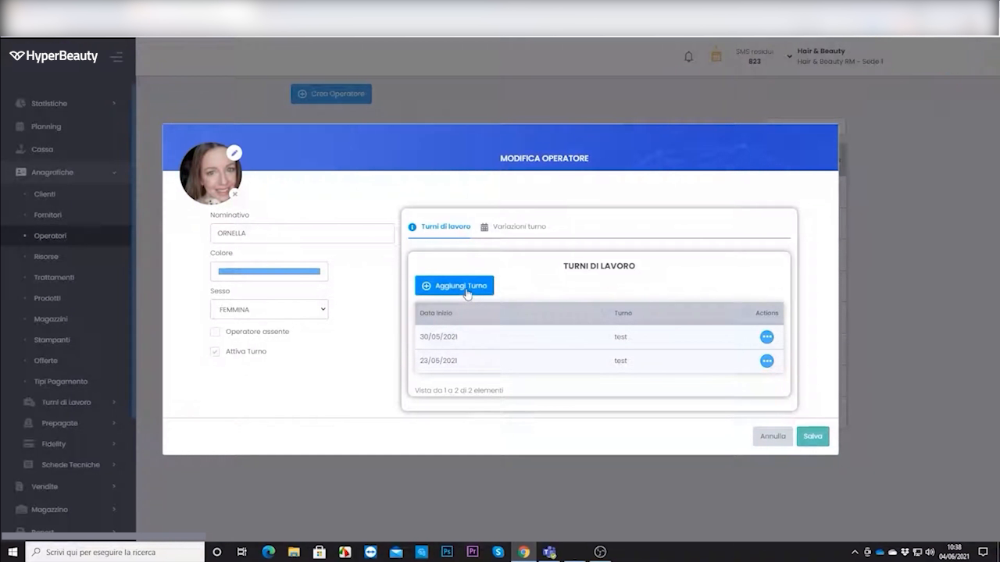
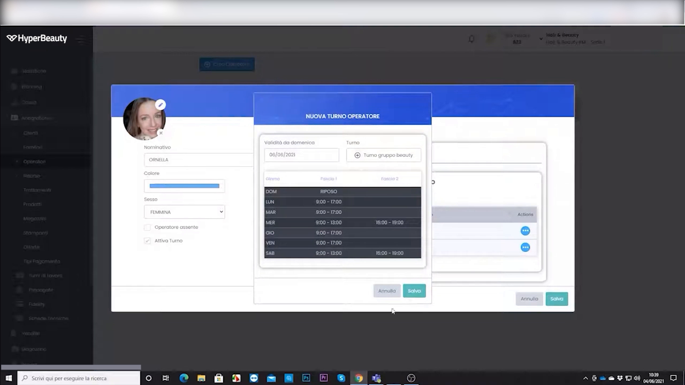
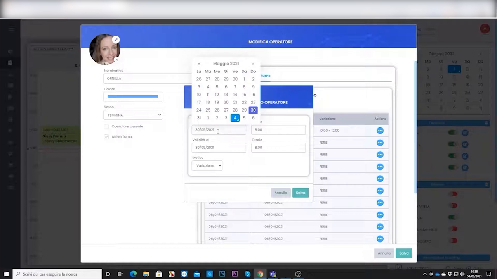
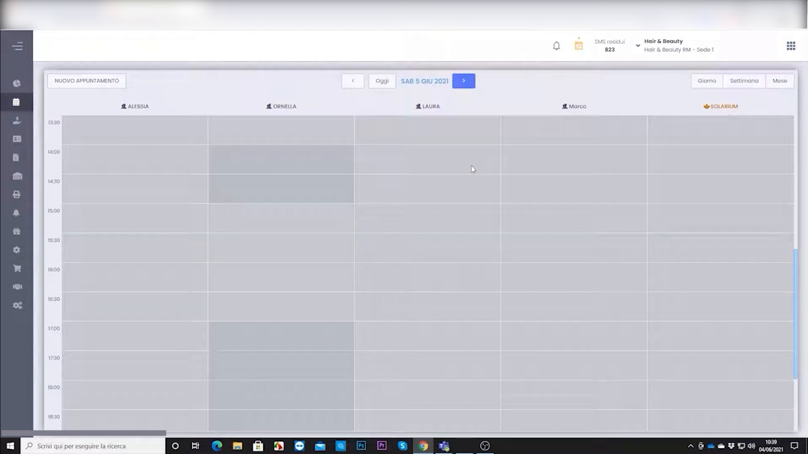
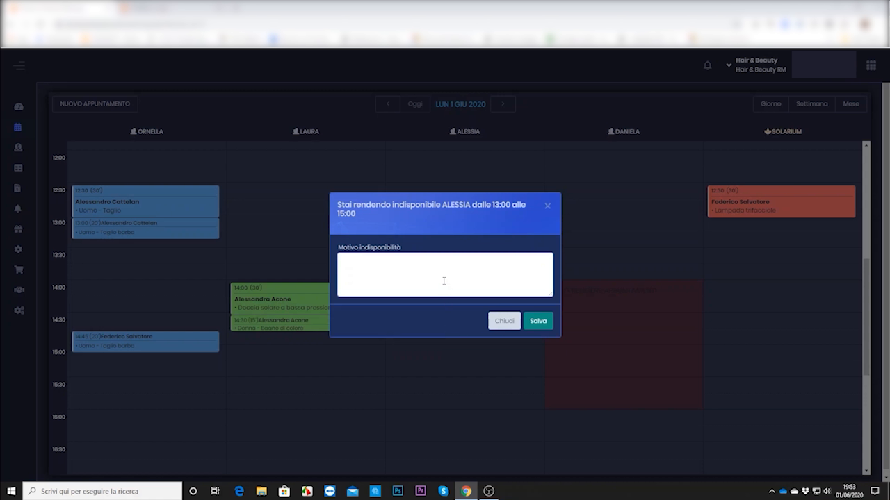

# Gestione Turni Operatori

La gestione turni serve a governare le **variazioni di orario** rispetto agli orari standard della sede: ferie, giornate corte, aperture straordinarie, turnazioni alternate. Ogni modifica si riflette immediatamente sull'agenda e sul motore di prenotazione online **BeWelly**.

---

<video controls width="100%" style="border-radius:8px; margin-bottom:1.5rem;">
  <source src="../assets/resources/GESTIRE/turni/gestione_turni.mp4" type="video/mp4">
  Il tuo browser non supporta il tag video.
</video>

---

## Il punto di partenza: l'agenda

L'agenda mostra gli operatori come **colonne**, ciascuno con i propri orari di lavoro. Le fasce in cui un operatore non lavora appaiono in grigio e non sono prenotabili.

**Percorso principale:** Anagrafiche → Operatori → *(seleziona operatore)* → **Turni** — oppure, dalla vista agenda, cliccando sull'operatore.

---

## Le fasce orarie di lavoro

L'unità di base del turno è la **fascia oraria**. Ogni giornata può avere una o due fasce (mattina e pomeriggio), per gestire anche i turni spezzati.

Per ogni fascia si imposta **ora di inizio** e **ora di fine**. Attivando la seconda fascia si configura il turno pomeridiano.

---

## Creare un turno "settimana tipo"

Per non reimpostare gli orari giorno per giorno, HyperBeauty consente di definire un **turno tipo** riutilizzabile: uno schema settimanale con le fasce per ciascun giorno.

Nella griglia si compila, per ogni giorno (Lun → Dom), la **Fascia 1** e l'eventuale **Fascia 2**. Lo schema può essere assegnato a più operatori.

---

## Assegnare i turni al singolo operatore

Dalla scheda operatore, il tab **Turni di Lavoro** raccoglie tutti i turni assegnati con il rispettivo periodo di validità.

Con **+ Aggiungi Turno** si assegna un nuovo turno all'operatore, indicando la **validità (dal / al)** e lo schema di fasce da applicare.

!!! tip "Turnazioni alternate"
    Per gli operatori con settimane alternate (una settimana mattina, una pomeriggio) si creano due schemi tipo diversi e si assegnano su periodi consecutivi.

---

## Eccezioni su date specifiche

Ferie, giornate corte o presenze straordinarie si gestiscono come **eccezioni** su date puntuali, senza toccare il turno standard.

Casistiche tipiche:

| Caso | Come si gestisce |
|------|------------------|
| **Giornata di ferie** | Bloccare un giorno specifico per l'operatore |
| **Venerdì corto** | Modificare orario di inizio/fine per una data |
| **Apertura sabato extra** | Aggiungere disponibilità oltre l'orario standard |
| **Turnazione complessa** | Configurare settimane tipo differenziate |

---

## Come appaiono i turni in agenda

Le fasce non lavorative dell'operatore compaiono **in grigio** nell'agenda: in quelle ore non è possibile fissare appuntamenti, né dal salone né online.

!!! warning "Integrazione con la prenotazione online BeWelly"
    Le modifiche ai turni si propagano automaticamente a **BeWelly**: se un operatore è in ferie nel gestionale, il cliente non potrà prenotarlo online in quei giorni. È la dimostrazione più efficace dell'integrazione agenda ↔ prenotazione online — impostare una settimana di ferie e verificare che l'agenda online non mostri più quella disponibilità.

!!! note "Orari operatore vs orari sede"
    Gli orari dell'operatore definiscono la disponibilità **all'interno** della finestra oraria della sede. Un operatore non può risultare disponibile quando la sede è chiusa.

---

## Riepilogo

| Passo | Azione |
|-------|--------|
| 1 | Definire le fasce orarie di lavoro (mattina / pomeriggio) |
| 2 | Creare uno o più turni "settimana tipo" |
| 3 | Assegnare i turni all'operatore con periodo di validità |
| 4 | Gestire ferie e variazioni come eccezioni su date specifiche |
| 5 | Verificare in agenda le fasce grigie non prenotabili |
| 6 | Controllare la ricaduta sulla disponibilità BeWelly |

---

## Eccezione rapida

Per una variazione veloce su una singola giornata (senza creare un turno tipo) si usa l'**eccezione rapida** direttamente dall'agenda.

<video controls width="100%" style="border-radius:8px; margin:1rem 0;">
  <source src="../assets/resources/GESTIRE/turni/04-Hyperbeauty_eccezione_rapida.mp4" type="video/mp4">
  Il tuo browser non supporta il tag video.
</video>

---

*Documento a cura di Custom S.p.a. — HyperBeauty Training Program — Versione 1.0 — Luglio 2026*
