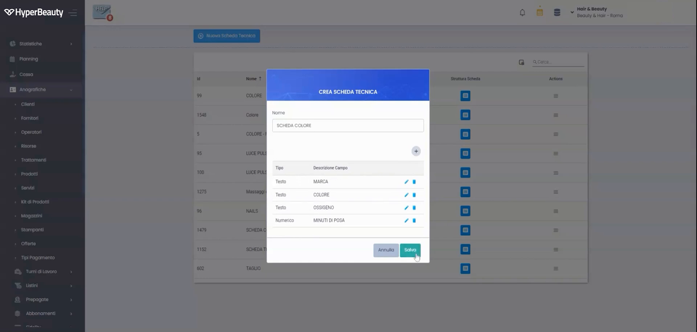
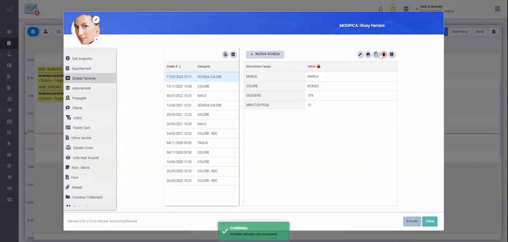

# Listino & Schede Tecniche

Il listino raccoglie i tuoi trattamenti con prezzi e durate. Le **schede tecniche** salvano i dettagli di esecuzione di un servizio (es. formula colore) per ripeterlo identico ogni volta.

---

<video controls width="100%" style="border-radius:8px; margin-bottom:1.5rem;">
  <source src="../assets/resources/GESTIRE/listino/06-Hyperbeauty_gestione_schede_tecniche.mp4" type="video/mp4">
  Il tuo browser non supporta il tag video.
</video>

---

## Passo 1 — Crea la scheda tecnica

Apri la gestione **schede tecniche** e crea una nuova scheda: inserisci i parametri del servizio (prodotti, dosi, tempi).

## Passo 2 — Associala al trattamento o al cliente

Collega la scheda al trattamento (o al singolo cliente), così ogni operatore la ritrova pronta.

!!! tip "Stesso risultato, sempre"
    Con le schede tecniche il cliente riceve lo stesso servizio anche se cambia l'operatore: è un forte elemento di fidelizzazione.

---

*Documento a cura di Custom S.p.a. — HyperBeauty Training Program — Versione 1.0 — Luglio 2026*
