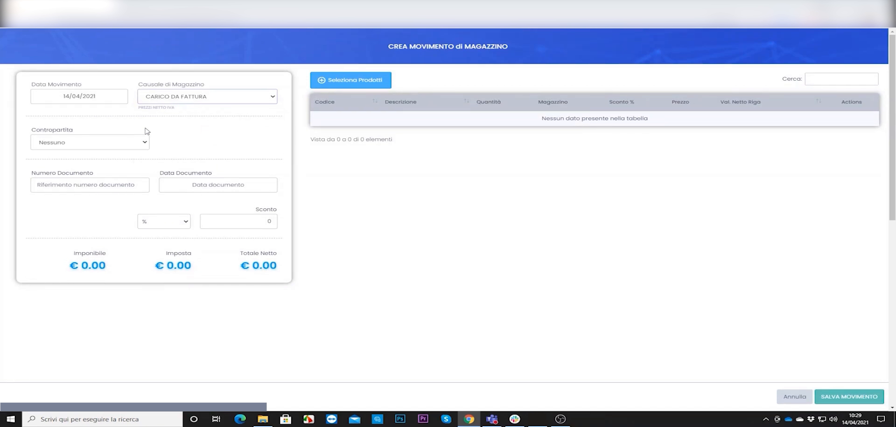
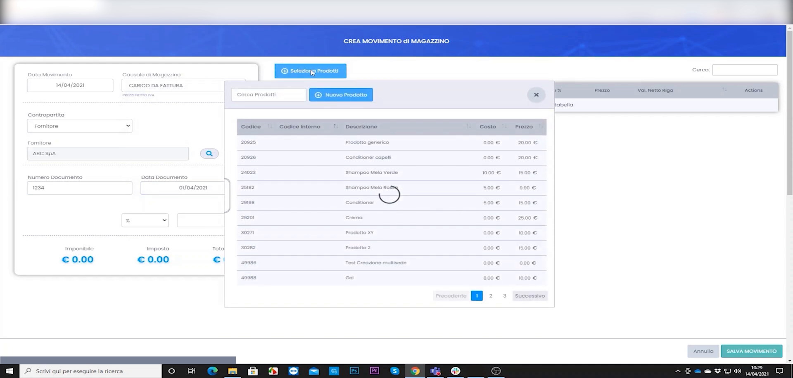
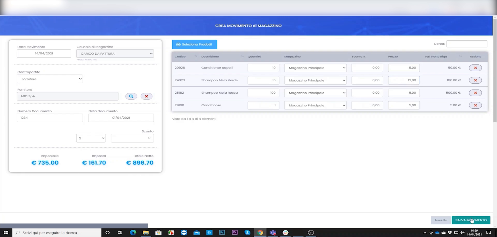

# Carico merce da fattura d'acquisto

Quando arriva merce dal fornitore devi **caricarla in magazzino**, così le giacenze aumentano e il sistema conosce il costo dei prodotti. Ecco come fare, passo per passo.

---

<video controls width="100%" style="border-radius:8px; margin-bottom:1.5rem;">
  <source src="../assets/resources/GESTIRE/magazzino/23-Hyperbeauty_registrazione_fattura_acquisto_in_magazzino.mp4" type="video/mp4">
  Il tuo browser non supporta il tag video.
</video>

---

## Passo 1 — Crea un nuovo movimento di carico

Vai su **Magazzino → Movimenti** e clicca su **Crea movimento di magazzino**. In alto scegli la **causale di carico** (es. "Acquisto da fornitore"), il **magazzino** di destinazione e il **fornitore**.

## Passo 2 — Aggiungi i prodotti della fattura

Clicca su **Seleziona prodotti** e scegli dall'elenco gli articoli presenti nella fattura. Puoi cercarli per nome o codice.

## Passo 3 — Inserisci quantità e prezzi, poi conferma

Per ogni prodotto indica la **quantità** ricevuta e il **prezzo di acquisto**. In basso il sistema calcola i **totali** (imponibile, IVA, totale). Controlla che corrispondano alla fattura e **conferma**.

!!! tip "Perché conviene farlo sempre"
    Registrare i carichi tiene le giacenze reali e permette al gestionale di calcolare il **margine** su ogni vendita (prezzo di vendita − costo d'acquisto).

!!! note "Suggerimento pratico"
    Prendi l'abitudine di caricare la merce **nel momento in cui arriva**, con la fattura davanti: eviti di dimenticare articoli e i numeri restano sempre corretti.

---

*Documento a cura di Custom S.p.a. — HyperBeauty Training Program — Versione 1.0 — Luglio 2026*
