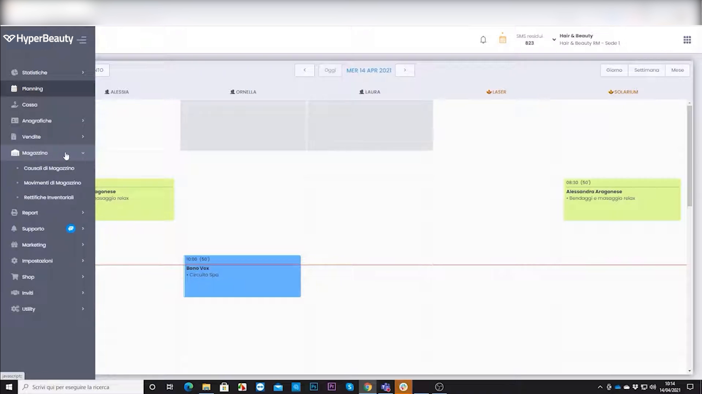
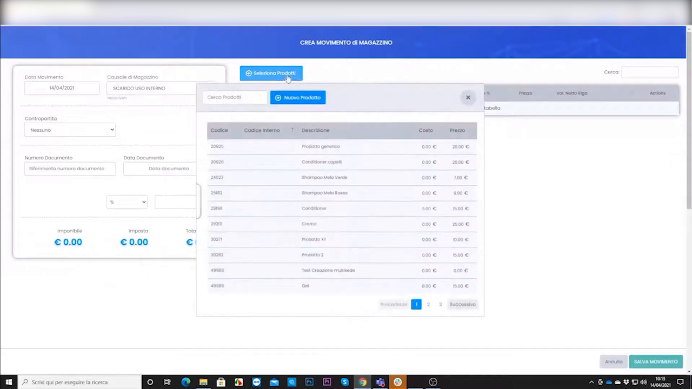
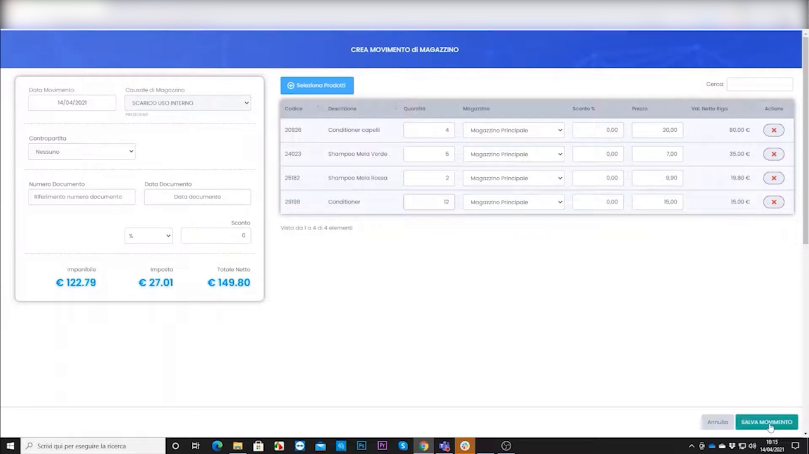

# Scarico prodotti ad uso interno

A volte usi dei prodotti **senza venderli** (es. una tinta usata durante un servizio, un campione, un consumo interno). Per tenere le giacenze corrette devi **scaricarli** dal magazzino. Ecco come.

---

<video controls width="100%" style="border-radius:8px; margin-bottom:1.5rem;">
  <source src="../assets/resources/GESTIRE/magazzino/24-Hyperbeauty_scarico_prodotti_ad_uso_interno.mp4" type="video/mp4">
  Il tuo browser non supporta il tag video.
</video>

---

## Passo 1 — Vai nei movimenti di magazzino

Dal menu a sinistra apri **Magazzino → Movimenti di magazzino**.

## Passo 2 — Crea un movimento di scarico e scegli i prodotti

Clicca su **Crea movimento**, imposta la **causale di scarico** "Uso interno", poi con **Seleziona prodotti** scegli gli articoli consumati.

## Passo 3 — Indica le quantità e conferma

Inserisci la **quantità** usata per ciascun prodotto e **conferma**. La giacenza scende immediatamente della quantità indicata.

!!! tip "Perché è importante"
    Registrare i consumi interni evita che le giacenze risultino più alte del reale. Così l'avviso di **sotto scorta** arriva al momento giusto e non rimani mai senza prodotto.

---

*Documento a cura di Custom S.p.a. — HyperBeauty Training Program — Versione 1.0 — Luglio 2026*
