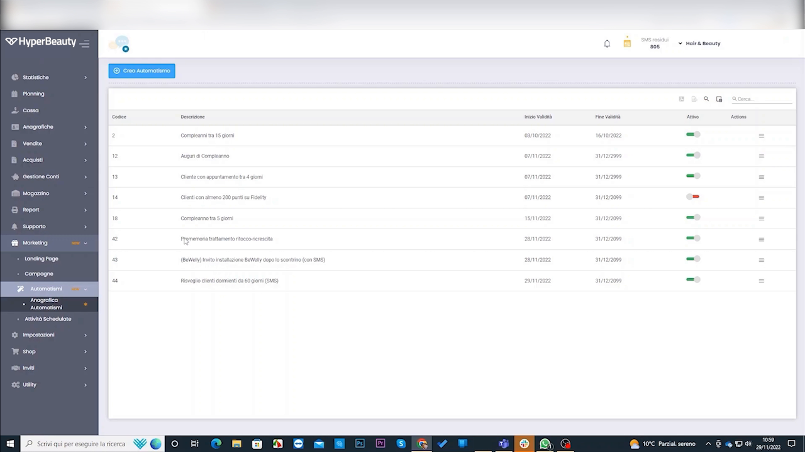
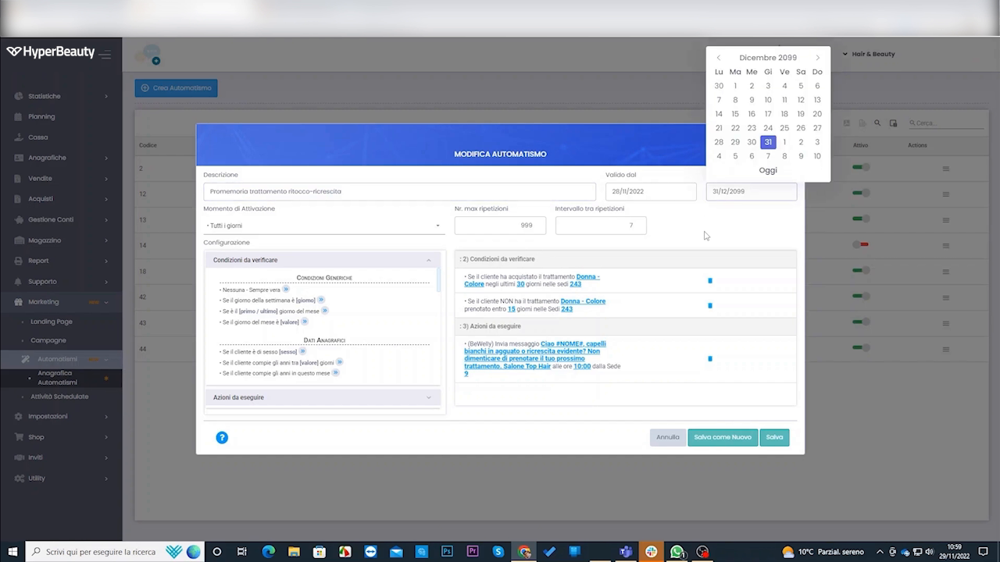
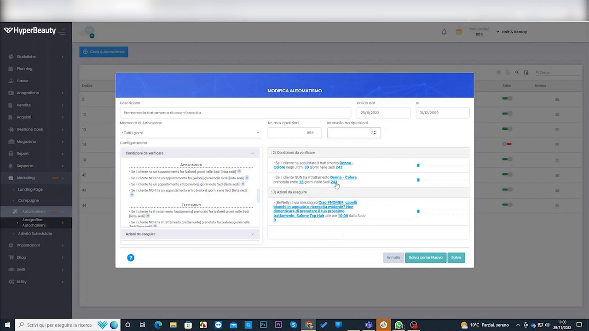
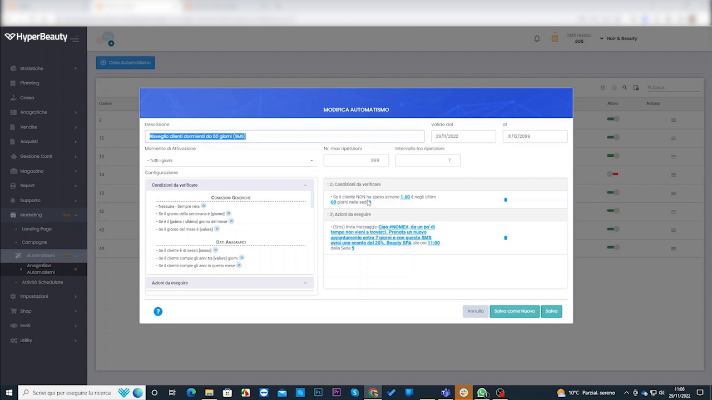
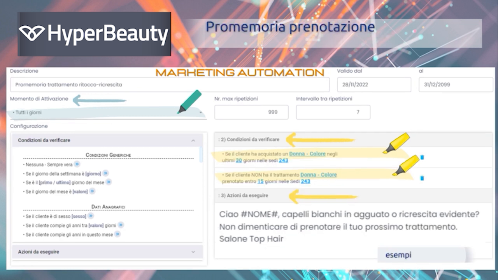

# Marketing Automation

Le automazioni sono l'**assistente virtuale** del salone: lavorano anche a serranda abbassata. La regola è semplice: **SE** accade una cosa, **ALLORA** parte un messaggio. Vediamo come crearle.

---

<video controls width="100%" style="border-radius:8px; margin-bottom:1.5rem;">
  <source src="../assets/resources/AUTOMATIZZARE/marketing_automation.mp4" type="video/mp4">
  Il tuo browser non supporta il tag video.
</video>

!!! quote "Luigi Novi"
    *"Nessun competitor ce l'ha così spinto."*

---

## Passo 1 — Apri le automazioni

Vai su **Marketing → Automazioni**: vedi l'elenco delle automazioni attive, con validità e stato (attiva/disattiva).

## Passo 2 — Crea una nuova automazione

Clicca **Crea Automazione**. Imposta il **momento di attivazione** e il **periodo di validità**.

## Passo 3 — Definisci "SE" e "ALLORA"

Nell'editor compili due colonne: a sinistra le **Condizioni da verificare** (il "SE"), a destra le **Azioni da eseguire** (l'"ALLORA", di solito un messaggio con campi dinamici come il nome cliente).

## Esempi pronti all'uso

| Automazione | Regola |
|-------------|--------|
| **Cliente inattivo** | Non prenota da 60 giorni → *"Ciao [nome], ti aspettiamo! 10% di sconto se prenoti entro la settimana."* |
| **Dopo la prima visita** | Nuovo cliente → dopo 3 giorni *"Come stai? Quando vuoi tornare?"* |
| **Abbonamento in scadenza** | Meno di 2 sedute residue → promemoria di rinnovo |
| **Compleanno** | Sequenza: 3 giorni prima → il giorno → 3 giorni dopo se non ha prenotato |
| **Cross-selling** | Solo manicure negli ultimi 3 mesi → proponi un trattamento viso |

---

## Risvegliare i clienti dormienti

L'automazione più redditizia: intercettare i **clienti inattivi** e riportarli in salone.

<video controls width="100%" style="border-radius:8px; margin:1rem 0;">
  <source src="../assets/resources/AUTOMATIZZARE/47-Hyperbeauty_risveglia_i_clienti_dormienti_con_gli_automatismi.mp4" type="video/mp4">
  Il tuo browser non supporta il tag video.
</video>

## Suggerimenti pratici

Alcuni esempi e best practice per automazioni efficaci (promemoria prenotazione, invito alla recensione).

<video controls width="100%" style="border-radius:8px; margin:1rem 0;">
  <source src="../assets/resources/AUTOMATIZZARE/50-Hyperbeauty_alcuni_suggerimenti_su_gli_automatismi.mp4" type="video/mp4">
  Il tuo browser non supporta il tag video.
</video>

---

## Misura i risultati

Ogni automazione mostra quanti messaggi sono stati **inviati, aperti e cliccati**: così sai cosa funziona.

!!! quote "La frase di chiusura del corso"
    *"Il gestionale continua a lavorare per voi anche quando siete chiusi."*

---

*Documento a cura di Custom S.p.a. — HyperBeauty Training Program — Versione 1.0 — Luglio 2026*
