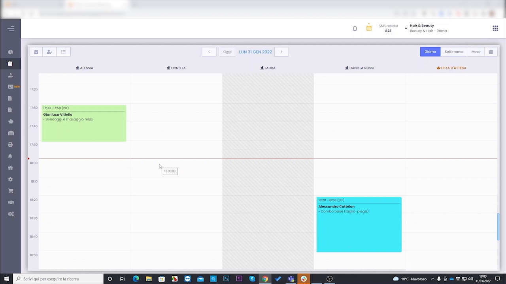
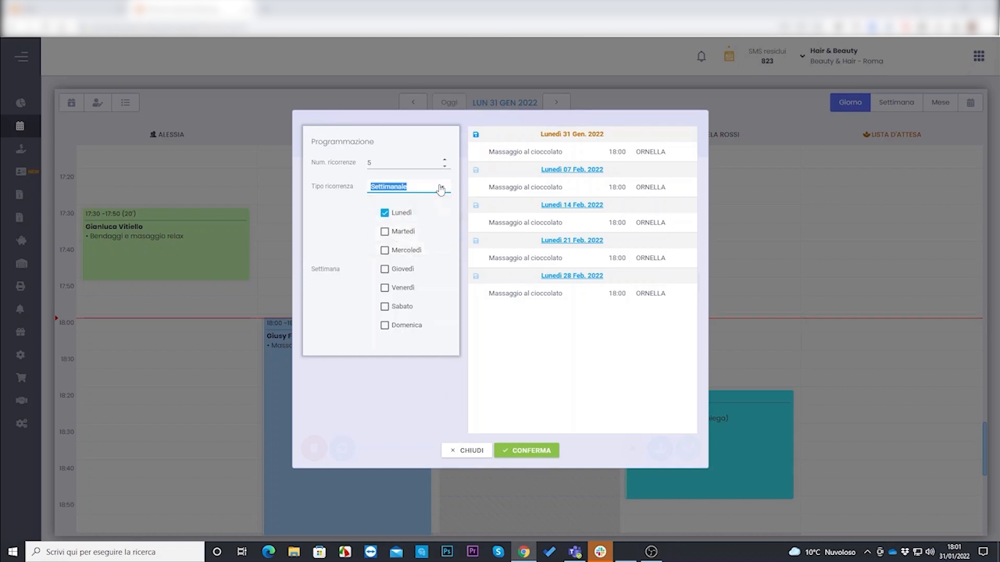
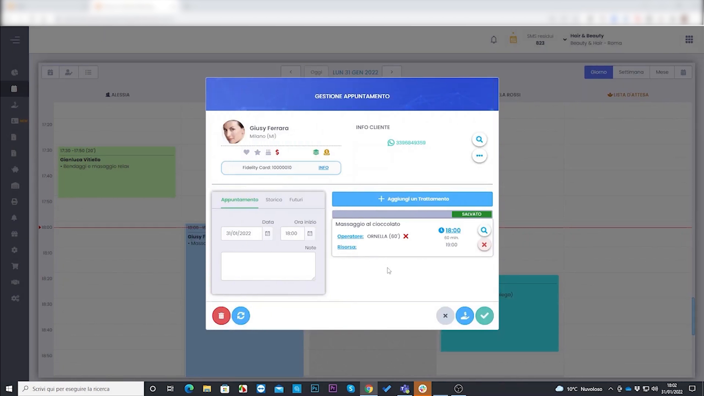

# Planning avanzato & ottimizzazione agenda

L'agenda di HyperBeauty non è solo uno strumento operativo, ma uno **strumento strategico**. In questo modulo vediamo le tecniche avanzate per ottimizzare il planning: appuntamenti ricorrenti, lista d'attesa, blocchi e spostamenti rapidi.

---

<video controls width="100%" style="border-radius:8px; margin-bottom:1.5rem;">
  <source src="../assets/resources/planning_avanzato.mp4" type="video/mp4">
  Il tuo browser non supporta il tag video.
</video>

---

## Il planning come strumento strategico

L'agenda mostra operatori, disponibilità e appuntamenti. Le fasce non lavorative appaiono in grigio e non sono prenotabili.

---

## Appuntamenti ricorrenti

Per i clienti con cadenza fissa (piega ogni 15 giorni, trattamento mensile) è possibile programmare un appuntamento che **si ripete automaticamente ogni X settimane**.

Dall'appuntamento si accede alla programmazione ricorrente.

Si imposta il **numero di ricorrenze**, il **tipo** (es. settimanale) e i **giorni della settimana**; il sistema genera automaticamente l'elenco delle date.

Il pannello propone l'anteprima di tutte le occorrenze generate, che si confermano in un'unica operazione.

!!! tip "Fidelizzazione automatica"
    Programmare la serie di appuntamenti significa che il cliente esce dal salone con i prossimi X appuntamenti già fissati: è uno degli strumenti di fidelizzazione più semplici ed efficaci.

---

## L'appuntamento in dettaglio

Ogni appuntamento raccoglie cliente, trattamenti, operatore e note. Da qui si gestiscono anche gli appuntamenti della serie ricorrente.

---

## Altre tecniche di ottimizzazione

| Funzione | A cosa serve |
|----------|--------------|
| **Lista d'attesa** | Se uno slot è occupato, si aggiunge il cliente alla lista. Se si libera un posto (cancellazione), il gestionale avvisa automaticamente i clienti in lista |
| **Blocchi in agenda** | Bloccare un orario per motivi non legati a un cliente (pausa pranzo, riunione, chiusura straordinaria): appare come slot non prenotabile |
| **Drag & drop** | Spostare un appuntamento trascinandolo nell'agenda |
| **Prenotazione online (BeWelly)** | Il cliente prenota da solo dallo smartphone; la prenotazione confluisce in agenda senza intervento dello staff (vedi pagina dedicata) |

!!! note "Perché i saloni passano ad Advanced"
    La prenotazione online è spesso il primo motivo per cui un salone vuole passare da Essential ad Advanced: elimina gran parte delle telefonate di prenotazione e libera tempo allo staff.

---

*Documento a cura di Custom S.p.a. — HyperBeauty Training Program — Versione 1.0 — Luglio 2026*
