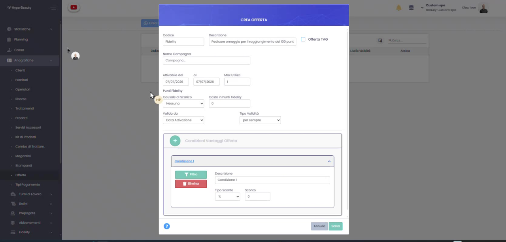
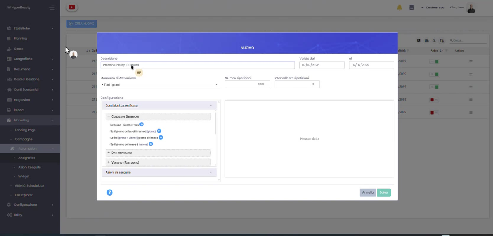
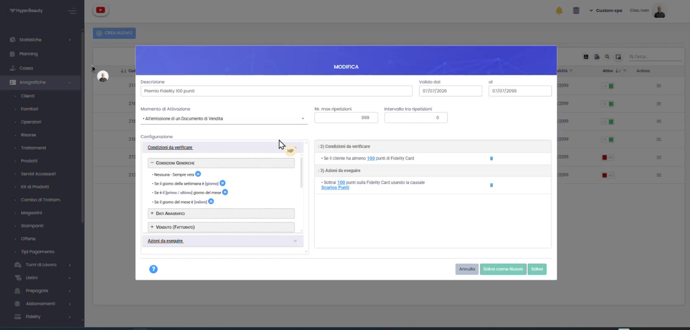
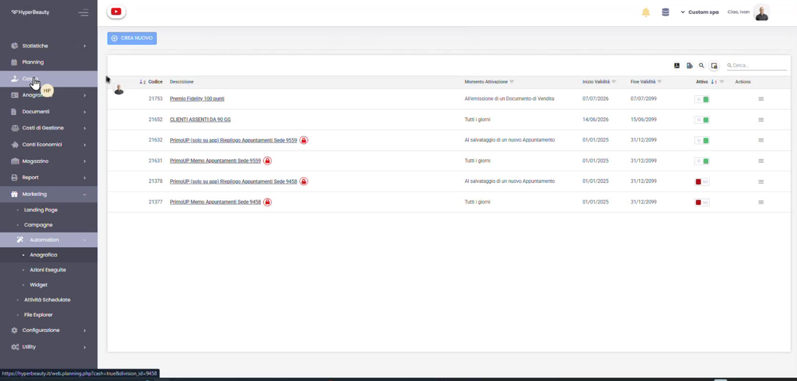

# Premio Fedeltà al Raggiungimento dei Punti

Con la fidelity card il cliente accumula punti (vedi [Fidelity Card](fidelity_card.md)); il passo successivo è **trasformarli in un premio automatico**. In questo esempio impostiamo un premio che scatta al **raggiungimento di 100 punti**: una **pedicure in omaggio**, riconosciuta dal sistema senza alcun lavoro dello staff.

Il meccanismo è in due parti: prima si definisce **il premio** (un'offerta), poi si crea **l'automazione** che controlla i punti e lo applica.

---

## Passo 1 — Prepara il premio

In **Anagrafiche → Offerte** clicca **Crea Offerta**. Dai un **Codice** (es. *Fidelity*) e una **Descrizione** chiara — nell'esempio *"Pedicure omaggio per il raggiungimento dei 100 punti"* — imposta la **validità** e, nelle **Condizioni Vantaggi Offerta**, il vantaggio da riconoscere (es. sconto 100% sul trattamento). Salva.

!!! info "Il premio è un'offerta"
    Definendo il premio come offerta puoi decidere con precisione il vantaggio (omaggio, sconto, prodotto) e le sue regole di validità.

## Passo 2 — Crea l'automazione

Vai su **Marketing → Automation** e clicca **Crea Nuovo**. Inserisci la **Descrizione** (*"Premio Fidelity 100 punti"*), il periodo **Valido dal / al**, il **Momento di Attivazione** (es. *All'emissione di un Documento di Vendita*) e, se vuoi, un limite con **Nr. max ripetizioni** e **Intervallo tra ripetizioni**.

## Passo 3 — Imposta condizione e azione

Nella **Configurazione** definisci quando e cosa deve fare l'automazione:

Come **condizione da verificare** scegli *"Se il cliente ha almeno 100 punti di Fidelity Card"*. Come **azione da eseguire** imposta *"Sottrai 100 punti sulla Fidelity Card"* (causale *Scarico Punti*) e collega il premio preparato al Passo 1. Poi premi **Salva**.

!!! tip "Come leggerla"
    "Quando emetto un documento di vendita, **se** il cliente ha almeno 100 punti, **allora** scalo 100 punti e gli riconosco il premio." La regola si imposta una volta sola e vale per tutti i clienti.

## Passo 4 — Premio attivo

Salvata l'automazione, il premio risulta **creato correttamente** e compare nell'elenco di **Marketing → Automation** come **Attivo**: la riga *"Premio Fidelity 100 punti"* mostra il momento di attivazione e la validità. Da ora il sistema riconosce da solo i clienti che raggiungono la soglia e applica il premio.

!!! success "Configurazione completata"
    Il premio fedeltà è operativo: nessun intervento manuale alla cassa, il controllo dei punti e l'applicazione del premio avvengono in automatico.

---

## In sintesi

| Elemento | Dove | Cosa fa |
|----------|------|---------|
| **Offerta** | Anagrafiche → Offerte | Definisce il premio (es. pedicure omaggio) |
| **Automazione** | Marketing → Automation | Controlla i punti e applica il premio |
| **Condizione** | Configurazione automazione | Almeno 100 punti sulla Fidelity Card |
| **Azione** | Configurazione automazione | Scala 100 punti e riconosce il premio |

Vedi anche [Fidelity Card](fidelity_card.md) e [Marketing Automation](marketing_automation.md).

---

*Documento a cura di Custom S.p.a. — HyperBeauty Training Program — Versione 1.0 — Luglio 2026*
