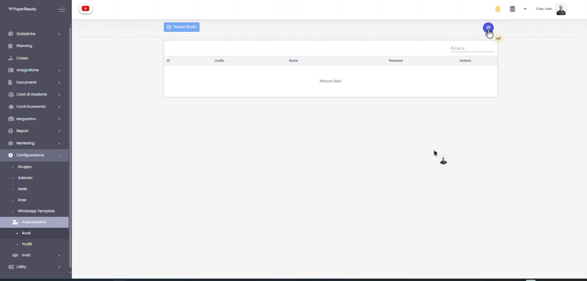
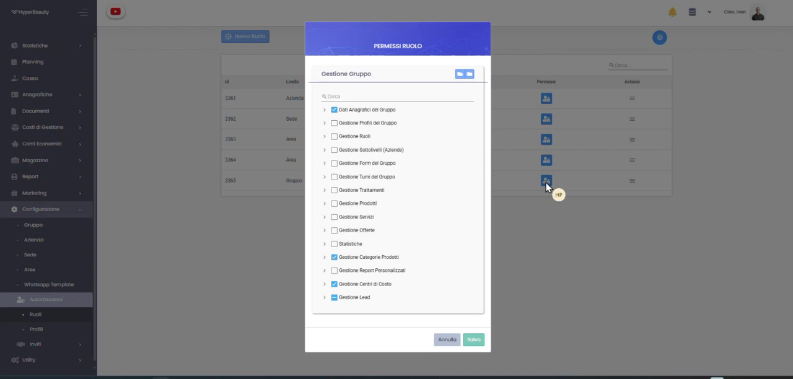
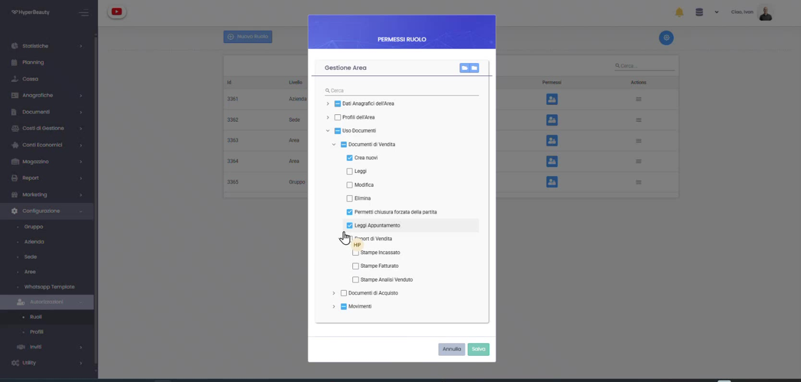
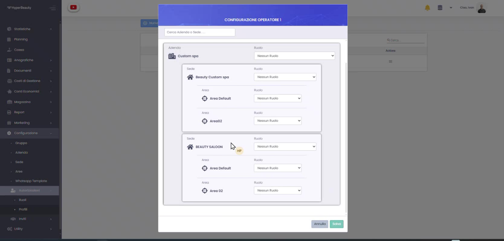

# Profili e Ruoli

I profili e i ruoli definiscono **chi può fare cosa** all'interno di HyperBeauty: assegnando a ciascun operatore un ruolo, si controlla l'accesso alle diverse aree del gestionale (agenda, cassa, documenti, report, impostazioni).

Il funzionamento è in due tempi: prima si crea un **Ruolo** (un insieme di permessi), poi si crea un **Profilo** che collega l'operatore ai ruoli sui vari livelli dell'organizzazione. Tutto si gestisce da **Configurazione → Autorizzazioni**.

---

## A cosa servono

Un **Ruolo** è il set di permessi che abilita o limita le funzioni visibili (es. Titolare, Reception, Operatore). Un **Profilo** è l'associazione tra l'operatore e i ruoli, definita per ogni Azienda, Sede e Area.

!!! tip "Perché è importante"
    Assegnare ruoli corretti semplifica l'uso quotidiano — ogni operatore vede solo ciò che gli serve — e mantiene ordinati dati e documenti, mostrando a ciascuno l'ambito di sua competenza.

---

## Passo 1 — Crea un nuovo Ruolo

Vai su **Configurazione → Autorizzazioni → Ruoli** e clicca **Nuovo Ruolo**. L'elenco mostra i ruoli esistenti con **Id, Livello, Nome e Permessi**.

!!! info "Il livello del ruolo"
    Ogni ruolo è definito su un **livello** dell'organizzazione — **Gruppo, Azienda, Sede o Area** — così i permessi si applicano esattamente all'ambito desiderato.

## Passo 2 — Scegli i permessi per categoria

Nella finestra **Permessi Ruolo** attivi o disattivi i permessi raggruppati per **categoria**: dati anagrafici, gestione profili e ruoli, trattamenti, prodotti, servizi, offerte, statistiche, report personalizzati, centri di costo e altro. Ti basta spuntare le voci che il ruolo deve poter usare.

## Passo 3 — Regola i permessi di dettaglio

Ogni categoria si espande in **permessi granulari**. Per l'**Uso Documenti**, ad esempio, puoi decidere per i documenti di vendita e di acquisto se il ruolo può **Creare, Leggere, Modificare o Eliminare**, oltre alla **visibilità dei preventivi** e delle stampe/report. È così che stabilisci con precisione cosa ciascun ruolo vede e può fare.

!!! tip "Suggerimento"
    Usa il campo **Cerca** in alto nella finestra per trovare velocemente un permesso senza scorrere tutto l'albero.

## Passo 4 — Crea il Profilo e assegna i ruoli

Passa a **Configurazione → Autorizzazioni → Profili**. Nella **Configurazione Operatore** scegli, per ogni **Azienda, Sede e Area**, il **Ruolo** da applicare tramite gli appositi menu a tendina, poi premi **Salva**. In questo modo l'operatore erediterà i permessi giusti su ciascun livello.

!!! info "Ruoli diversi su livelli diversi"
    Uno stesso operatore può avere un ruolo su una sede e un ruolo differente su un'altra: basta impostare il menu **Ruolo** riga per riga.

---

*Documento a cura di Custom S.p.a. — HyperBeauty Training Program — Versione 1.0 — Luglio 2026*
