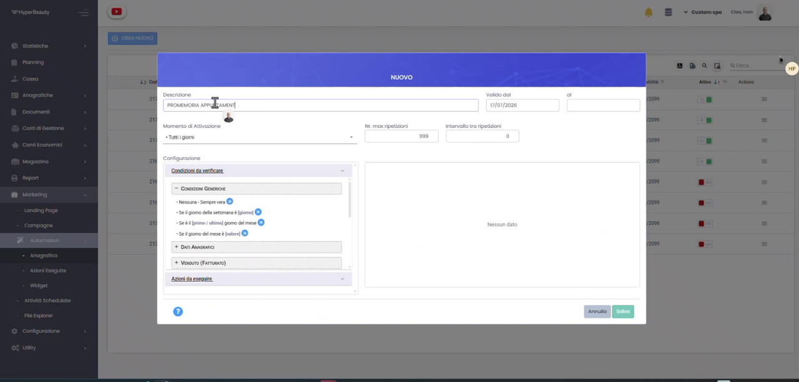
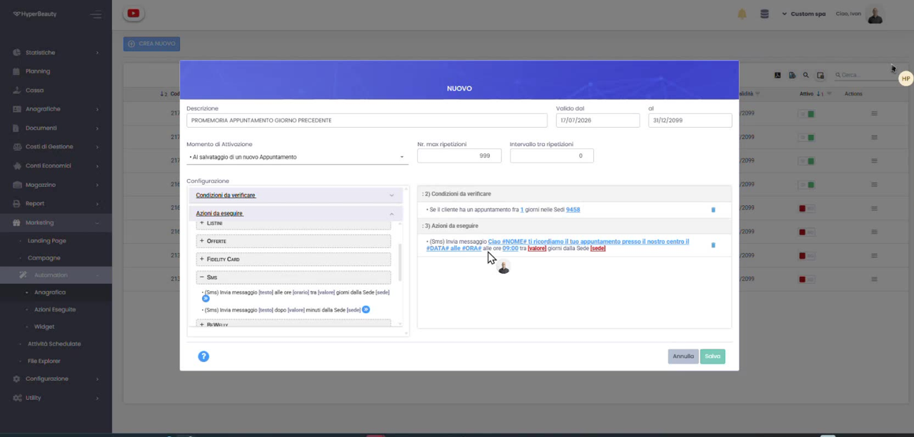

# Promemoria SMS Appuntamento

Il **promemoria SMS il giorno prima dell'appuntamento** riduce i mancati arrivi: il sistema controlla gli appuntamenti e invia da solo l'SMS al cliente. Si realizza con un'**automazione** dedicata.

!!! note "Prerequisiti"
    Servono un **pacchetto SMS** attivo e un **alias mittente** configurato: vedi [SMS — Acquisto C4U e Alias Mittente](sms_c4u_alias.md).

---

## Passo 1 — Crea la nuova automazione

Vai su **Marketing → Automation** e clicca **Crea Nuovo**. Inserisci la **Descrizione** (es. *"Promemoria appuntamento giorno precedente"*), il periodo **Valido dal / al** e il **Momento di Attivazione** — per questo scopo *Al salvataggio di un nuovo Appuntamento*. Puoi lasciare **Nr. max ripetizioni** e **Intervallo** ai valori di default.

## Passo 2 — Imposta condizione e azione

Nella **Configurazione** definisci la regola "SE / ALLORA":

Come **condizione da verificare** scegli *"Se il cliente ha un appuntamento fra **1** giorno"* (nelle sedi desiderate). Come **azione da eseguire** seleziona, sotto **Sms**, *"(Sms) Invia messaggio [testo] alle ore [orario]…"*, imposta l'**orario** di invio (es. **09:00**) e scrivi il **testo** con i tag dinamici, ad esempio:

> Ciao **#NOME#**, ti ricordiamo il tuo appuntamento presso il nostro centro il **#DATA#** alle **#ORA#**.

Poi premi **Salva**.

!!! tip "Come leggere la regola"
    "Quando salvo un appuntamento, **se** il cliente ha un appuntamento fra 1 giorno, **allora** invia l'SMS alle 09:00 con data e ora." Così il promemoria parte automaticamente il giorno prima.

## Passo 3 — Promemoria attivo

Salvata l'automazione, il promemoria risulta **attivo** e compare nell'elenco di **Marketing → Automation**: da quel momento ogni cliente con un appuntamento l'indomani riceverà l'SMS, senza alcun intervento dello staff.

!!! success "Configurazione completata"
    Il promemoria è operativo: gli SMS vengono inviati in automatico usando il credito e l'alias configurati.

---

## In sintesi

| Elemento | Impostazione |
|----------|--------------|
| **Momento di attivazione** | Al salvataggio di un nuovo appuntamento |
| **Condizione** | Il cliente ha un appuntamento fra 1 giorno |
| **Azione** | Invio SMS alle 09:00 con testo e tag #NOME# #DATA# #ORA# |

Vedi anche [SMS — Acquisto C4U e Alias Mittente](sms_c4u_alias.md) e [Marketing Automation](marketing_automation.md).

---

*Documento a cura di Custom S.p.a. — HyperBeauty Training Program — Versione 1.0 — Luglio 2026*
