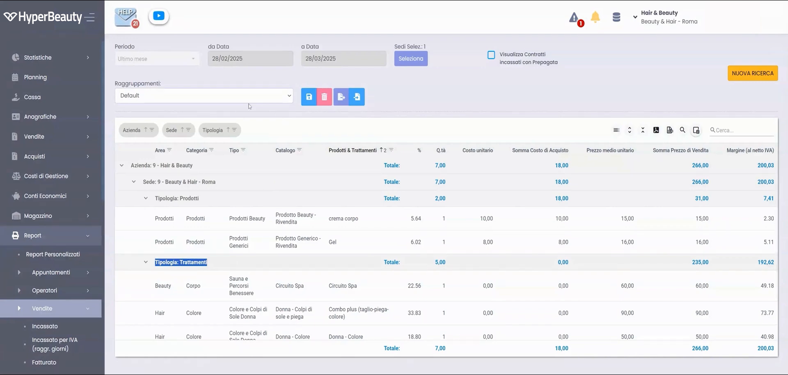
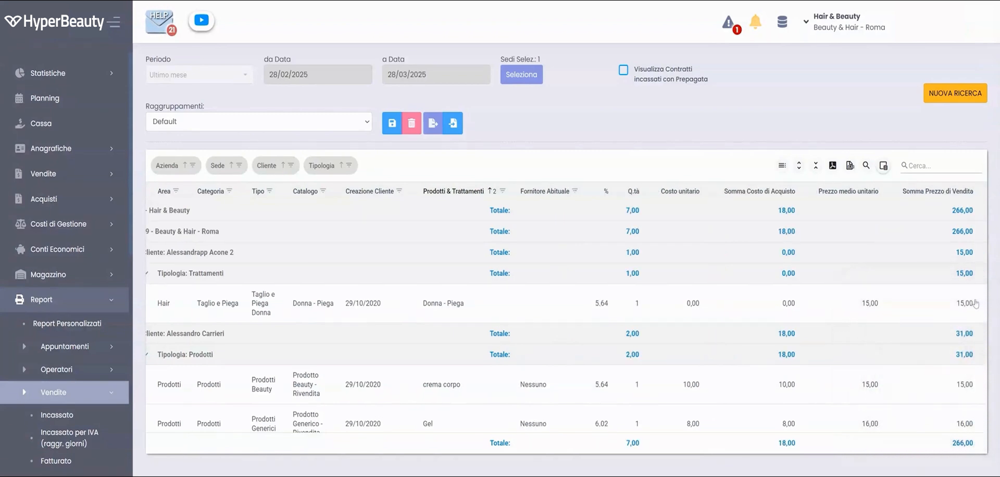
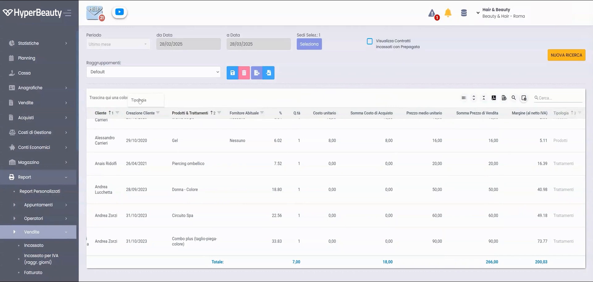
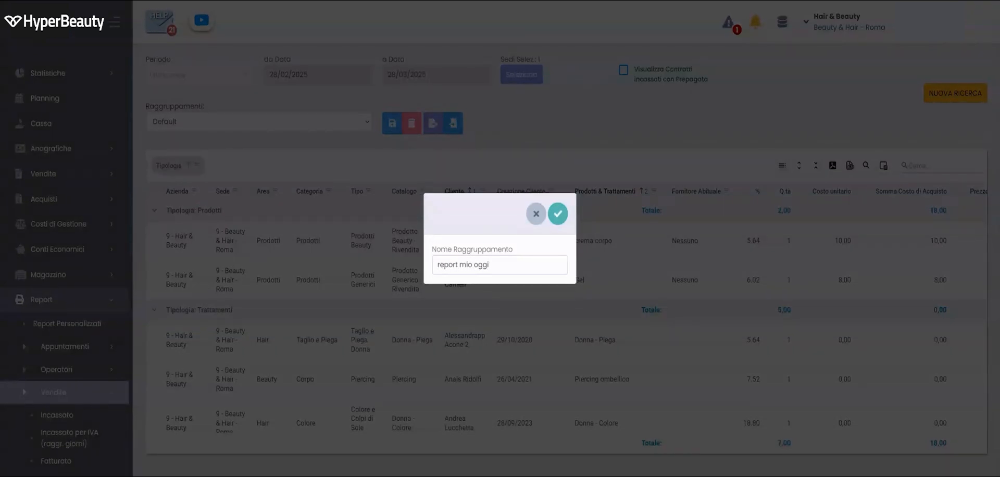
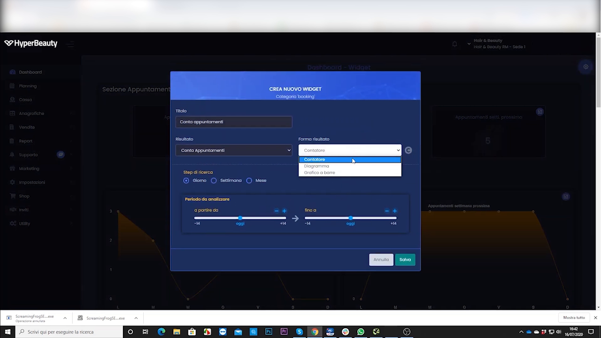
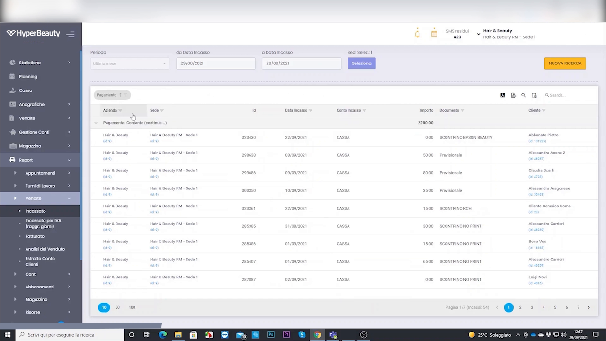
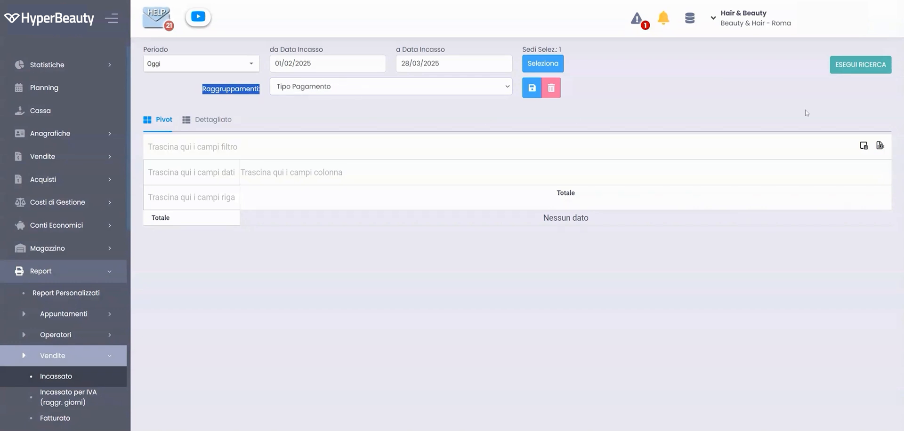

# Report & Statistiche di Vendita

Il modulo di reportistica è **il più potente della categoria** e uno dei principali differenziatori competitivi di HyperBeauty: pivot interattive, filtri, raggruppamenti ed esportazione, tutto in tempo reale.

---

<video controls width="100%" style="border-radius:8px; margin-bottom:1.5rem;">
  <source src="../assets/resources/FIDELIZZARE/statistiche/report_vendite.mp4" type="video/mp4">
  Il tuo browser non supporta il tag video.
</video>

---

## La pivot table interattiva

**Percorso:** Report → Vendita / Operatori / Clienti / Trattamenti

Il report di vendita è una **pivot table** con raggruppamenti per area, categoria, tipo e catalogo, e colonne per quantità, costi d'acquisto, prezzi medi e **margini**.

---

## Selezione dei campi e raggruppamenti

Il pulsante **Selezione Campi** apre un pannello per scegliere quali colonne mostrare (operatore, cliente, trattamento, quantità, importo). I campi si spostano in **drag-and-drop** per riorganizzare la pivot.

Raggruppamenti disponibili: per operatore, per cliente, per tipo di trattamento, per periodo.

---

## Analisi per cliente e report salvati

Cambiando raggruppamento si passa, ad esempio, all'analisi per **cliente** (frequenza di visita o importo speso). Le configurazioni possono essere **salvate come report personalizzati** per richiamarle rapidamente.

---

## I report disponibili

| Report | A cosa serve |
|--------|--------------|
| **Vendite per periodo** | Fatturato giornaliero / settimanale / mensile / annuale |
| **Performance per operatore** | Chi produce di più, mix trattamento/prodotto |
| **Top clienti** | Per frequenza di visita o per importo speso |
| **Trattamenti più venduti** | Per costruire il listino ottimale |
| **Report sospesi** | Tutti i clienti con debiti aperti |

!!! info "Esportazione in Excel"
    Tutti i report sono esportabili in **Excel** per ulteriori elaborazioni o presentazioni.

!!! quote "Differenziatore competitivo"
    *"Nessun competitor ce l'ha così spinto."* — Il modulo report è la funzione più differenziante rispetto ai competitor diretti nella stessa fascia di prezzo. Usare come closing argument: se non bastano questi numeri in tempo reale con tutti questi filtri, non esiste un gestionale della stessa fascia che faccia meglio.

---

## Dashboard & Widget statistiche

La dashboard mostra i **widget statistici** configurabili con i numeri chiave del salone in tempo reale (fatturato, appuntamenti, incassi).

<video controls width="100%" style="border-radius:8px; margin:1rem 0;">
  <source src="../assets/resources/FIDELIZZARE/statistiche/10-Hyperbeauty_dashboard_widget_statistiche_base.mp4" type="video/mp4">
  Il tuo browser non supporta il tag video.
</video>

---

## Report ed estrazioni personalizzate

Oltre ai report standard, è possibile creare **estrazioni personalizzate** dei dati, filtrando e selezionando i campi desiderati ed esportando il risultato.

<video controls width="100%" style="border-radius:8px; margin:1rem 0;">
  <source src="../assets/resources/FIDELIZZARE/statistiche/29-Hyperbeauty_report_ed_estrazioni_personalizzate.mp4" type="video/mp4">
  Il tuo browser non supporta il tag video.
</video>

---

## Report degli incassi

Il report degli incassi riepiloga gli importi incassati per periodo e metodo di pagamento, utile per la quadratura di cassa.

<video controls width="100%" style="border-radius:8px; margin:1rem 0;">
  <source src="../assets/resources/FIDELIZZARE/statistiche/64-Hyperbeauty_report_deglli_incassi.mp4" type="video/mp4">
  Il tuo browser non supporta il tag video.
</video>

---

*Documento a cura di Custom S.p.a. — HyperBeauty Training Program — Versione 1.0 — Luglio 2026*
