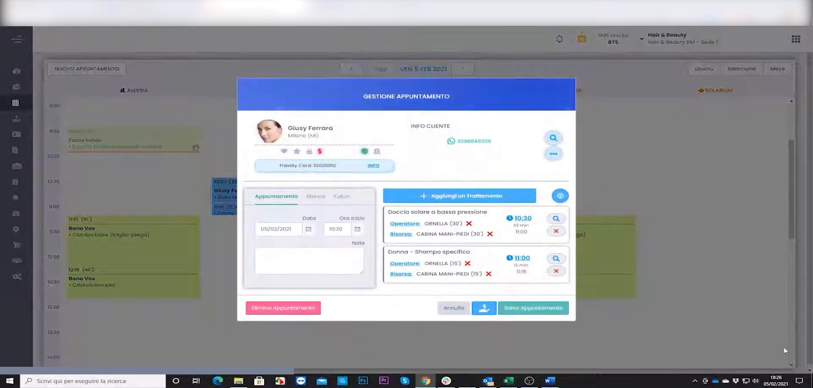
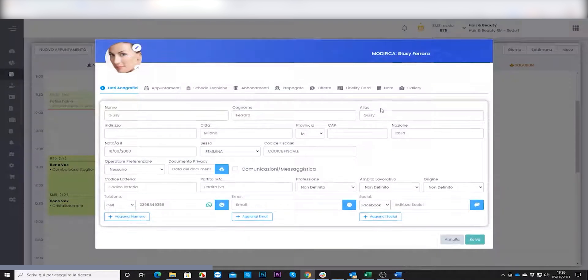
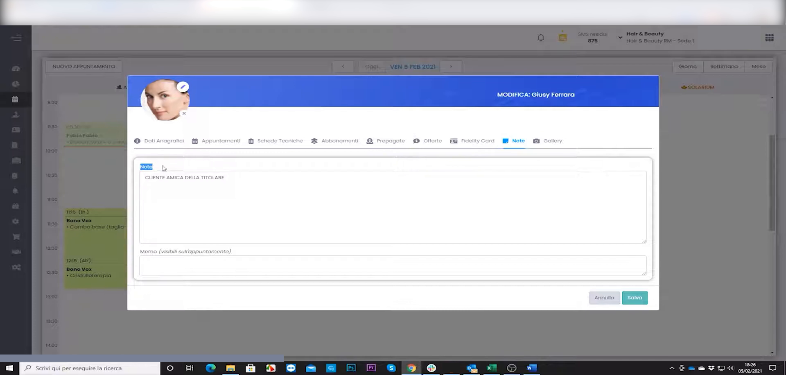
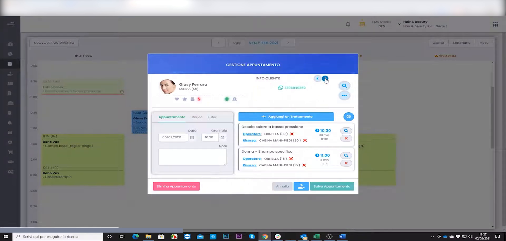

# Scheda Cliente avanzata

La scheda cliente di HyperBeauty è molto più di un'anagrafica: è la **memoria storica completa del rapporto con il cliente**. Da un unico pannello si vedono dati anagrafici, storico appuntamenti e acquisti, situazione economica (sospesi, prepagate, abbonamenti) e le note interne dello staff. Saperla usare bene è il primo passo per gestire e fidelizzare la clientela.

---

<video controls width="100%" style="border-radius:8px; margin-bottom:1.5rem;">
  <source src="../assets/resources/scheda_cliente.mp4" type="video/mp4">
  Il tuo browser non supporta il tag video.
</video>

---

## Aprire la scheda dal cliente in agenda

La scheda cliente è raggiungibile da più punti: dall'anagrafica (**Anagrafiche → Clienti**) e, nel modo più rapido, direttamente dall'appuntamento in agenda.

Aprendo un appuntamento si accede al pannello **Gestione Appuntamento**, che riepiloga a colpo d'occhio il cliente (foto, nominativo) e la sezione **Info Cliente** con i trattamenti prenotati. Da qui si passa alla scheda completa per consultare o aggiornare i dati.

---

## La scheda cliente completa

**Percorso:** Anagrafiche → Clienti → *(seleziona cliente)* → **Modifica**

La scheda è organizzata in **tab tematici** che raccolgono tutta la storia del cliente:

| Sezione | Contenuto |
|---------|-----------|
| **Dati Anagrafici** | Nome, cognome, contatti, data di nascita, foto profilo, consensi |
| **Appuntamenti** | Storico completo con trattamento, operatore, data e importo |
| **Schede Tecniche** | Schede di trattamento/servizio associate al cliente |
| **Abbonamenti** | Pacchetti attivi e sedute residue |
| **Prepagate** | Carte prepagate attive e credito residuo |
| **Offerte** | Offerte e promozioni dedicate al cliente |
| **Fidelity Card** | Tessera fedeltà e punti accumulati |
| **Note** | Note interne visibili solo allo staff |
| **Galleria** | Foto e allegati (es. consenso GDPR, schede cartacee scansionate) |

!!! tip "Una sola fonte di verità"
    Tutto ciò che riguarda il cliente vive qui dentro. Prima di ogni servizio, un'occhiata alla scheda permette all'operatore di arrivare preparato: preferenze, trattamenti passati, allergie e situazione economica.

---

## Le Note interne del cliente

Il tab **Note** consente di annotare informazioni utili allo staff — preferenze, avvertenze, promemoria — che **non sono visibili al cliente**.

Basta scrivere il testo nell'area dedicata. La nota resta legata al cliente e viene riproposta ogni volta che se ne apre la scheda o l'appuntamento.

!!! example "Esempi di note utili"
    *"Preferisce appuntamenti al mattino"*, *"Allergia al nichel — usare linea dedicata"*, *"Cliente fedele dal 2024 — riservare operatore preferenziale"*.

---

## La nota richiamata sull'appuntamento

Una volta salvata, la nota è immediatamente disponibile durante la gestione dell'appuntamento: lo staff vede l'informazione senza doverla cercare.

!!! info "Icone reminder in agenda e in cassa"
    Oltre alle note, la scheda alimenta le **icone reminder** già viste nel Webinar 1: **$ rosso** = sospeso, **arancione** = prepagata, **verde** = abbonamento, **torta** = compleanno. Sono visibili sia in agenda sia all'accesso alla cassa — il salone è sempre informato sulla situazione del cliente.

---

## Import massivo dei clienti

Per i saloni che migrano da un altro gestionale non è necessario reinserire i clienti a mano.

**Percorso:** Anagrafiche → Import → Clienti

Si prepara un file Excel/CSV con i campi obbligatori (**nome, cognome, telefono**) e quelli facoltativi (email, data di nascita, note). Il sistema mostra una **anteprima dei dati** prima di completare l'importazione, così da verificare la corretta corrispondenza delle colonne.

!!! tip "Lo sblocco psicologico per i saloni titubanti"
    *"Non devo reinserire 3.000 clienti a mano"* è spesso il messaggio che convince il salone a partire. L'import massivo va sempre sottolineato in fase di presentazione.

---

## Tag e bandiere cliente

I **tag** permettono di segmentare la clientela per le campagne marketing. Si aggiungono manualmente dalla scheda e possono rappresentare qualsiasi caratteristica utile: *cliente VIP*, *allergie nichel*, *preferisce mattina*, *top spender*.

!!! note "Preparare il terreno per il Marketing"
    I tag cliente sono la base delle campagne marketing avanzate (blocco Automatizzare del Webinar 2). Conviene impostarli fin da subito, così da avere una clientela già segmentata quando si attivano le automazioni.

---

## Riepilogo

| Passo | Azione |
|-------|--------|
| 1 | Aprire la scheda dall'agenda o da Anagrafiche → Clienti |
| 2 | Consultare i tab (appuntamenti, abbonamenti, prepagate, ecc.) |
| 3 | Aggiungere note interne nel tab **Note** |
| 4 | Verificare le icone reminder in agenda e cassa |
| 5 | Usare l'import massivo per la migrazione da altri gestionali |
| 6 | Assegnare tag per la segmentazione marketing |

---

*Documento a cura di Custom S.p.a. — HyperBeauty Training Program — Versione 1.0 — Luglio 2026*
