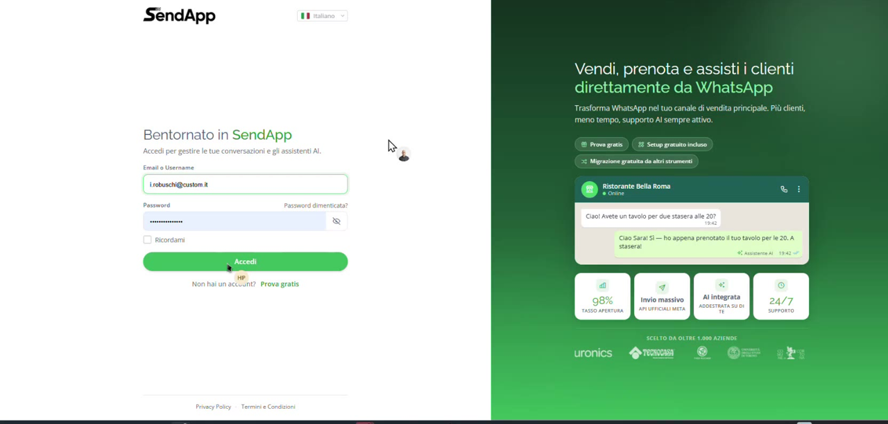
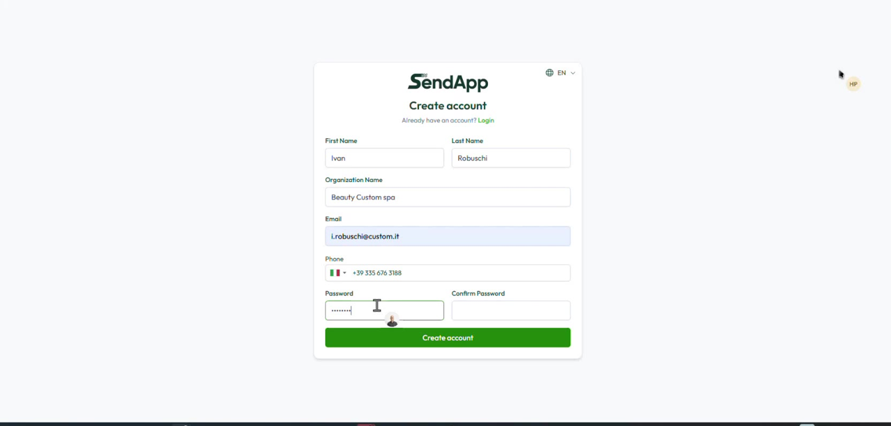
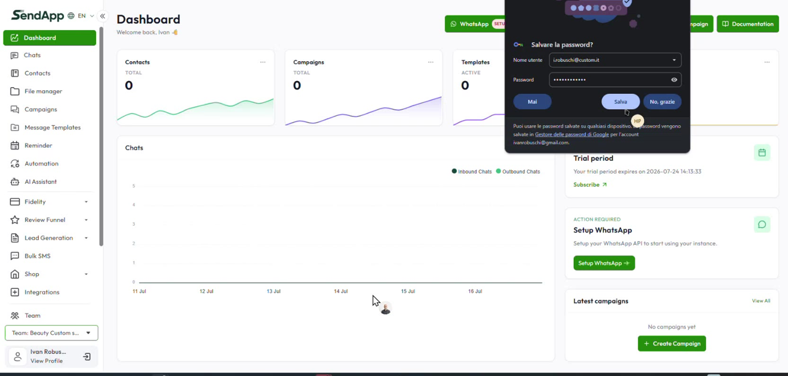
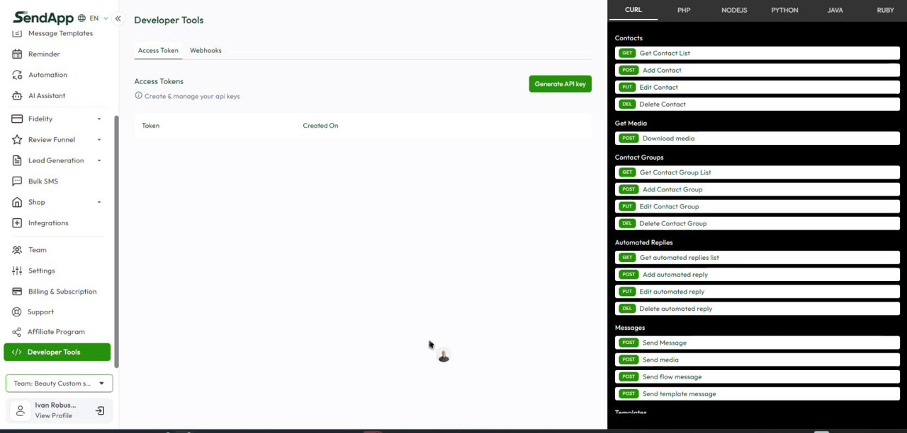
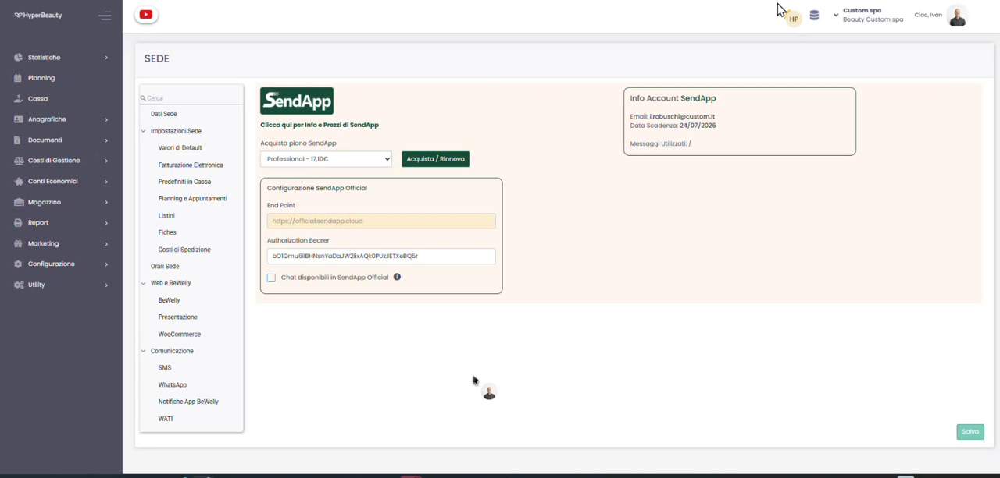
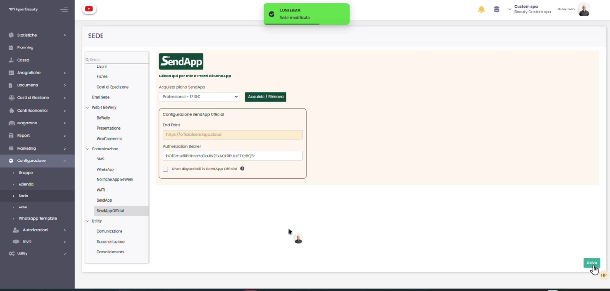
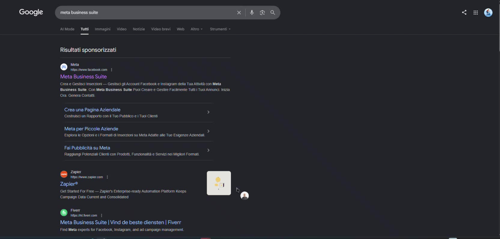

# SendApp Official — Acquisto e Configurazione

**SendApp** è la piattaforma che trasforma **WhatsApp** nel canale di vendita e assistenza del salone (API ufficiali Meta, invio massivo, AI, supporto). In questa guida vediamo come **creare l'account, acquistare il pacchetto Official e configurarlo in HyperBeauty**, fino alla richiesta di collegamento del numero al proprio account **Meta Business Suite**.

---

## Passo 1 — Accedi a SendApp

Apri **app.sendapp.ai**. Se hai già un account inserisci **email e password** e clicca **Accedi**; altrimenti scegli **Prova gratis** per crearne uno nuovo.

## Passo 2 — Crea l'account

Nella pagina **Create account** compila **Nome, Cognome, Nome organizzazione, Email, Telefono** e imposta la **password**. Poi premi **Create account**.

## Passo 3 — Dashboard e Setup WhatsApp

Entrato nella **Dashboard** vedi il **periodo di prova** e, in *Action Required*, il pulsante **Setup WhatsApp**: è il promemoria per attivare l'API di WhatsApp sulla tua istanza.

!!! info "Periodo di prova"
    L'account parte in prova: per l'uso continuativo dovrai attivare il pacchetto (vedi Passo 5).

## Passo 4 — Genera l'API key

Vai su **Developer Tools → Access Token** e clicca **Generate API key**: questo token è l'**Authorization Bearer** che servirà a collegare HyperBeauty a SendApp. Tienilo a portata di mano (insieme all'End Point `https://official.sendapp.cloud`).

!!! warning "Tratta la chiave come una password"
    L'API key dà accesso al tuo account SendApp: non condividerla e conservala in un luogo sicuro.

## Passo 5 — Acquista e configura in HyperBeauty

In HyperBeauty apri **Configurazione → Sede → Comunicazione → SendApp Official**. Qui:

Scegli il **piano** dal menu *Acquista piano SendApp* (es. *Professional*) e premi **Acquista / Rinnova**. Poi, in **Configurazione SendApp Official**, incolla l'**End Point** (`https://official.sendapp.cloud`) e l'**Authorization Bearer** (la API key del Passo 4) e spunta **Chat disponibili in SendApp Official**. A destra, in *Info Account SendApp*, trovi email, data di scadenza e messaggi utilizzati.

## Passo 6 — Salva

Premi **Salva**: la conferma *Sede modificata* indica che il collegamento tra HyperBeauty e SendApp Official è memorizzato.

## Passo 7 — Richiedi il collegamento a Meta Business Suite

Il pacchetto Official usa le **API ufficiali di WhatsApp**, che passano da **Meta Business Suite**. L'ultimo passaggio è quindi **richiedere il contatto con SendApp** per far collegare il tuo numero WhatsApp al tuo account **Meta Business Suite**: sarà l'assistenza SendApp a completare l'abbinamento con Meta.

!!! tip "Cosa preparare per la richiesta"
    Tieni pronti il **numero WhatsApp** da collegare e i dati del tuo **account Meta Business Suite** (o l'accesso per crearlo): velocizzano l'attivazione da parte di SendApp.

---

## In sintesi

| Fase | Dove | Risultato |
|------|------|-----------|
| **Account** | app.sendapp.ai | Crei/accedi all'account SendApp |
| **API key** | SendApp → Developer Tools | Ottieni l'Authorization Bearer |
| **Acquisto + configurazione** | HyperBeauty → Configurazione → Sede → SendApp Official | Piano attivo, End Point e token impostati |
| **Collegamento Meta** | Richiesta a SendApp | Numero collegato a Meta Business Suite |

---

*Documento a cura di Custom S.p.a. — HyperBeauty Training Program — Versione 1.0 — Luglio 2026*
