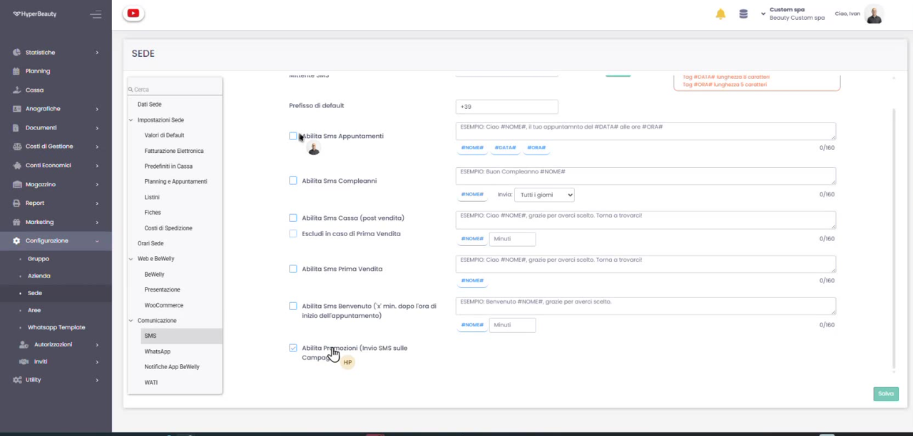

# SMS — Acquisto C4U e Alias Mittente

Per inviare SMS dal gestionale servono due cose: un **pacchetto SMS** (il credito) acquistato sul portale **C4U** e un **alias mittente** (il nome che il cliente vede come mittente del messaggio). L'alias va **richiesto** e, una volta ottenuto, **configurato** in HyperBeauty. Vediamo l'intero percorso.

---

## Passo 1 — Acquista il pacchetto SMS su C4U

Accedi al **portale C4U** e acquista il **pacchetto SMS** (il credito) per la sede. L'attivazione del servizio per l'istanza Hyper Beauty avviene dalla console di gestione Custom, dove si seleziona l'esercente e si conferma l'acquisto.

!!! info "Il credito SMS"
    Gli SMS si scalano dal credito acquistato: puoi verificarne il residuo dalle informazioni del servizio. Quando si esaurisce, basta acquistare un nuovo pacchetto su C4U.

## Passo 2 — Richiedi l'alias mittente

L'**alias** è il nome che comparirà come mittente degli SMS (es. il nome del salone). Per ottenerlo compila il **modulo di richiesta alias** e invialo a:

**hyperbeauty-sms@custom.it**

Una volta verificato e approvato, ti verrà comunicato l'alias da utilizzare.

!!! warning "Regole sull'alias"
    L'alias deve rispettare i requisiti degli operatori (in genere massimo 11 caratteri alfanumerici, senza spazi particolari) e deve essere approvato **prima** di poter essere usato: per questo va richiesto in anticipo via email.

## Passo 3 — Configura l'alias in HyperBeauty

Ottenuto l'alias, vai su **Configurazione → Sede → Comunicazione → SMS**. Imposta il **Mittente SMS** con l'alias assegnato e il **Prefisso di default** (es. `+39`). Da qui puoi anche abilitare i vari SMS automatici (appuntamenti, compleanni, post vendita, benvenuto, promozioni) con i relativi testi e i tag dinamici **#NOME#**, **#DATA#**, **#ORA#**. Al termine premi **Salva**.

!!! tip "Tag dinamici"
    Nei testi puoi inserire i tag che il sistema sostituisce automaticamente: **#NOME#** (nome cliente), **#DATA#** e **#ORA#** (data e ora appuntamento). Occhio ai limiti: un SMS standard è di **160 caratteri**.

---

## In sintesi

| Passo | Dove | Risultato |
|-------|------|-----------|
| **Acquisto** | Portale C4U | Credito SMS disponibile |
| **Richiesta alias** | Email a hyperbeauty-sms@custom.it | Alias mittente approvato |
| **Configurazione** | HyperBeauty → Configurazione → Sede → SMS | Mittente e prefisso impostati |

Per l'invio automatico del promemoria appuntamento il giorno precedente, vedi [Promemoria SMS Appuntamento](promemoria_sms.md).

---

*Documento a cura di Custom S.p.a. — HyperBeauty Training Program — Versione 1.0 — Luglio 2026*
