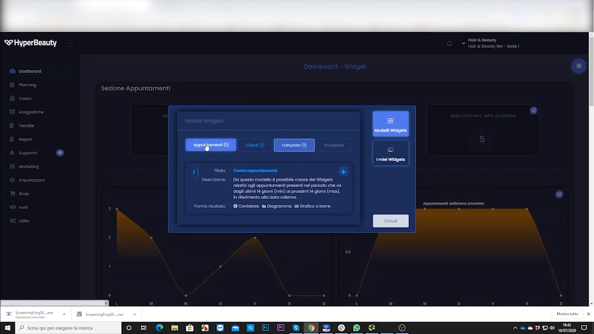
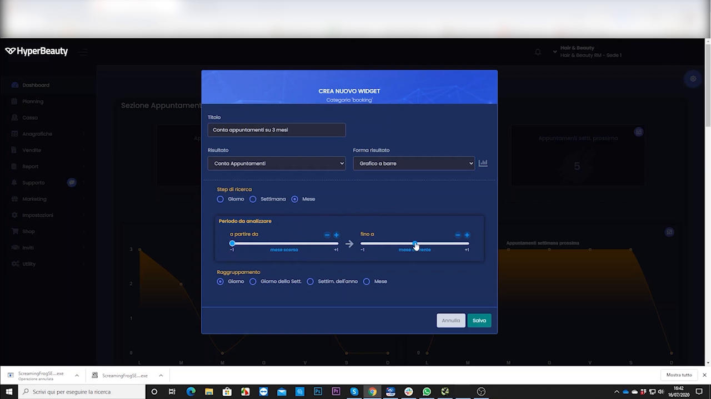
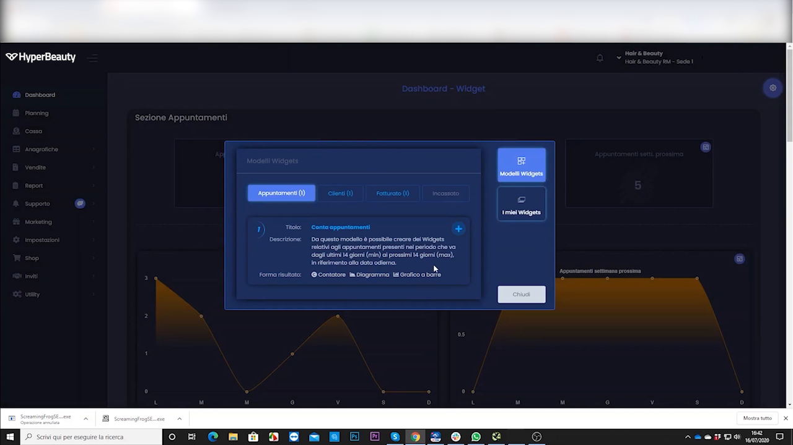

# Dashboard & Widget statistiche

La dashboard è la **schermata iniziale** con i numeri chiave del salone sempre sott'occhio: fatturato, appuntamenti, incassi. Puoi comporla con i **widget** che ti servono. Ecco come.

---

<video controls width="100%" style="border-radius:8px; margin-bottom:1.5rem;">
  <source src="../assets/resources/FIDELIZZARE/statistiche/10-Hyperbeauty_dashboard_widget_statistiche_base.mp4" type="video/mp4">
  Il tuo browser non supporta il tag video.
</video>

---

## Passo 1 — Apri la dashboard e aggiungi un widget

Vai nella **Dashboard** e clicca su **Aggiungi widget**: si apre l'elenco dei widget disponibili.

## Passo 2 — Crea e configura il widget

Scegli **Crea nuovo widget**, poi imposta: il **tipo** di dato (es. incassi, appuntamenti), il **nome** e il **periodo** da mostrare.

## Passo 3 — Conferma e sistema i widget

Conferma: il widget compare nella dashboard. Puoi aggiungerne altri e spostarli per comporre la vista che preferisci.

!!! tip "La tua fotografia quotidiana"
    Tieni sulla dashboard 3-4 widget essenziali (incasso del giorno, appuntamenti di oggi, fatturato del mese): al mattino ti bastano pochi secondi per capire come sta andando.

---

*Documento a cura di Custom S.p.a. — HyperBeauty Training Program — Versione 1.0 — Luglio 2026*
