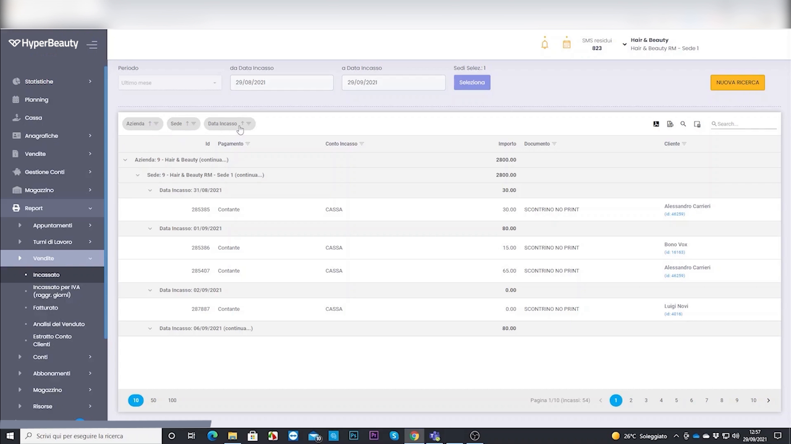
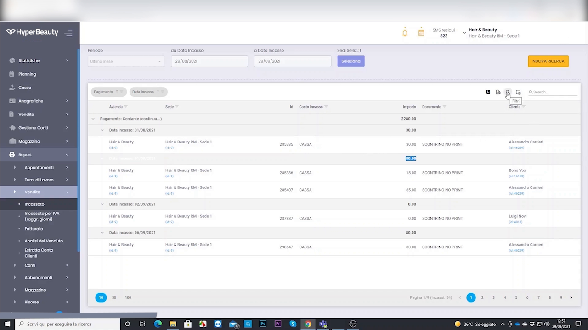
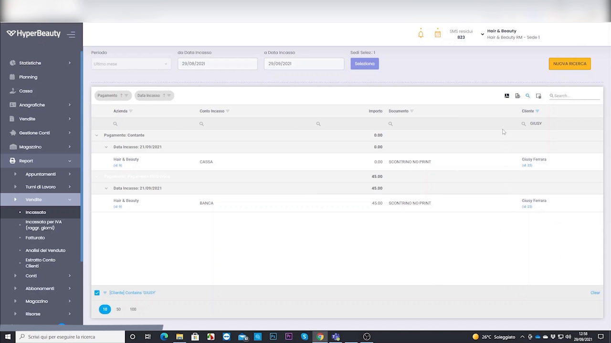

# Report ed estrazioni personalizzate

Oltre ai report standard puoi creare **estrazioni su misura**: scegli i dati, applichi i filtri e li esporti. Utile per analisi specifiche o per il commercialista.

---

<video controls width="100%" style="border-radius:8px; margin-bottom:1.5rem;">
  <source src="../assets/resources/FIDELIZZARE/statistiche/29-Hyperbeauty_report_ed_estrazioni_personalizzate.mp4" type="video/mp4">
  Il tuo browser non supporta il tag video.
</video>

---

## Passo 1 — Apri i report personalizzati

Dal menu vai su **Report → Report personalizzati** e scegli il tipo di dato da estrarre; imposta il **periodo**.

## Passo 2 — Filtra e scegli le colonne

Applica i **filtri** (operatore, tipo, metodo di pagamento…) e seleziona le **colonne** che vuoi nell'estrazione.

## Passo 3 — Salva ed esporta

**Salva** l'estrazione per riutilizzarla in futuro ed **esportala in Excel** quando ti serve.

!!! tip "Crea i tuoi modelli"
    Salva le estrazioni che usi spesso (es. "incassi mensili per operatore"): la prossima volta ti basterà aprirle e cambiare il periodo.

---

*Documento a cura di Custom S.p.a. — HyperBeauty Training Program — Versione 1.0 — Luglio 2026*
