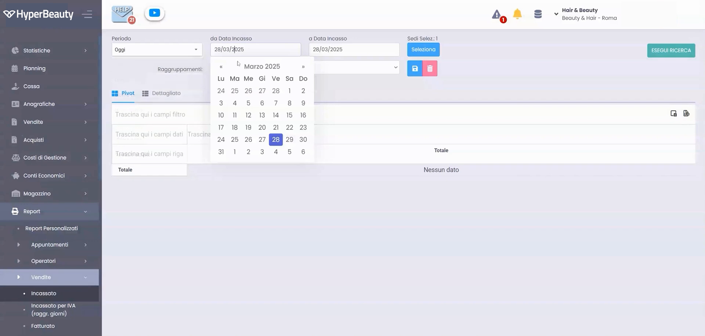
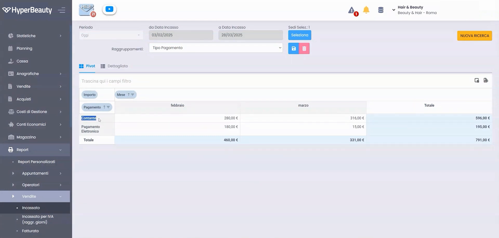
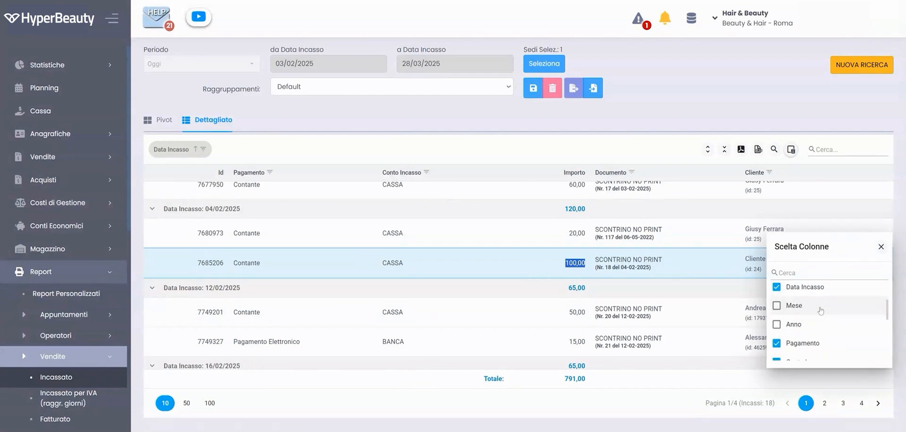

# Report degli incassi

Il report incassi ti dice **quanto hai incassato** in un periodo e **con quali metodi di pagamento** (contanti, carte, ecc.). È lo strumento per la quadratura di cassa.

---

<video controls width="100%" style="border-radius:8px; margin-bottom:1.5rem;">
  <source src="../assets/resources/FIDELIZZARE/statistiche/64-Hyperbeauty_report_deglli_incassi.mp4" type="video/mp4">
  Il tuo browser non supporta il tag video.
</video>

---

## Passo 1 — Scegli il periodo

Vai su **Report → Incassi** e seleziona l'**intervallo di date** dal calendario (es. il mese corrente).

## Passo 2 — Leggi gli incassi per metodo di pagamento

Il report mostra i totali suddivisi per **metodo di pagamento** (Contanti, Elettronico, ecc.), con il totale complessivo.

## Passo 3 — Personalizza le colonne

Con **Scelta colonne** decidi quali informazioni visualizzare (data, cliente, operatore, importo…) e, se serve, esporti il risultato.

!!! tip "Quadratura di fine giornata"
    A fine giornata confronta l'incasso in **contanti** del report con i contanti in cassa: se coincidono, la quadratura è a posto.

---

*Documento a cura di Custom S.p.a. — HyperBeauty Training Program — Versione 1.0 — Luglio 2026*
