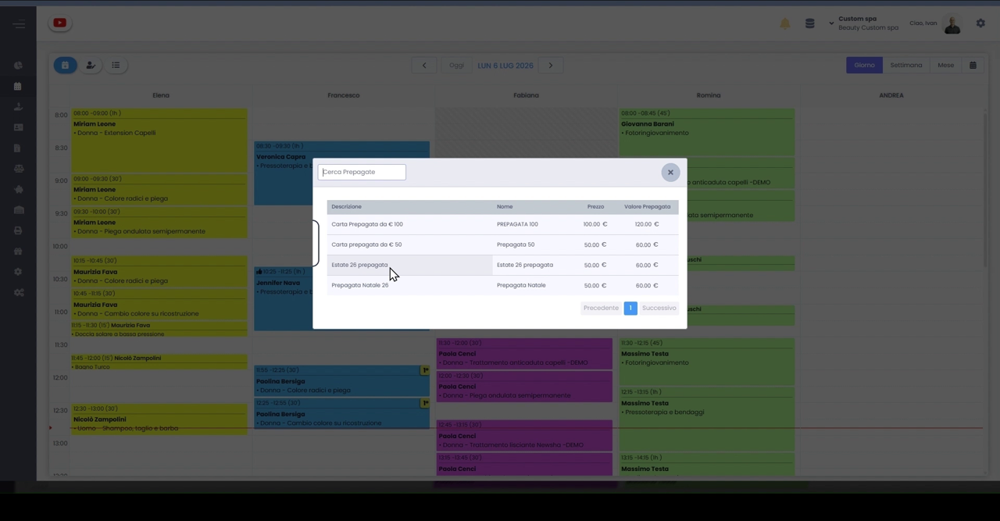
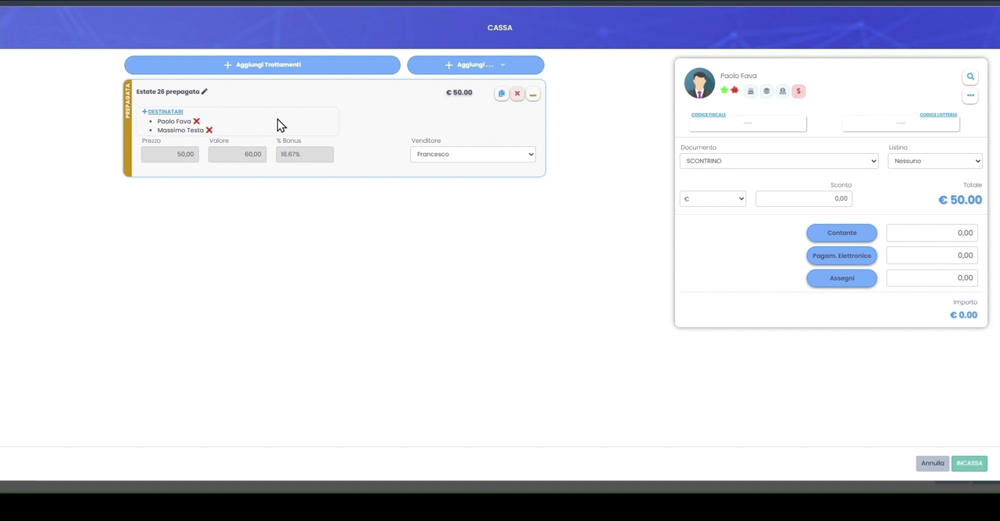
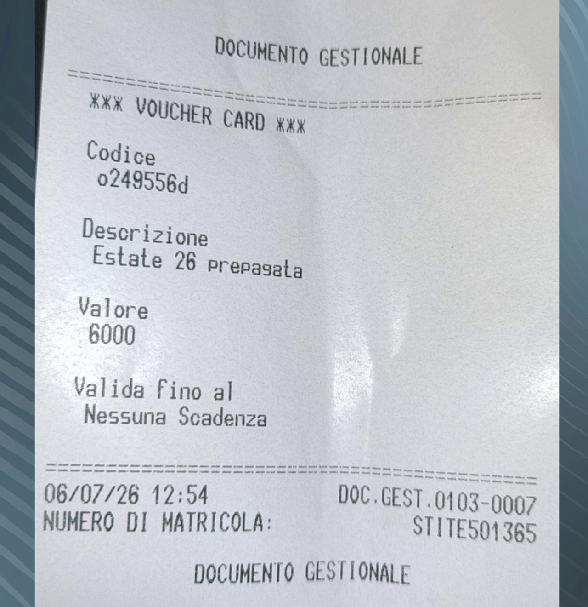
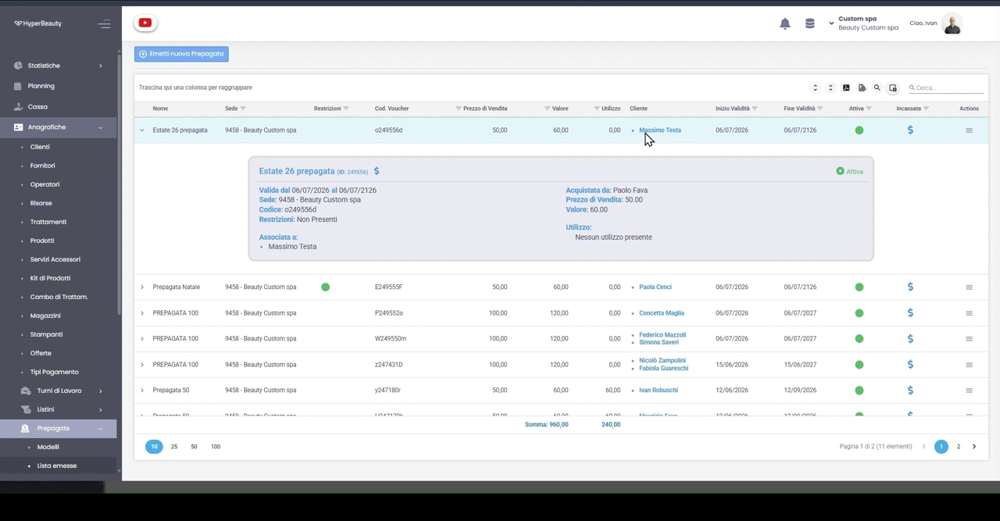
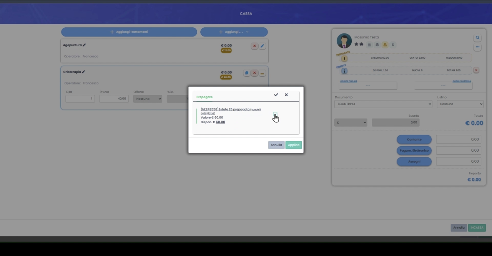
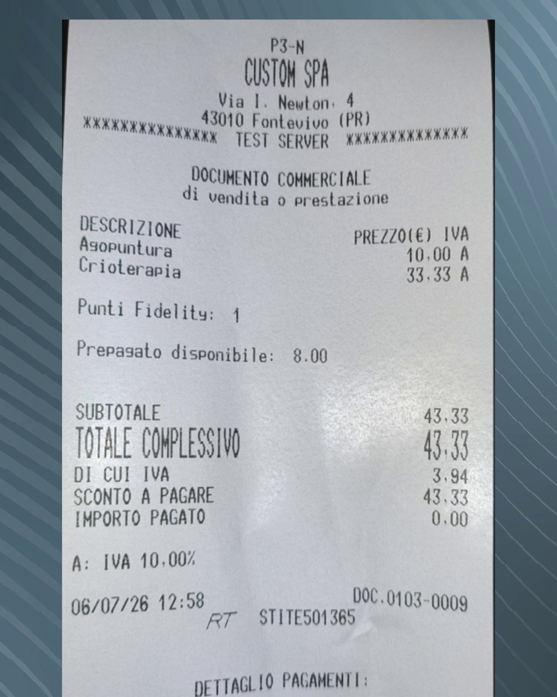

# Vendita e Utilizzo della Prepagata

Dopo aver creato il modello (vedi [Emissione Prepagate](emissione_prep.md)), la prepagata si **vende in cassa**: il cliente paga, riceve la sua **voucher card** con il credito e da quel momento può spenderlo. Ecco l'intero ciclo, dalla vendita all'utilizzo.

---

<video controls width="100%" style="border-radius:8px; margin-bottom:1.5rem;">
  <source src="../assets/resources/FIDELIZZARE/prepagate/vendita_prep.mp4" type="video/mp4">
  Il tuo browser non supporta il tag video.
</video>

---

## Passo 1 — Aggiungi la prepagata in cassa

In **Cassa**, seleziona il cliente e usa il pulsante **Aggiungi…** per aprire la ricerca prepagate. Scegli dall'elenco il modello da vendere: vedi **Descrizione, Nome, Prezzo e Valore** di ciascuna carta.

## Passo 2 — Imposta i dati e incassa

La prepagata entra nel carrello. Puoi rivedere **Prezzo, Valore e % Bonus**, indicare il **Venditore** e, sotto **Destinatari**, a chi è intestata (anche a più persone). Scegli la modalità di pagamento (*Contante, Pagam. Elettronico, Assegni*) e premi **INCASSA**.

!!! info "Prezzo e valore possono differire"
    Il cliente paga il **Prezzo** (es. 50 €) ma riceve il **Valore** come credito (es. 60 €): la differenza è il **bonus**.

## Passo 3 — La voucher card stampata

Alla conferma, oltre al documento commerciale di vendita viene stampata la **Voucher Card** (documento gestionale) con il **Codice** univoco, la **descrizione**, il **valore** e la **validità**. È la "carta" che consegni al cliente.

## Passo 4 — Controlla la Lista emesse

Ogni carta venduta finisce in **Anagrafiche → Prepagate → Lista emesse**. Aprendo la riga vedi il **codice voucher**, chi l'ha **acquistata** e a chi è **associata**, prezzo, valore, validità e l'**utilizzo** (credito ancora da spendere).

!!! tip "Emetti anche da qui"
    Con **Emetti nuova Prepagata** puoi generare una carta direttamente da questa schermata, senza passare dalla cassa.

## Passo 5 — Usa il credito in cassa

Quando il cliente torna, in **Cassa** aggiungi i trattamenti, poi apri la sua **Prepagata** e clicca **Applica** per scalare il credito. Il pannello a destra mostra sempre **Credito, Usato e Residuo** della carta (e i punti Fidelity).

## Passo 6 — Chiudi lo scontrino

Premi **INCASSA**: il credito viene scalato e il documento riporta **Prepagato disponibile** aggiornato e l'importo pagato. Se il credito copre tutto, l'*Importo pagato* è 0,00.

---

## Il ciclo della prepagata

| Fase | Dove | Risultato |
|------|------|-----------|
| **Emissione** | Prepagate → Modelli | Crei il tipo di carta ([guida](emissione_prep.md)) |
| **Vendita** | Cassa | Il cliente paga e riceve la voucher card |
| **Utilizzo** | Cassa | Il credito viene scalato a ogni acquisto |
| **Controllo** | Prepagate → Lista emesse | Vedi codice, cliente e credito residuo |

Vedi anche [Carte Prepagate & Gift Card](carte_prepagate.md).

---

*Documento a cura di Custom S.p.a. — HyperBeauty Training Program — Versione 1.0 — Luglio 2026*
