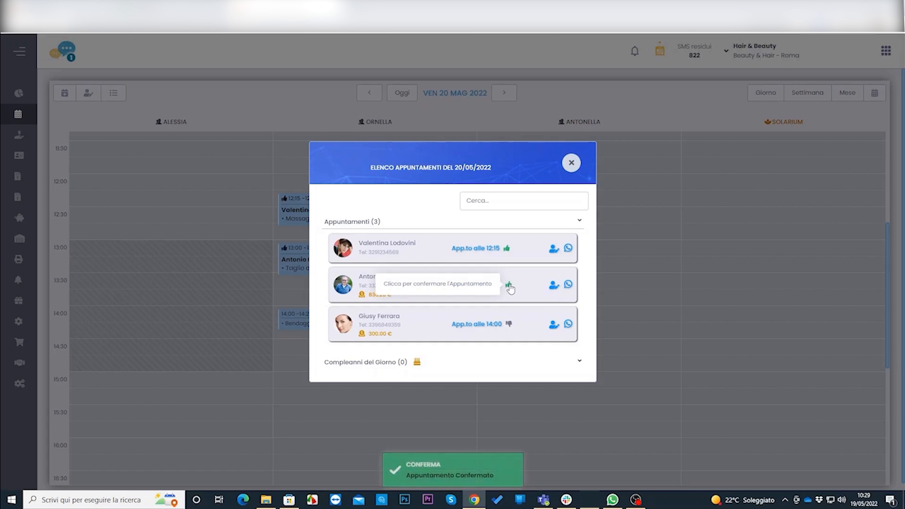
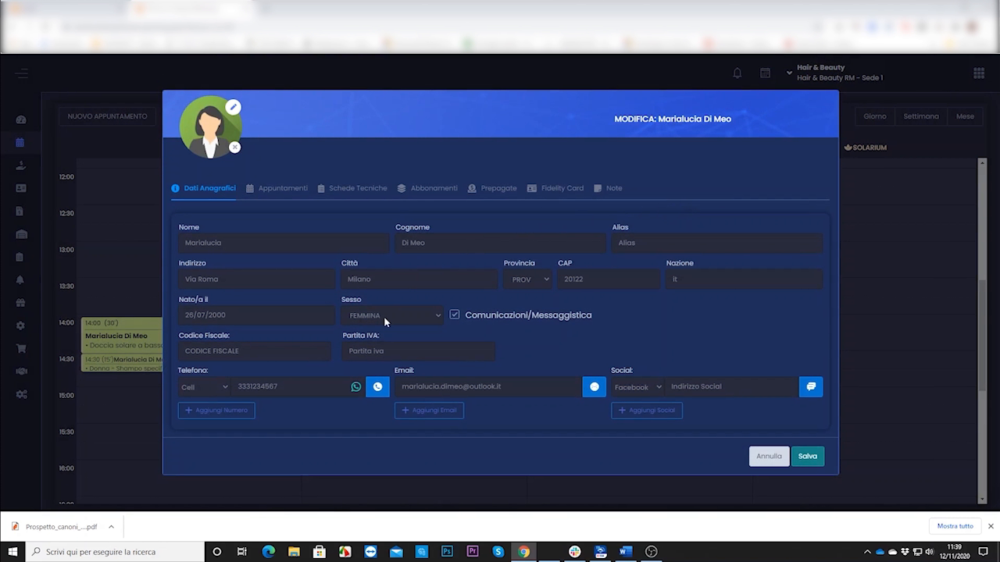
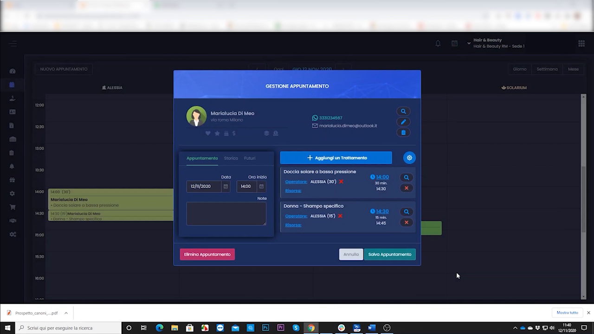
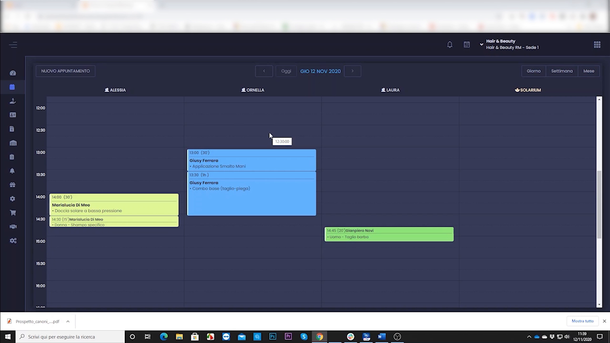

# WhatsApp — 3 livelli di utilizzo

HyperBeauty parla con i clienti via WhatsApp in **tre modi**, dal più semplice e gratuito al più automatico. Vediamo prima il requisito, poi i tre livelli.

---

<video controls width="100%" style="border-radius:8px; margin-bottom:1.5rem;">
  <source src="../assets/resources/AUTOMATIZZARE/39-Hyperbeauty_promemoria_rapido_appuntamenti_con_whatsapp_con_intervento_operatore.mp4" type="video/mp4">
  Il tuo browser non supporta il tag video.
</video>

!!! note "Nota sui video"
    Il clip del singolo messaggio rapido (video 17) è da ri-registrare; il video 51 (riepilogo appuntamenti al salvataggio) è in [Gestione appuntamento](gestione_appuntamento.md).

---

## Requisito (vale per tutti i livelli)

Sulla **scheda del cliente** servono due cose:

1. un **numero WhatsApp valido**;
2. il flag **"consenso comunicazioni"** attivo.

---

## Livello 1 — WhatsApp manuale (gratuito, tutti i piani)

Funziona con **WhatsApp Desktop** aperto sul PC del salone.

1. Attiva in **Impostazioni → Sede → Comunicazioni → WhatsApp** e imposta il **template** del messaggio.
2. Al salvataggio dell'appuntamento, il gestionale **scrive già il messaggio** (nome, data, ora, trattamento).
3. L'operatore controlla e clicca **Invia**.

!!! note "Limiti"
    Richiede WhatsApp Desktop aperto e un clic manuale; funziona da quel PC.

---

## Livello 2 — WhatsApp automatico (WATI / SendApp)

*Modulo a pagamento.* Si collega WhatsApp Business tramite **API ufficiale Meta** (con WATI o SendApp): i messaggi partono **da soli**, senza intervento dell'operatore — conferme, promemoria, auguri, promozioni.

!!! info "Costi"
    Canone mensile dell'API + costo per messaggio. Verifica le tariffe con Custom.

---

## Livello 3 — WhatsApp post-cassa

Messaggio inviato in automatico **dopo ogni incasso**: ringraziamento + link alla pagina Google per la recensione.

!!! quote "Esempio"
    *"Grazie [nome]! Se sei soddisfatta, ci farebbe piacere una recensione Google 🌟 [link]"*

!!! tip "Recensioni che crescono da sole"
    I saloni che lo usano riportano **+20–30 recensioni Google in 3 mesi**. Si imposta nel template delle comunicazioni post-cassa.

---

## Riepilogo

| Livello | Piano | Chi invia | Punto di forza |
|---------|-------|-----------|----------------|
| 1 · Manuale | Tutti | L'operatore (clic) | Gratuito, subito |
| 2 · Automatico | A pagamento | Il sistema | Zero effort |
| 3 · Post-cassa | A pagamento | Il sistema | Recensioni Google |

---

*Documento a cura di Custom S.p.a. — HyperBeauty Training Program — Versione 1.0 — Luglio 2026*
