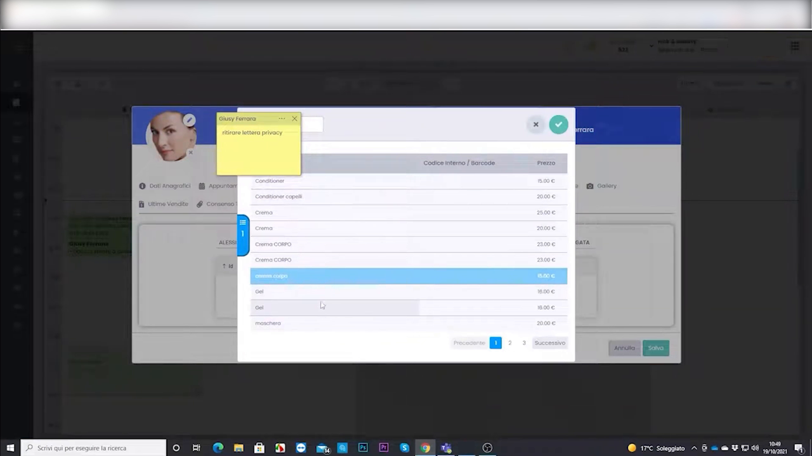
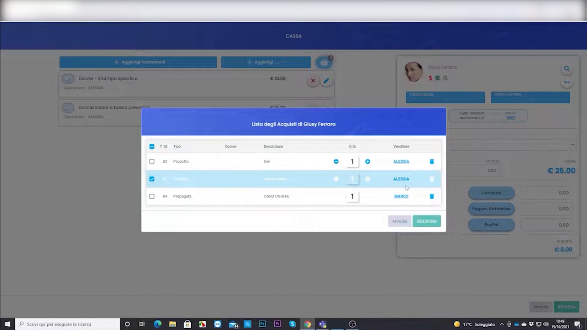

# Wishlist (lista acquisti)

La wishlist è la **lista dei desideri** del cliente: prodotti o trattamenti che gli interessano ma che non ha ancora comprato. Ti serve per proporglieli al momento giusto.

---

<video controls width="100%" style="border-radius:8px; margin-bottom:1.5rem;">
  <source src="../assets/resources/GESTIRE/wishlist/32-Hyperbeauty_lista_degli_acquisti_wishlist.mp4" type="video/mp4">
  Il tuo browser non supporta il tag video.
</video>

---

## Passo 1 — Aggiungi un articolo alla wishlist

Quando un cliente mostra interesse per un prodotto/trattamento, aggiungilo alla sua **lista dei desideri** dalla scheda cliente o dalla vendita.

## Passo 2 — Richiamala in cassa o in appuntamento

Alla visita successiva richiami la wishlist per proporre l'articolo desiderato: una vendita facile perché il cliente lo voleva già.

!!! tip "Piccolo strumento, grande effetto"
    Trasformare un "mi piacerebbe provare…" in un promemoria concreto aumenta il valore medio del cliente senza forzature.

---

*Documento a cura di Custom S.p.a. — HyperBeauty Training Program — Versione 1.0 — Luglio 2026*
